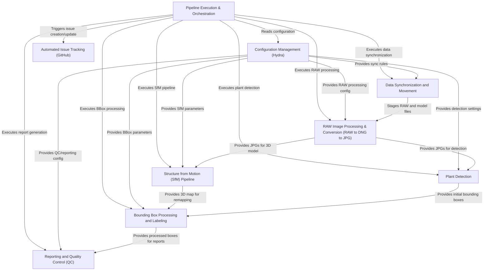

# Tutorial: SemiF-Preprocessing

This project automates the *preprocessing* of **RAW agricultural images**, particularly those of plants in controlled environments.
It takes raw image data, converts it to standard formats (**JPG**), reconstructs a **3D scene** using Structure from Motion (SfM), detects plants (**YOLO**), refines their locations (**bounding boxes**), assigns species labels, generates quality control **reports**, and automatically tracks progress and issues on **GitHub**.
The entire workflow is orchestrated as a pipeline, managed by configuration files for flexibility.

## Chapters

1. [RAW Image Processing & Conversion (RAW -> DNG -> JPG)
](docs/01_raw_image_processing___conversion__raw____dng____jpg__.md)
2. [Plant Detection
](docs/02_plant_detection_.md)
3. [Structure from Motion (SfM) Pipeline
](docs/03_structure_from_motion__sfm__pipeline_.md)
4. [Bounding Box Processing & Labeling
](docs/04_bounding_box_processing___labeling_.md)
5. [Pipeline Execution & Orchestration
](docs/05_pipeline_execution___orchestration_.md)
6. [Configuration Management (Hydra)
](docs/06_configuration_management__hydra__.md)
7. [Data Synchronization & Movement
](docs/07_data_synchronization___movement_.md)
8. [Reporting & Quality Control (QC)
](docs/08_reporting___quality_control__qc__.md)
9. [Automated Issue Tracking (GitHub)
](docs/09_automated_issue_tracking__github__.md)

---

Generated by [AI Codebase Knowledge Builder](https://github.com/The-Pocket/Tutorial-Codebase-Knowledge)
