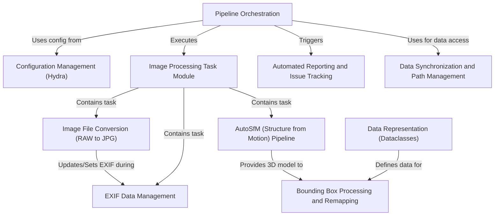

# Tutorial: SemiF-Preprocessing

The **SemiF-Preprocessing** project is an *automated pipeline* for processing SemiField Benchbot images.
It takes *RAW image files*, converts them to JPG, and manages their **EXIF metadata**.
A core part is the *AutoSfM (Structure from Motion)* process, generating **3D models** from these images.
These models aid in tasks like *detecting plants*, creating **bounding boxes**, and remapping them to real-world coordinates.
The workflow is driven by a **Pipeline Orchestrator** using a flexible **Configuration Management** system (Hydra).
Finally, it generates *automated reports* and tracks issues on GitHub, while also handling **data synchronization** with long-term storage.

## Chapters

1. [Pipeline Orchestration
](docs/01_pipeline_orchestration_.md)
2. [Configuration Management (Hydra)
](docs/02_configuration_management__hydra__.md)
3. [Data Synchronization and Path Management
](docs/03_data_synchronization_and_path_management_.md)
4. [Image Processing Task Module
](docs/04_image_processing_task_module_.md)
5. [Image File Conversion (RAW to JPG)
](docs/05_image_file_conversion__raw_to_jpg__.md)
6. [EXIF Data Management
](docs/06_exif_data_management_.md)
7. [AutoSfM (Structure from Motion) Pipeline
](docs/07_autosfm__structure_from_motion__pipeline_.md)
8. [Data Representation (Dataclasses)
](docs/08_data_representation__dataclasses__.md)
9. [Bounding Box Processing and Remapping
](docs/09_bounding_box_processing_and_remapping_.md)
10. [Automated Reporting and Issue Tracking
](docs/10_automated_reporting_and_issue_tracking_.md)

---

Generated by [AI Codebase Knowledge Builder](https://github.com/The-Pocket/Tutorial-Codebase-Knowledge)
