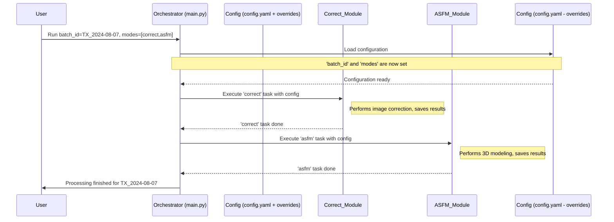

# Chapter 1: Pipeline Orchestration

Welcome to the `SemiF-Preprocessing` project! This tutorial will guide you through its core concepts, starting with the very heart of the system: **Pipeline Orchestration**.

Imagine you're a scientist studying plant growth using images taken by drones or field robots. For each "batch" of images (say, from a specific field on a specific day), you need to perform a series of processing steps:
1.  Download the latest images.
2.  Convert them from a RAW camera format to a more usable format like JPG, perhaps correcting colors.
3.  Stitch these images together to create a 3D model or a map of the field.
4.  Analyze the images or map to identify and count plants.
5.  Package all the results and generate a report.

Doing all these steps manually for *every* batch of images would be incredibly time-consuming and prone to errors. What if you forget a step? Or run them in the wrong order? This is where **Pipeline Orchestration** comes to the rescue!

**Pipeline Orchestration** in `SemiF-Preprocessing` is like a **General Contractor** for a construction project.
*   The **"house"** we want to build is our processed image batch.
*   The **"blueprint"** is a configuration file that tells the contractor exactly what needs to be done.
*   The **"specialized teams"** (like plumbers, electricians, carpenters) are different software modules, each responsible for a specific task (like image correction, 3D modeling, or plant detection).

The Pipeline Orchestrator (our General Contractor) reads the blueprint and calls upon each specialized team in the correct sequence to build the house (process the image batch). It ensures everything happens smoothly, from start to finish.

## What Problem Does It Solve?

The main problem Pipeline Orchestration solves is **managing complexity and ensuring consistency**. It allows you to:

1.  **Automate** a sequence of potentially many processing tasks.
2.  Ensure tasks are run in the **correct order**.
3.  Make it easy to **re-run** the same process for different image batches with consistent results.
4.  Specify **which tasks to run** for a particular batch (maybe you only want to do color correction today, not the full 3D model).

## How Does It Work? The Big Picture

At its core, the `SemiF-Preprocessing` pipeline is controlled by a main script, `main.py`. You tell this script which "image batch" you want to process and which "modes" (or main tasks) you want to run.

Let's look at a simplified example of how you might tell the system to process a batch:

```bash
# Tell the system to process images for batch "TX_2024-08-07"
python main.py batch_id=TX_2024-08-07
```

This command starts the orchestrator (`main.py`). The orchestrator then looks at a special "blueprint" file, typically `conf/config.yaml`, to figure out exactly what to do.

### The Blueprint: `config.yaml`

Inside `conf/config.yaml`, you'll find settings that control the pipeline. Two important ones for orchestration are `batch_id` and `modes`:

```yaml
# conf/config.yaml (simplified snippet)

# ... other settings ...

############################################
# Main configuration for the current batch
############################################
batch_id: MD_2025-05-02 # Which image batch to process
modes:
  # - sync      # Example: Download data (commented out, so it won't run)
  - correct   # Run image correction
  - asfm      # Run 3D modeling (Structure from Motion)
  - label     # Run object labeling
  # - deliver   # Example: Deliver results (commented out)
############################################

# ... other settings ...
```

*   `batch_id`: This tells the system which specific set of images we're working on. In the example above, it's `MD_2025-05-02`. If you run `python main.py batch_id=TX_2024-08-07`, this value from the command line will usually override the one in the file for that specific run.
*   `modes`: This is a list of the main processing stages you want to execute. In the example, it's set to run `correct`, `asfm`, and `label`. The orchestrator will run these tasks in the order they appear in this list.

The exact details of how these configuration files work will be covered in [Chapter 2: Configuration Management (Hydra)](02_configuration_management__hydra__.md). For now, just know that this file is the blueprint for our General Contractor.

### The General Contractor: `main.py`

The `main.py` script is our General Contractor. When it starts, it:
1.  Reads the configuration (including the `modes` list).
2.  For each mode in the `modes` list, it calls the corresponding "specialized team" (a Python module dedicated to that task).

Let's peek at a very simplified version of what `main.py` does:

```python
# main.py (highly simplified concept)
import logging # For printing messages

# A pretend registry of our specialized teams (tasks)
TASK_REGISTRY = {
    "correct": "run_correction_module",  # Maps mode name to a function
    "asfm": "run_asfm_module",
    "label": "run_labeling_module",
    # ... and so on for other tasks
}

log = logging.getLogger(__name__) # Standard way to log messages

def run_single_batch(config):
    log.info(f"Starting pipeline for batch: {config.batch_id}")
    
    # Get the list of tasks (modes) to run from the configuration
    tasks_to_run = config.modes 
    
    for task_name in tasks_to_run:
        if task_name in TASK_REGISTRY:
            log.info(f"Running task: {task_name}")
            # In reality, this calls the actual task's main function
            # For example: TASK_REGISTRY[task_name](config)
            log.info(f"Finished task: {task_name}")
        else:
            log.error(f"Unknown task: {task_name}")
            
    log.info(f"Pipeline finished for batch: {config.batch_id}")

# ... (code to load configuration and call run_single_batch) ...
```

In this conceptual snippet:
*   `TASK_REGISTRY` is like a phonebook where the General Contractor can look up which team to call for "correction", "asfm", etc.
*   `run_single_batch` gets the configuration (which includes `batch_id` and the `modes` list).
*   It then loops through each `task_name` in `modes` and "runs" it.

The actual `main.py` is more sophisticated, using a library called Hydra for configuration and directly importing and calling functions from other modules like `correct.py`, `asfm.py`, etc. We'll learn more about individual tasks like image correction or 3D modeling in later chapters such as [Image Processing Task Module](04_image_processing_task_module_.md), [Image File Conversion (RAW to JPG)](05_image_file_conversion__raw_to_jpg_.md), and [AutoSfM (Structure from Motion) Pipeline](07_autosfm__structure_from_motion__pipeline_.md).

### Running Multiple Batches

Often, you'll have many image batches to process. The `SemiF-Preprocessing` system is designed for this. You might have a script, like `run.sh`, that tells the orchestrator to process several batches one after another.

Here's a small piece of what such a `run.sh` script might look like:

```bash
# run.sh (simplified snippet)

# Process batch TX_2024-08-07
python main.py batch_id=TX_2024-08-07
# The 'wait' command (if present in a more complex script) 
# would ensure this batch finishes before starting the next.

# Process batch TX_2024-08-03
python main.py batch_id=TX_2024-08-03

# ... and so on for other batches
```
This script simply calls `main.py` multiple times, each time with a different `batch_id`. The orchestrator will then run the configured `modes` (from `config.yaml`, unless overridden) for each of these batches.

The `taskset -c 2-31` part you might see in the full `run.sh` script is an advanced setting used to tell the operating system which CPU cores the program should use, often for performance optimization. You don't need to worry about it as a beginner.

## Under the Hood: A Step-by-Step Flow

Let's visualize the process when you run `python main.py batch_id=TX_2024-08-07 modes=[correct,asfm]`:



1.  **You (User)** start the process by running `main.py` with specific parameters (like `batch_id` and `modes`).
2.  **Orchestrator (`main.py`)** wakes up.
3.  It loads its **Configuration**. This usually involves reading `conf/config.yaml` and applying any overrides you provided on the command line (like `batch_id=TX_2024-08-07`).
4.  The Orchestrator checks the `modes` list. Let's say it's `[correct, asfm]`.
5.  **First task: `correct`**. The Orchestrator calls the **Correct_Module** (the specialized team for image correction). It passes along the current configuration so the module knows which batch to work on and any specific settings for correction. The Correct_Module does its job (e.g., converts RAW images to JPGs, applies color profiles).
6.  Once the Correct_Module is finished, control returns to the Orchestrator.
7.  **Next task: `asfm`**. The Orchestrator calls the **ASFM_Module** (the team for 3D modeling). Again, it passes the configuration. The ASFM_Module takes the (now corrected) images and builds a 3D model or map.
8.  Once the ASFM_Module is finished, control returns to the Orchestrator.
9.  Since there are no more tasks in the `modes` list, the Orchestrator reports that the pipeline for `TX_2024-08-07` is complete.

If any task encounters a serious error, the Orchestrator is also responsible for logging this error and, in some cases, even creating an issue report automatically (this is an advanced feature).

### A Glimpse into the Actual `main.py`

Let's look at a slightly more realistic (but still simplified) part of `main.py` to see how it calls the tasks:

```python
# main.py (simplified snippet focusing on task execution)
import logging
# ... other imports ...

# TASK_REGISTRY connects mode names to actual imported functions
from src.correct import main as correct_main_function
from src.autosfm import main as asfm_main_function
# ... imports for other tasks ...

TASK_REGISTRY = {
    "correct": correct_main_function,
    "asfm": asfm_main_function,
    # "label": label_main_function, # etc.
}

log = logging.getLogger(__name__)

def run_single_batch(cfg): # 'cfg' holds all configuration
    log.info(f"Running pipeline for batch {cfg.batch_id} with modes: {cfg.modes}")

    for mode_name in cfg.modes: # Loop through tasks like 'correct', 'asfm'
        if mode_name in TASK_REGISTRY:
            task_function = TASK_REGISTRY[mode_name]
            try:
                log.info(f"--- Starting task: {mode_name} ---")
                task_function(cfg) # Call the actual function for the task!
                log.info(f"--- Finished task: {mode_name} ---")
            except Exception as e:
                log.error(f"Error in task {mode_name}: {e}")
                # Potentially stop or handle error
                raise # Stop processing if a task fails
        else:
            log.warning(f"Task {mode_name} not found in registry.")
    
    log.info(f"Successfully finished pipeline for batch {cfg.batch_id}")

# The @hydra.main decorator (not shown here) handles loading 'cfg' 
# and calling this main function or run_single_batch.
# We'll learn about Hydra in the next chapter!
```
In this snippet:
*   `TASK_REGISTRY` now maps mode names (strings like `"correct"`) to the actual `main` functions imported from other Python files (e.g., `correct_main_function` which is `main` from `src.correct.py`).
*   The `run_single_batch` function iterates through the `modes` specified in the configuration (`cfg.modes`).
*   For each `mode_name`, it looks up the corresponding `task_function` in `TASK_REGISTRY` and calls it, passing the entire configuration `cfg`. This `cfg` object contains all the settings the task might need.

This structure makes the pipeline flexible. To add a new processing stage, developers would:
1.  Create a new Python module for the new task (e.g., `src/new_feature.py` with a `main(cfg)` function).
2.  Add it to the `TASK_REGISTRY` in `main.py`.
3.  Then, users can simply add `"new_feature"` to the `modes` list in their `config.yaml` to include it in their processing workflow!

## Conclusion

You've now had your first look at **Pipeline Orchestration** in `SemiF-Preprocessing`. You've learned:
*   It acts like a "General Contractor" managing a sequence of image processing tasks.
*   It uses a "Blueprint" (configuration files) to know what to do for an "Image Batch" (the house to be built).
*   The main script (`main.py`) is the orchestrator, calling "Specialized Teams" (task modules like `correct.py`, `asfm.py`) in order.
*   This makes processing complex image data automated, repeatable, and manageable.

The key to customizing the orchestrator's behavior lies in its configuration. In the next chapter, we'll dive into how `SemiF-Preprocessing` manages these configurations using a powerful tool called Hydra.

Next up: [Chapter 2: Configuration Management (Hydra)](02_configuration_management__hydra__.md)

---

Generated by [AI Codebase Knowledge Builder](https://github.com/The-Pocket/Tutorial-Codebase-Knowledge)
