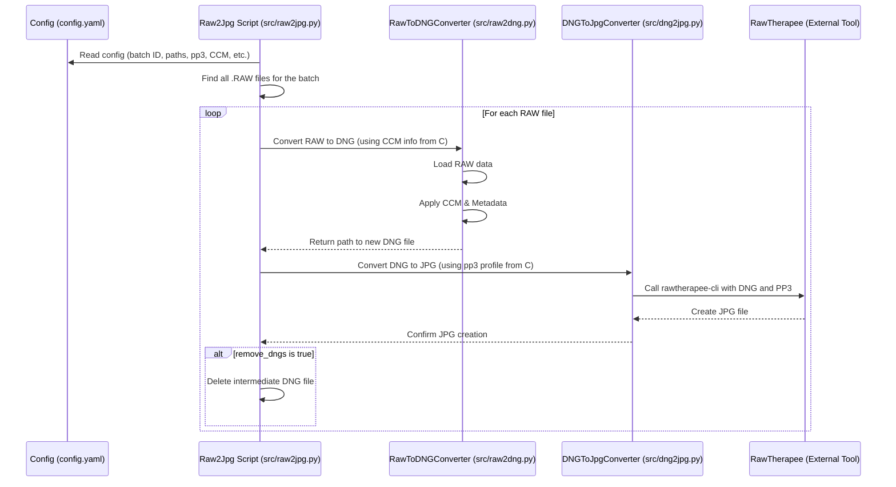

# Chapter 1: RAW Image Processing & Conversion (RAW -> DNG -> JPG)

Welcome to the SemiF-Preprocessing project! This tutorial will guide you through the different stages involved in processing the image data collected by our semi-field phenotyping system.

Let's start at the very beginning: the images captured by the camera.

## What Problem Are We Solving?

Imagine you're a photographer using a high-end digital camera. Instead of saving photos directly as JPEGs (like your phone might), you save them in a special "RAW" format. Think of a RAW file like a **digital negative** or **undeveloped film**. It contains *all* the information captured by the camera's sensor, without any processing or compression applied by the camera itself.

Our camera system also captures images in a `.RAW` format. These files hold the purest form of the image data, which is great for quality, but they have a few drawbacks:

1.  **Not Directly Viewable:** Most standard image viewers can't open RAW files directly.
2.  **Proprietary:** Different camera sensors might produce slightly different RAW formats.
3.  **Unprocessed:** The colors might look off, and the image might appear dark or lack contrast because it hasn't been "developed" yet.

Our goal in this first chapter is to take these raw, unprocessed digital negatives and convert them into a standard, viewable, and high-quality format (JPG) that we can use for further analysis, like detecting plants. We'll do this via an intermediate step using the DNG (Digital Negative) format.

The overall flow looks like this:

**RAW -> DNG -> JPG**

Let's break down how we achieve this.

## Key Concepts

### 1. RAW Files: The Digital Negative

As mentioned, the `.RAW` files from our camera contain the raw, unprocessed data directly from the image sensor. They hold a lot more information (like color depth and dynamic range) than a standard JPG, giving us more flexibility during processing. However, they need to be processed or "developed" before they look like a normal photograph.

### 2. DNG (Digital Negative): A Standardized Negative

Because RAW formats can differ between cameras, Adobe created the DNG (Digital Negative) format. Think of it as a standardized, open-format digital negative. Converting our camera's `.RAW` files to `.DNG` gives us a consistent starting point for further processing. It also allows us to embed important information (metadata) directly into the file.

### 3. Metadata Tags: Information About the Image

Metadata is "data about data". When we convert to DNG, we add important tags, like:

*   Camera Make and Model (`SVS_VISTEK`, `shr661CXGE`)
*   Image Dimensions (Width, Height)
*   Sensor Information (Color Filter Array pattern like `RGGB`)
*   Focal Length

This information is crucial for later steps, especially for [Structure from Motion (SfM) Pipeline](03_structure_from_motion__sfm__pipeline_.md). We define these tags in configuration files.

```yaml
# --- File: conf/dng_tags/default.yaml ---
# DNG metadata details
Make: SVS_VISTEK
Model: shr661CXGE
DNGVersion: "V1_4"
# ... (other tags)

# Basic image_details
ImageWidth: 13376     # image width in pixels
ImageLength: 9528     # image length in pixels
# ... (other tags)

# Photometric interpretation
PhotometricInterpretation: Color_Filter_Array
CFARepeatPatternDim: [2, 2]
CFAPattern: RGGB
# ... (other tags)
```

This snippet shows some of the metadata we embed using the `dng_tags/default.yaml` configuration. It ensures every DNG file knows which camera took it and the basic image properties.

### 4. Color Correction Matrix (CCM): Getting the Colors Right

RAW sensor data doesn't inherently know what "red," "green," or "blue" should look like accurately under specific lighting conditions. A Color Correction Matrix (CCM) is a mathematical tool (specifically, a matrix of numbers) used to transform the raw color values into more accurate, standardized colors (like the standard sRGB color space).

We calculate this matrix by taking pictures of a color chart with known color values (`rgb_target`) and seeing what color values the camera *actually* records (`rgb_sample`). The difference helps us build the correction matrix.

```yaml
# --- File: conf/ccm/NC_1740166530.yaml ---
# Example for one color patch on the chart
- number: 1
  name: dark skin
  rgb_target: [115, 82, 68]   # The *known* R, G, B values
  # ... (other color representations)
  rgb_sample: [21.3, 23.8, 10.0] # The R, G, B values *measured* by the camera
  # ... (other color representations)
# --- (continues for other color patches) ---
```

This configuration file (`ccm/NC_1740166530.yaml`) stores the target vs. measured colors from a specific calibration session. A script (`src/utils/calculate_ccm.py`) uses this data to compute the actual CCM numbers, which are then applied during the RAW to DNG conversion. This ensures that the colors in our images are consistent and realistic.

### 5. RawTherapee & PP3 Profiles: Developing the DNG to JPG

Once we have a DNG file with correct metadata and colors, we need to "develop" it into a standard, viewable JPG. We use a powerful open-source tool called **RawTherapee** for this. RawTherapee can apply various adjustments like brightness, contrast, sharpening, and noise reduction.

To ensure every DNG is developed consistently, we use a **RawTherapee Processing Profile (`.pp3` file)**. This file stores all the development settings. Think of it like a recipe for developing the photo.

```yaml
# --- File: conf/config.yaml ---
# ... (other settings)
rt_pp3_name: NC_2025-02-21 # Specifies which .pp3 profile to use
ccm_name: NC_1740166530 # Specifies which CCM calibration data to use
# ... (other settings)
raw2jpg:
  jpg_samples: 0         # How many sample JPGs to save for quick checks
  resize_factor: 0.25    # How much to shrink the sample JPGs
  remove_dngs: true      # Delete DNG files after creating JPGs?
# ... (other settings)

```

Our main configuration file (`config.yaml`) specifies which `.pp3` profile (`rt_pp3_name`) and which CCM calibration (`ccm_name`) to use for a particular batch of images. It also controls whether we keep the intermediate DNG files (`remove_dngs`).

## How It Works: Under the Hood

The entire process (RAW -> DNG -> JPG) is managed by the `raw2jpg` task, which you can see listed in the `tasks` section of `conf/config.yaml`. Let's visualize the steps when this task runs:



1.  **Initiation:** The main script `src/raw2jpg.py` starts, reading settings from `conf/config.yaml`.
2.  **Find RAWs:** It locates all the `.RAW` image files for the specified `batch_id`.
3.  **RAW to DNG:** For each `.RAW` file:
    *   It uses `src/raw2dng.py` (`RawToDNGConverter`).
    *   This loads the raw image data.
    *   It reads metadata settings from `conf/dng_tags/default.yaml`.
    *   It loads the appropriate Color Correction Matrix (CCM) based on `ccm_name` in `config.yaml` (using data from `conf/ccm/`) and applies it.
    *   It saves the result as a `.DNG` file in a temporary local directory.

    ```python
    # Simplified snippet from src/raw2jpg.py
    # Inside the conversion loop for one RAW file:
    
    # --- RAW to DNG ---
    # Initialize the converter with config settings
    raw2dng = RawToDNGConverter(self.cfg.dng_tags, # DNG tags config
                                self.batch_id,     # Current batch
                                self.lts_dir,      # Storage location info
                                self.developed_dng_dir, # Where to put DNGs
                                self.local_ccm_path) # Path to CCM file
    
    # Load the raw image data from the .RAW file
    raw_data = raw2dng.load_raw_image(raw_file)
    
    # Prepare DNG tags (metadata)
    dng_tags = raw2dng.configure_dng_tags()
    
    # Perform the conversion and save the .DNG file
    dng_file = raw2dng.convert_to_dng(raw_data, dng_tags, raw_file)
    log.debug(f"Converted RAW to DNG: {dng_file.name}")
    ```

4.  **DNG to JPG:** For each newly created `.DNG` file:
    *   It uses `src/dng2jpg.py` (`DNGToJpgConverter`).
    *   This script first checks if RawTherapee is installed using `scripts/validate_rawtherapee.sh`.
    *   It then calls the `rawtherapee-cli` command-line tool.
    *   It tells RawTherapee to use the `.DNG` file as input, apply the settings from the specified `.pp3` file (`rt_pp3_name` from `config.yaml`), and save the output as a high-quality JPG (quality 100).

    ```python
    # Simplified snippet from src/raw2jpg.py
    # Continuing inside the loop, after DNG is created:
    
    # --- DNG to JPG ---
    # Define where the final JPG will be saved (on network storage)
    jpg_output_path = self.lts_jpg_dst / f"{dng_file.stem}.jpg"
    
    # Initialize the DNG-to-JPG converter
    dng2jpg = DNGToJpgConverter(dng_file,         # Input DNG file path
                                jpg_output_path,    # Output JPG file path
                                self.local_pp3_path, # Path to the .pp3 profile
                                self.validate_rt_cli_script) # Script to find RawTherapee
    
    # Find the RawTherapee executable
    rt_cli = dng2jpg.validate_rawtherapee()
    
    # Perform the conversion using RawTherapee
    is_converted = dng2jpg.convert(rt_cli)
    log.info(f"Converted DNG to JPG: {jpg_output_path.name}")
    ```

5.  **Cleanup (Optional):** If `remove_dngs` is set to `true` in `config.yaml`, the intermediate `.DNG` file is deleted after the JPG has been successfully created.

This entire process runs in parallel for multiple images (using `ProcessPoolExecutor`) to speed things up, making use of multiple CPU cores.

## Conclusion

You've now learned about the crucial first step in the `SemiF-Preprocessing` pipeline: converting raw camera sensor data into usable JPG images. We saw how `.RAW` files act like digital negatives, why we convert them to the standardized `.DNG` format, and how we embed metadata and apply color correction (CCM) during this step. Finally, we use RawTherapee with predefined profiles (`.pp3`) to "develop" these DNGs into high-quality, consistent JPGs, ready for the next stage.

This conversion ensures that all subsequent processing steps start with clean, consistent, and visually accurate images.

In the next chapter, we'll take these generated JPG images and begin the process of identifying plants within them.

Next: [Chapter 2: Plant Detection](02_plant_detection_.md)

---

Generated by [AI Codebase Knowledge Builder](https://github.com/The-Pocket/Tutorial-Codebase-Knowledge)