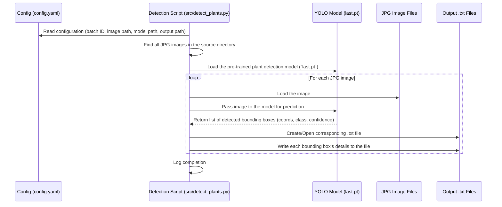

# Chapter 2: Plant Detection

Hi there! Welcome back. In [Chapter 1: RAW Image Processing & Conversion (RAW -> DNG -> JPG)](01_raw_image_processing___conversion__raw____dng____jpg__.md), we learned how the `SemiF-Preprocessing` project takes the raw, unprocessed photos from the camera and turns them into clean, high-quality JPG images that we can easily view and work with.

Now that we have these nice JPG images, what's next? We want to find the plants in them!

## What Problem Are We Solving?

Imagine you have hundreds, maybe thousands, of photos taken from our semi-field system. Each photo shows a plot of ground with various plants growing. Manually looking through every single photo to find every plant, figure out where it is, and maybe even identify its species would take a *huge* amount of time and effort.

This is where **Plant Detection** comes in. We want to automate this process. Think of it like hiring a super-fast, tireless assistant who can scan every photo and draw a little box around every plant they see.

The goal of this chapter is to understand how we use a smart computer program (a machine learning model) to automatically find the location and size of each plant within our processed JPG images.

## Key Concepts

Let's break down the important ideas behind plant detection.

### 1. Input: The JPG Images

The starting point for this step is the collection of JPG images we created in Chapter 1. These images are well-lit, have corrected colors, and are in a standard format that computer programs can easily read.

### 2. Machine Learning (ML) & AI: Teaching Computers to "See"

How can a computer possibly "see" a plant? We use a technique called **Machine Learning (ML)**, which is a type of Artificial Intelligence (AI).

Think of it like teaching a child. You show the child many, many pictures of plants and say "This is a plant." You also show pictures *without* plants and say "No plant here." Over time, the child (or the computer program) learns the patterns – the shapes, colors, and textures – that usually mean a plant is present.

Our plant detection system uses a pre-trained ML model. This means someone has already "taught" it using thousands of images containing plants.

### 3. YOLO: The Speedy Object Detector

There are many types of ML models. For finding objects in images quickly and efficiently, we use one called **YOLO**, which stands for "You Only Look Once".

Imagine trying to find all the apples in a picture. You could scan the picture slowly, section by section. Or, like YOLO, you could glance at the whole picture *once* and immediately point out where the apples are. YOLO is known for being fast and pretty accurate, which is great when we have lots of images to process.

### 4. The Detection Model File (`last.pt`)

Where is this "trained brain" stored? It's kept in a special file. In our project configuration, you'll often see a path pointing to a file like `last.pt`.

```yaml
# --- File: conf/paths/default.yaml ---
# ... (other paths)

# Detection model
local_detection_model: ${paths.data_dir}/semifield-tools/detection_model/last.pt
lts_detection_model: /mnt/research-projects/s/screberg/longterm_images2/semifield-tools/models/plant_detector/train22/weights/last.pt

# ... (other paths)
```

This configuration tells the plant detection script where to find the `last.pt` file, which contains all the learned patterns for identifying plants. The `local_detection_model` is a copy on your machine, while `lts_detection_model` might be the master copy on network storage.

### 5. Bounding Boxes: Drawing Boxes Around Plants

When the YOLO model finds a plant, how does it tell us *where* it is? It uses **bounding boxes**.

A bounding box is simply a rectangle drawn around the detected object. It's defined by a set of coordinates, typically:

*   The position of the center of the box (x, y coordinates).
*   The width and height of the box.

Imagine a photo as a grid. A bounding box tells us: "The plant is inside the rectangle that starts at this grid point, and has this width and this height."

### 6. Output: Label Files (`.txt`)

For each JPG image processed, the plant detection step creates a corresponding text file (`.txt`) with the same name (e.g., for `image123.jpg`, it creates `image123.txt`). This text file contains the bounding box information for *all* the plants found in that image.

Each line in the text file usually represents one detected plant and contains:

*   A number representing the *class* of the object (e.g., 0 might stand for "plant").
*   The bounding box coordinates (center x, center y, width, height), usually normalized (meaning they are fractions of the image width/height, between 0 and 1).
*   A *confidence score* (a number between 0 and 1 indicating how sure the model is that it found a plant).

Example line in `image123.txt`:
`0 0.5123 0.6789 0.055 0.082 0.92`
This could mean: Class 0 (plant), centered at (51.2% across, 67.9% down), width 5.5% of image width, height 8.2% of image height, with 92% confidence.

## How It Works: Using the Plant Detector

Running the plant detection is straightforward within the `SemiF-Preprocessing` pipeline.

1.  **Enable the Task:** Make sure `detect_plants` is included in the `tasks` list in your main configuration file (`conf/config.yaml`).

    ```yaml
    # --- File: conf/config.yaml ---
    # ... (other settings)

    tasks:
      - sync_from_remote
      - raw2jpg # Creates the JPGs
      # - update_exif # Example of another task
      # - autosfm   # Example of another task
      - detect_plants # <<< Make sure this is listed!
      - merge_overlapping_bboxes
      # ... (other tasks like merge, label, report)

    # ... (other settings like paths, model info)
    ```

2.  **Run the Pipeline:** When you execute the main pipeline script, if `detect_plants` is in the task list, it will automatically run after the necessary preceding steps (like creating the JPGs).

**Input:** The JPG images located in the batch's image directory (e.g., `data/longterm_images2/semifield-developed-images/YOUR_BATCH_ID/images/`).
**Output:** Text files (`.txt`) containing bounding box coordinates, saved to a specific output directory, usually within the batch folder (e.g., `data/longterm_images2/semifield-developed-images/YOUR_BATCH_ID/plant-detections/labels/`).

## Under the Hood: The `detect_plants.py` Script

What happens when the `detect_plants` task runs? It executes the script `src/detect_plants.py`. Let's look at the simplified flow:



1.  **Initialization:** The `detect_plants.py` script starts and reads settings from `conf/config.yaml`, finding where the JPG images are, where the YOLO model (`last.pt`) is, and where to save the results.
2.  **Load Model:** It loads the powerful YOLO model into memory using the `ultralytics` library.
3.  **Image Loop:** It goes through each JPG image in the specified input folder.
4.  **Prediction:** For each image, it feeds the image data to the loaded YOLO model. The model analyzes the image ("looks once") and identifies potential plants.
5.  **Get Results:** The model outputs a list of detections for that image. Each detection includes the class (plant), the bounding box coordinates, and a confidence score.
6.  **Save Results:** The script takes these detections and writes them into a plain text file (`.txt`) that has the same name as the image file, saving it in the designated output directory.

Here's a simplified peek at the main part of the `src/detect_plants.py` script:

```python
# --- File: src/detect_plants.py ---
import logging
from pathlib import Path
import hydra
from omegaconf import DictConfig
from ultralytics import YOLO # The library that handles YOLO models

log = logging.getLogger(__name__)

# (Helper functions like 'predict' are defined elsewhere in the file)

@hydra.main(version_base="1.3", config_path="../conf", config_name="config")
def main(cfg: DictConfig):
    log.info(f"Starting detection for batch {cfg.batch_id}")

    # 1. Get paths from configuration
    # Example: '.../YOUR_BATCH_ID/images'
    source = Path(cfg.paths.lts_locations[-1]) / "semifield-developed-images" / cfg.batch_id / "images"
    # Example: '.../data/semifield-tools/detection_model/last.pt'
    model_path = Path(cfg.paths.local_detection_model)
    # Example: '.../YOUR_BATCH_ID/' (output goes inside this)
    save_dir = Path(cfg.paths.batch_dir)
    save_dir.mkdir(parents=True, exist_ok=True) # Ensure output dir exists

    # Check if inputs exist
    if not source.exists():
        log.error(f"Source path {source} does not exist.")
        raise FileNotFoundError(f"Source path {source} does not exist.")
    if not model_path.exists():
        log.error(f"Model path {model_path} does not exist.")
        raise FileNotFoundError(f"Model path {model_path} does not exist.")

    try:
        # 2. Prepare options for the prediction function
        opt = {
            "model_path": str(model_path),
            "source": source,
            "batch_name": cfg.batch_id, # Used for organizing output
            "save_dir": save_dir
        }

        # 3. Load the model and run detection (simplified call)
        log.info(f"Loading model from {model_path}")
        model = YOLO(model_path) # Load the 'brain'
        log.info(f"Running detection on images in {source}")
        # This runs detection and saves .txt files automatically
        model.predict(source=source, project=str(save_dir), name='plant-detections', save_txt=True, save=False, save_conf=True)

        log.info("Detection completed.")
    except Exception as e:
        log.error(f"An error occurred during detection: {e}", exc_info=True)
        raise

if __name__ == "__main__":
    main()
```

This script essentially acts as a conductor: it reads the plan (config), gets the orchestra members ready (loads the YOLO model and finds the images), and then tells the `ultralytics` library's `YOLO` object to perform the detection and save the results (`.txt` files with bounding boxes).

## Conclusion

Great job! You've now learned how the `SemiF-Preprocessing` pipeline uses a smart AI assistant (a YOLO machine learning model) to automatically scan our processed JPG images and find plants. You understand that it draws bounding boxes around the detected plants and saves this location information into simple text files.

This automatic detection saves a massive amount of manual effort and provides crucial data – the locations of plants – that we'll use in later steps.

In the next chapter, we'll shift gears slightly and explore how we use these images (and information about where the camera was) to build a 3D model of the scene.

Next: [Chapter 3: Structure from Motion (SfM) Pipeline](03_structure_from_motion__sfm__pipeline_.md)

---

Generated by [AI Codebase Knowledge Builder](https://github.com/The-Pocket/Tutorial-Codebase-Knowledge)