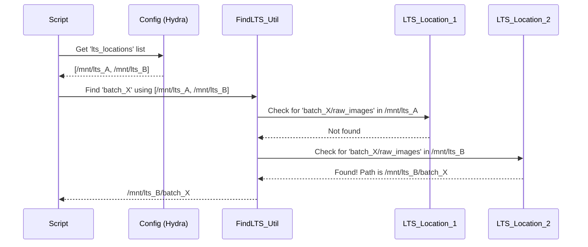

# Chapter 3: Data Synchronization and Path Management

In [Chapter 2: Configuration Management (Hydra)](02_configuration_management__hydra__.md), we saw how Hydra acts as our project's "master control panel," allowing us to define settings, including paths to our data. Now, let's explore how `SemiF-Preprocessing` actually uses these path settings to find, organize, and move data around. This chapter is all about the "logistics and warehousing" of our image processing factory!

Imagine you're working with a new batch of drone images, say from a field named `TX_FRUITVALE_2024-10-26`.
*   The **raw images** are stored on a central, shared server (we'll call this Long-Term Storage, or LTS).
*   Your computer (local machine) is where the actual image processing happens.
*   You also need certain **helper files**, like a plant detection model or specific camera color profiles, which are also kept up-to-date on the LTS.
*   Once processing is done, you want to save the **results** (like corrected images, 3D models, and reports) back to the LTS for safekeeping and sharing.

How does the system know where to find the raw images on the LTS? How does it ensure your local helper files are the latest versions? And where do the final results go? This is where **Data Synchronization and Path Management** comes in.

It solves these key problems:
1.  **Knowing Where Files Live:** Defining clear, consistent locations for data, whether it's on your local machine or on a shared server.
2.  **Keeping Things Tidy:** Organizing data for each batch in a structured way.
3.  **Moving Data Efficiently:** Handling the transfer of files between your local processing environment and the LTS.
4.  **Staying Up-to-Date:** Ensuring that critical files (like models or configurations) used in processing are the correct versions.

Think of this system as the **logistics and warehousing department** for `SemiF-Preprocessing`. It doesn't do the image processing itself, but it makes sure all the "raw materials" (images, helper files) get to the "factory floor" (your processing scripts) and the "finished products" (results) are stored correctly in the "warehouse" (LTS).

## Knowing Where Things Are: Path Management with Hydra

As we learned in [Chapter 2: Configuration Management (Hydra)](02_configuration_management__hydra__.md), Hydra helps us define paths in configuration files. The most important one for paths is `conf/paths/default.yaml`.

Let's look at a tiny snippet of how paths might be defined there:

```yaml
# conf/paths/default.yaml (simplified snippet)

workdir: /home/user/SemiF-Preprocessing # Your project's main folder
data_dir: ${paths.workdir}/data/        # Local data storage
developed_dir: ${paths.data_dir}/longterm_images2/semifield-developed-images # Base for local processed batches
batch_dir: ${paths.developed_dir}/${batch_id} # Specific directory for the current batch

lts_locations: # List of possible shared server (LTS) base paths
  - /mnt/research-projects/s/screberg/longterm_images
  - /mnt/research-projects/s/screberg/GROW_DATA

# Path to a plant detection model on LTS
lts_detection_model: /mnt/research-projects/s/screberg/longterm_images2/semifield-tools/models/plant_detector/train22/weights/last.pt
# Where to keep the local copy of the model
local_detection_model: ${paths.data_dir}/semifield-tools/detection_model/last.pt
```

*   `workdir`: The main folder where your `SemiF-Preprocessing` project code lives.
*   `data_dir`: A general folder on your local machine for storing data related to the project.
*   `developed_dir`: A base directory on your local machine where processed data for different batches will be stored.
*   `batch_dir: ${paths.developed_dir}/${batch_id}`: This is a very important one! It uses **interpolation**. `${batch_id}` is a variable that gets replaced by the actual batch ID you're processing (e.g., `TX_FRUITVALE_2024-10-26`). So, if `batch_id` is `TX_FRUITVALE_2024-10-26`, then `batch_dir` automatically becomes `/home/user/SemiF-Preprocessing/data/longterm_images2/semifield-developed-images/TX_FRUITVALE_2024-10-26`. This is the main local "workspace" for that batch.
*   `lts_locations`: This is a list of base paths on the shared servers (NFS mounts) where raw data might be stored. The system can search through these.
*   `lts_detection_model` and `local_detection_model`: These define where a critical file (the detection model) is stored on the LTS and where its local copy should be.

When the pipeline runs for a specific `batch_id` (e.g., `python main.py batch_id=TX_FRUITVALE_2024-10-26`), Hydra uses these definitions to construct the exact paths needed. For example, if a script needs to save a corrected image, it might save it to `${paths.batch_dir}/images/corrected_image_001.jpg`.

### Finding Data on the Long-Term Storage (LTS)

Raw images for a batch are usually on one of the LTS servers. But which one? The project has a helper function, often called something like `find_lts_dir` (found in `src/utils/utils.py`), that helps with this.

Conceptually, `find_lts_dir` does this:
1.  You give it a `batch_id` (e.g., `TX_FRUITVALE_2024-10-26`).
2.  It knows the list of `lts_locations` from the configuration.
3.  It checks each `lts_location` to see if a folder for that `batch_id` (e.g., `/mnt/research-projects/s/screberg/longterm_images/semifield-upload/TX_FRUITVALE_2024-10-26`) exists and contains the expected raw image files.
4.  It returns the path to the correct LTS location if found.

This way, even if raw data organization on the LTS changes slightly, or if data is spread across multiple NFS mounts, the code can still find it as long as `lts_locations` is configured correctly.


This diagram shows a simplified idea of how `find_lts_dir` might work. It tries the first LTS location, doesn't find the data, then tries the second and succeeds.

## Keeping Helper Files Up-to-Date: Syncing from LTS to Local

Before we start processing a batch, we need to make sure certain essential "tools" or "ingredients" are available locally and are the latest versions. These could be:
*   Plant detection models (`.pt` files)
*   Species information files (`.json` files)
*   Camera color profiles or raw processing profiles (`.pp3` files)

These files are typically managed and updated on the LTS. The `SemiF-Preprocessing` pipeline has a mechanism to synchronize them to your local machine. This is often handled by a script like `src/sync_from_remote.py`, which might be run as part of a `sync` mode in your pipeline configuration.

```yaml
# conf/config.yaml (snippet)
modes:
  - sync      # Run the synchronization task first!
  - correct
  # ... other modes
```

The `sync_from_remote.py` script typically performs the following for each important file:

1.  **Gets Paths:** It reads the configured local path (e.g., `cfg.paths.local_detection_model`) and remote LTS path (e.g., `cfg.paths.lts_detection_model`) for a file.
2.  **Checks Remote:** It verifies that the remote file actually exists on the LTS. If not, it logs an error and might skip it.
3.  **Checks Local:**
    *   If the local file doesn't exist, it copies the file from the LTS to the local path.
    *   If the local file *does* exist, it compares it to the remote file. A common way to compare is by calculating a "fingerprint" (a hash, like SHA-256) for both files. If the fingerprints are different, the local file is outdated or corrupted.
4.  **Updates if Necessary:** If the local file is missing or different from the remote one, it gets replaced by copying the version from the LTS.

Let's look at a very simplified conceptual piece of `src/sync_from_remote.py`:

```python
# src/sync_from_remote.py (highly simplified concept)
import logging
from pathlib import Path
# shutil is a Python module for file operations like copying
import shutil 

log = logging.getLogger(__name__)

# This function would compare file contents (e.g., using hashes)
def files_are_identical(local_file: Path, remote_file: Path) -> bool:
    # ... (actual comparison logic is more complex) ...
    if not local_file.exists(): return False
    # For simplicity, let's pretend they are different if local is older
    # Real check is based on content hash.
    return local_file.stat().st_mtime >= remote_file.stat().st_mtime 

def update_file_if_needed(local_path_str: str, remote_path_str: str):
    local_file = Path(local_path_str)
    remote_file = Path(remote_path_str)

    if not remote_file.exists():
        log.error(f"Remote file {remote_file} missing! Cannot sync.")
        return

    if not local_file.exists():
        log.warning(f"Local file {local_file} missing. Copying from remote...")
        # Ensure parent directory exists
        local_file.parent.mkdir(parents=True, exist_ok=True)
        shutil.copy2(remote_file, local_file) # Copy from remote to local
    elif not files_are_identical(local_file, remote_file):
        log.warning(f"Local file {local_file} is outdated. Updating...")
        shutil.copy2(remote_file, local_file) # Replace local with remote
    else:
        log.info(f"Local file {local_file} is up-to-date.")

# In the main part of the script, called by Hydra:
# def main(cfg: DictConfig):
#     log.info("Starting file synchronization...")
#     update_file_if_needed(cfg.paths.local_detection_model, cfg.paths.lts_detection_model)
#     update_file_if_needed(cfg.paths.species_info, cfg.paths.lts_species_info)
#     # ... and so on for other important files ...
#     log.info("File synchronization complete.")
```
In this simplified example:
*   `update_file_if_needed` takes the local and remote paths (which come from the Hydra `cfg` object).
*   It checks if the remote file exists.
*   If the local file is missing or `files_are_identical` returns `false` (meaning they are different), it copies the file from the remote path to the local path using `shutil.copy2`.
*   The actual `sync_from_remote.py` uses robust methods like SHA-256 hashing in its `files_are_identical` check.

This ensures that before any processing tasks like [Image File Conversion (RAW to JPG)](05_image_file_conversion__raw_to_jpg_.md) or [Bounding Box Processing and Remapping](09_bounding_box_processing_and_remapping_.md) run, they are using the correct, centrally-managed versions of any necessary auxiliary files.

## Storing Your Hard Work: Moving Processed Data to LTS

Once the pipeline has run its course for a batch – images are corrected, analyses are done, reports are generated – these valuable results need to be stored safely in the Long-Term Storage (LTS). This is typically handled by a task within the `deliver` mode, often involving a script like `src/tasks/deliver_utils/move_data.py`.

This "move data" step usually does the following:
1.  **Identifies Local Results:** It knows where the processed data for the current batch is stored locally (e.g., in `cfg.paths.batch_dir`). This could include:
    *   Corrected JPG or PNG images.
    *   Metadata files.
    *   AutoSfM outputs ([Chapter 7: AutoSfM (Structure from Motion) Pipeline](07_autosfm__structure_from_motion__pipeline_.md)).
    *   Generated reports ([Chapter 10: Automated Reporting and Issue Tracking](10_automated_reporting_and_issue_tracking_.md)).
2.  **Determines LTS Destination:** It figures out the correct destination path on the LTS for this batch's results. This often involves using `find_lts_dir` or a similar utility to get the base LTS path for the batch, and then appending a standard subfolder like `semifield-developed-images/<batch_id>`.
3.  **Copies Data:** It copies the relevant files and folders from the local processing directory to the LTS destination.
4.  **Cleanup (Optional):** After successfully copying data to LTS, it might clean up the temporary local `batch_dir` to save disk space. This is what the `CleanUpLocalTemp` class in `move_data.py` helps with.

Let's look at a conceptual simplification of moving data:

```python
# src/tasks/deliver_utils/move_data.py (highly simplified concept)
import logging
from pathlib import Path
import shutil # For file operations

log = logging.getLogger(__name__)

# (cfg would be the Hydra configuration object)
# (batch_id would be like 'TX_FRUITVALE_2024-10-26')

# def move_batch_results_to_lts(cfg, batch_id):
#     # 1. Define local source paths (derived from cfg.paths.batch_dir)
#     local_batch_dir = Path(cfg.paths.batch_dir) # e.g., /home/user/SemiF-Preprocessing/data/.../TX_FRUITVALE_2024-10-26
#     local_metadata_dir = local_batch_dir / "metadata"
#     local_inspection_dir = local_batch_dir / "inspection"
#     # ... other result folders ...

#     # 2. Determine LTS destination path
#     # This would use a utility like find_lts_dir to get the base LTS path for the batch
#     # and then construct the full destination path.
#     # For example: lts_base_path = find_lts_dir(batch_id, cfg.paths.lts_locations, developed=True)
#     lts_destination_for_batch = Path(f"/mnt/research-projects/s/screberg/longterm_images2/semifield-developed-images/{batch_id}")
    
#     # Ensure destination parent directories exist
#     lts_destination_for_batch.mkdir(parents=True, exist_ok=True)

#     # 3. Copy data
#     if local_metadata_dir.exists():
#         destination_metadata = lts_destination_for_batch / "metadata"
#         shutil.copytree(str(local_metadata_dir), str(destination_metadata), dirs_exist_ok=True)
#         log.info(f"Copied metadata to {destination_metadata}")
    
#     if local_inspection_dir.exists():
#         destination_inspection = lts_destination_for_batch / "inspection"
#         shutil.copytree(str(local_inspection_dir), str(destination_inspection), dirs_exist_ok=True)
#         log.info(f"Copied inspection results to {destination_inspection}")
    
#     # ... copy other results ...

#     # 4. Cleanup local (conceptual - actual cleanup is more careful)
#     # if all_copied_successfully:
#     #    shutil.rmtree(local_batch_dir) 
#     #    log.info(f"Cleaned up local directory: {local_batch_dir}")
```
In this simplified view:
*   It constructs paths for local results and the LTS destination using the `batch_id` and configured base paths.
*   `shutil.copytree` is used to copy entire directories (like `metadata` or `inspection` results). `dirs_exist_ok=True` means it won't complain if the destination directory already exists, and will overwrite content.
*   The actual `move_data.py` script has more robust checks (like `can_remove_local_dir`) before deleting local data to ensure everything was transferred correctly.

## The Journey of Data: A Batch Processing Example

Let's trace the data flow for our example batch `TX_FRUITVALE_2024-10-26`, assuming we run `sync`, `correct` (an image processing task), and `deliver` modes.

```mermaid
sequenceDiagram
    participant User
    participant "Orchestrator (main.py)"
    participant "Sync Module (sync_from_remote.py)"
    participant "Local Filesystem"
    participant "LTS (Shared Server)"
    participant "Correct Module (e.g., image correction)"
    participant "Deliver Module (move_data.py)"

    User->>"Orchestrator (main.py)": Run batch `TX_FRUITVALE_2024-10-26` with modes: `sync, correct, deliver`
    "Orchestrator (main.py)"->>"Sync Module (sync_from_remote.py)": Execute 'sync' task
    "Sync Module (sync_from_remote.py)"->>"LTS (Shared Server)": Check for `lts_detection_model`
    alt Remote model newer or local missing
        "LTS (Shared Server)"-->>"Sync Module (sync_from_remote.py)": Model file
        "Sync Module (sync_from_remote.py)"->>"Local Filesystem": Save/Update `local_detection_model`
    end
    "Sync Module (sync_from_remote.py)"-->>"Orchestrator (main.py)": Sync done

    "Orchestrator (main.py)"->>"Correct Module (e.g., image correction)": Execute 'correct' task
    Note over "Correct Module (e.g., image correction)": Reads raw images (path possibly found via `find_lts_dir` or already local from a previous step not shown), uses `local_detection_model`.
    "Correct Module (e.g., image correction)"->>"Local Filesystem": Saves corrected images to `batch_dir/images`
    "Correct Module (e.g., image correction)"->>"Local Filesystem": Saves metadata to `batch_dir/metadata`
    "Correct Module (e.g., image correction)"-->>"Orchestrator (main.py)": Correction done

    "Orchestrator (main.py)"->>"Deliver Module (move_data.py)": Execute 'deliver' task
    "Deliver Module (move_data.py)"->>"Local Filesystem": Read results from `batch_dir`
    "Deliver Module (move_data.py)"->>"LTS (Shared Server)": Copy `batch_dir/metadata` to LTS path for `TX_FRUITVALE_2024-10-26`
    "Deliver Module (move_data.py)"->>"LTS (Shared Server)": Copy `batch_dir/images` to LTS path
    Note over "Deliver Module (move_data.py)": May also clean up local `batch_dir` after successful copy.
    "Deliver Module (move_data.py)"-->>"Orchestrator (main.py)": Delivery done
    "Orchestrator (main.py)"-->>User: Pipeline finished for `TX_FRUITVALE_2024-10-26`
```

1.  **You start the pipeline** for `batch_id=TX_FRUITVALE_2024-10-26` and include `sync`, `correct`, and `deliver` in your `modes`.
2.  **Sync Module:** The `sync_from_remote.py` (or similar) runs. It checks if `local_detection_model` is up-to-date with `lts_detection_model`. If not, it downloads the latest version from LTS to your local machine.
3.  **Correct Module:** This image processing task (which we'll explore more in [Chapter 4: Image Processing Task Module](04_image_processing_task_module_.md)) runs. It accesses raw images (perhaps directly from an LTS path determined by `find_lts_dir`, or from a local copy if a download step occurred earlier). It uses the now up-to-date `local_detection_model`. It saves its output (corrected images, metadata JSONs) into the local `batch_dir` (e.g., `/home/user/SemiF-Preprocessing/data/longterm_images2/semifield-developed-images/TX_FRUITVALE_2024-10-26/images` and `.../metadata`).
4.  **Deliver Module:** The `move_data.py` script runs. It takes the contents of the local `batch_dir` (like the `images` and `metadata` subfolders) and copies them to the designated long-term storage location for `TX_FRUITVALE_2024-10-26` on the LTS server. Optionally, it might then remove the temporary files from your local `batch_dir`.

This careful management of paths and data movement ensures that the pipeline uses the correct inputs and that all valuable outputs are safely stored and organized.

## Conclusion

You've now seen how `SemiF-Preprocessing` handles its "logistics and warehousing" through **Data Synchronization and Path Management**. You've learned:

*   How **Hydra configurations** (especially `conf/paths/default.yaml`) define where data should be, both locally and on Long-Term Storage (LTS).
*   The importance of the `batch_id` in creating specific, organized **local working directories** (`batch_dir`).
*   How the system **finds data on LTS** using configured locations and helper utilities.
*   The process of **synchronizing essential helper files** (like models) from LTS to your local machine to ensure you're using the latest versions (`sync` mode).
*   How **processed results are moved** from your local machine back to LTS for safekeeping and sharing (`deliver` mode).

This underlying framework of managing file locations and movements is crucial for automating complex processing workflows. Without it, each step would need to manually figure out where its inputs are and where its outputs should go, leading to a messy and error-prone system.

Now that we understand how the pipeline is orchestrated, how its settings are managed, and how data is moved around, we're ready to look at the actual "specialized teams" that do the image processing work.

Next up: [Chapter 4: Image Processing Task Module](04_image_processing_task_module_.md)

---

Generated by [AI Codebase Knowledge Builder](https://github.com/The-Pocket/Tutorial-Codebase-Knowledge)
