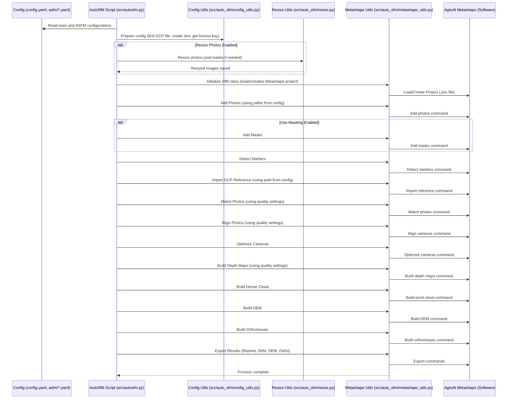

# Chapter 3: Structure from Motion (SfM) Pipeline

Hello again! In [Chapter 2: Plant Detection](02_plant_detection_.md), we saw how the `SemiF-Preprocessing` pipeline uses AI to automatically find plants in our 2D images and draw boxes around them. That gave us information *within* each flat photo.

But what if we want to see the scene in 3D? Or create a detailed, top-down map of the entire plot? That's where the Structure from Motion (SfM) pipeline comes in!

## What Problem Are We Solving?

Imagine you took many photos of a plant plot from slightly different angles as the camera moved across it. Each photo is just a flat, 2D view. How can we use these photos to understand the 3D shape and layout of the plot?

Think about how your own eyes work. You have two eyes, each seeing a slightly different view. Your brain combines these views to perceive depth and understand the 3D world around you.

The SfM pipeline does something similar with the camera photos. It takes dozens or hundreds of overlapping 2D JPG images (the ones we prepared in [Chapter 1: RAW Image Processing & Conversion (RAW -> DNG -> JPG)](01_raw_image_processing___conversion__raw____dng____jpg__.md)) and uses clever geometry to reconstruct a 3D representation of the scene.

The goal is to create useful 3D data products like:

*   **Dense Point Clouds:** Millions of tiny points in 3D space, like a digital cloud outlining the scene.
*   **Textured 3D Models:** A solid 3D surface (mesh) with the photo textures wrapped around it, like a realistic digital sculpture.
*   **Digital Elevation Models (DEMs):** A map showing the height of the ground and objects, like a topographical map.
*   **Orthomosaics:** A single, super-detailed top-down image of the entire plot, stitched together from all the photos and corrected for perspective distortion. It's like a perfect aerial photograph or map.

These outputs are incredibly valuable for measuring plant heights, canopy volume, or just getting a precise overview of the experimental plot.

## Key Concepts

Let's break down the magic behind SfM.

### 1. Input: Overlapping JPG Images

The process starts with the collection of high-quality JPG images created in Chapter 1. Crucially, these images must *overlap* – meaning each part of the scene should be visible in multiple photos taken from different positions. Our camera system is designed to ensure this overlap as it moves.

### 2. The SfM Idea: Finding Common Points

How does the software figure out the 3D structure?
*   It looks for distinctive features (like corners, textures) in each image.
*   It then matches the *same* features across different photos. If the corner of a specific leaf appears in Photo A and Photo B, the software knows those photos show the same part of the scene.
*   By finding thousands of these common points across many overlapping photos, and knowing a bit about the camera (like its focal length from Chapter 1's metadata), the software can calculate:
    *   Where the camera was positioned and oriented for each photo.
    *   The 3D coordinates (X, Y, Z) of those common points in the scene.

This initial set of 3D points is often called a "sparse point cloud".

### 3. Agisoft Metashape: The 3D Workshop

Doing all these calculations is complex! We use a specialized commercial software called **Agisoft Metashape**. Think of it as a digital workshop packed with tools specifically designed for SfM photogrammetry (the science of making measurements from photographs). Our pipeline scripts will automatically control Metashape to perform the necessary steps.

*Note: Metashape requires a license. The path to the license key is configured in the project.*

### 4. Ground Control Points (GCPs): Anchoring to Reality

Imagine building a 3D model, but it's just floating in space. We don't know exactly where it is, how big it is, or which way is North. To fix this, we use **Ground Control Points (GCPs)**.

These are special markers (in our case, circular coded targets) placed in the scene *before* taking photos. We know their *exact* real-world coordinates (like latitude, longitude, and elevation, or precise local X, Y, Z) measured with high accuracy.

Metashape can automatically detect these coded markers in the photos. We then provide a reference file (`.csv`) listing the known coordinates for each marker ID.

```csv
# --- Example snippet from a marker reference file (e.g., data/semifield-utils/autosfm/GroundControlPoints/cool_season_covers_2024_2025/MD_gcp_reference.csv) ---
#label;Easting_m;Northing_m;Elevation_m
target 1;398957.685;4301961.077;124.462
target 2;398957.694;4301961.307;124.469
target 3;398957.913;4301961.313;124.465
# ... (more targets)
```

By matching the detected markers to their known coordinates, Metashape can:
*   **Scale** the model correctly (e.g., ensure 1 meter in the model equals 1 meter in reality).
*   **Orient** the model correctly (e.g., align it with North).
*   **Position** the model accurately in the chosen coordinate system.
*   **Improve** the overall accuracy of the reconstruction.

### 5. Key Steps Inside Metashape (Automated)

Our pipeline script tells Metashape to perform a sequence of steps:

1.  **Add Photos:** Load the JPG images.
2.  **(Optional) Add Masks:** Load files that tell Metashape to ignore certain areas (like the blue robot frame).
3.  **Detect Markers:** Automatically find the GCP targets in the photos.
4.  **Import Reference:** Load the GCP coordinate file.
5.  **Align Photos:** Find common points, calculate camera positions, and create the initial sparse point cloud. This step also uses the GCPs to refine the alignment.
6.  **Build Depth Maps:** Create detailed depth information for each camera view.
7.  **Build Dense Cloud:** Use depth maps to generate millions of 3D points.
8.  **Build Model (Mesh):** Create a 3D surface connecting the dense cloud points.
9.  **(Optional) Build Texture:** Wrap the photo information onto the 3D model surface.
10. **Build DEM:** Create the elevation map based on the dense cloud or mesh.
11. **Build Orthomosaic:** Create the single, top-down, distortion-free map.
12. **Export Results:** Save the outputs (DEM, Ortho, reports, etc.).

### 6. Configuration: Quality vs. Speed

Building highly detailed 3D models takes a lot of computing power and time. Sometimes, we might need results quickly, even if they are slightly less detailed. We can control this trade-off using configuration files.

The `conf/asfm/` directory contains settings for the automated SfM (`autosfm`) process. `default.yaml` might have settings for high quality, while `fast.yaml` might use lower settings for speed.

```yaml
# --- File: conf/asfm/default.yaml (Snippet) ---
# ...
align_photos:
  downscale: 4 # Lower number = Higher accuracy alignment (slower)
# ...
depth_map:
  downscale: 4 # Lower number = Higher quality depth maps (slower)
# ...
```

```yaml
# --- File: conf/asfm/fast.yaml (Snippet) ---
# ...
align_photos:
  downscale: 8 # Higher number = Lower accuracy alignment (faster)
# ...
depth_map:
  downscale: 8 # Higher number = Lower quality depth maps (faster)
# ...
```

These `downscale` parameters tell Metashape to work with lower-resolution versions of the images during certain steps. A higher downscale factor (like 8) means using much smaller images, which is faster but less precise. A lower factor (like 1 or 2) uses more detail but takes longer.

The main `conf/config.yaml` file specifies which `asfm` profile to use:

```yaml
# --- File: conf/config.yaml (Snippet) ---
defaults:
  - _self_
  # ... other defaults
  - asfm: default # <<< Tells Hydra to load settings from conf/asfm/default.yaml
  # ...
```

You could change `asfm: default` to `asfm: fast` to run a quicker, lower-quality reconstruction.

## How to Use It

Running the SfM pipeline is handled by the `autosfm` task.

1.  **Enable the Task:** Make sure `autosfm` is listed in the `tasks` section of your main configuration file (`conf/config.yaml`), usually after `raw2jpg` and potentially `update_exif`.

    ```yaml
    # --- File: conf/config.yaml ---
    # ...
    tasks:
      - sync_from_remote
      - raw2jpg
      - update_exif # Adds camera info needed by SfM
      - autosfm     # <<< This runs the SfM pipeline
      - detect_plants
      # ... other tasks
    # ...
    ```

2.  **Configure Paths:** Ensure the paths in `conf/paths/default.yaml` are correct, especially the location of the marker reference files (`marker_dir`) and the various output directories (`autosfm`, `proj_dir`, `orthodir`, `demdir`, etc.). The script usually finds the correct marker file automatically based on the `batch_id` and `season`.

    ```yaml
    # --- File: conf/paths/default.yaml (Snippet) ---
    marker_dir: ${paths.semif_util_dir}/autosfm/GroundControlPoints
    # ... other paths ...
    autosfm: ${paths.batch_dir}/autosfm # Base output folder for SfM results
    proj_path: ${paths.autosfm}/project/${batch_id}.psx # Metashape project file
    gcp_ref: ${paths.autosfm}/reference/gcp_reference.csv # Exported GCP stats
    cam_ref: ${paths.autosfm}/reference/camera_reference.csv # Exported camera stats
    ortho_path: ${paths.orthodir}/orthomosaic.tif # Output orthomosaic
    dem_path: ${paths.demdir}/dem.tif # Output DEM
    pdf_report: ${paths.inspection_dir}/${batch_id}_asfm_report.pdf # Output PDF report
    ```

3.  **Run the Pipeline:** Execute the main pipeline script. If `autosfm` is in the task list, it will:
    *   **Input:** Read the JPG images from the batch's image directory (e.g., `data/.../YOUR_BATCH_ID/images/`) and the GCP reference file specified or found automatically.
    *   **Process:** Launch Metashape and run through the configured SfM steps (alignment, dense cloud, DEM, orthomosaic, etc.).
    *   **Output:** Save the results into the `autosfm` subdirectories defined in the configuration (e.g., `data/.../YOUR_BATCH_ID/autosfm/`). This includes the Metashape project file (`.psx`), the orthomosaic (`.tif`), the DEM (`.tif`), reference CSV files, and a PDF quality report.

## Under the Hood: The `autosfm.py` Script

When the `autosfm` task runs, it executes the main script `src/autosfm.py`. This script acts as a controller for Metashape.

**Simplified Flow:**



1.  **Setup:** `autosfm.py` starts, reads the configuration (`config.yaml` and the chosen `asfm/*.yaml`). It uses helper functions from `config_utils.py` to find the correct GCP file, create output directories, and get the Metashape license key.
2.  **(Optional) Resize:** If `resize_photos` is enabled in the config, it calls functions in `resize.py` to create downscaled copies of the images (and masks) in a temporary location for Metashape to use. This speeds up processing if lower quality is acceptable.
3.  **Initialize Metashape:** It creates an `SfM` object from `metashape_utils.py`. This object either loads an existing Metashape project file (`.psx`) for the batch or creates a new one.
4.  **Run Pipeline Steps:** The `autosfm.py` script then calls methods on the `SfM` object sequentially, based on which steps are enabled in the `asfm` configuration (e.g., `cfg.asfm.add_photos_and_masks`, `cfg.asfm.detect_markers`, `cfg.asfm.align`, etc.).
5.  **Metashape Interaction:** Each method in the `SfM` class (like `add_photos`, `detect_markers`, `align_photos`, `build_dem`, `build_ortomosaic`) translates the request into commands for the Metashape software using its Python API.
6.  **Export:** Finally, methods like `export_gcp_reference`, `export_camera_reference`, `export_report`, and export options within `build_dem`/`build_ortomosaic` are called to save the results to the directories specified in `conf/paths/default.yaml`.

Here's a tiny peek at how `autosfm.py` calls the `SfM` utility class methods:

```python
# --- File: src/autosfm.py (Simplified main function) ---
import logging
from omegaconf import DictConfig
# Import helper modules
from auto_sfm.config_utils import create_config, autosfm_present
from auto_sfm.metashape_utils import SfM
from auto_sfm.resize import resize_photo_diretory, resize_masks

log = logging.getLogger(__name__)

def main(cfg: DictConfig) -> None:
    # ... (Signal handling setup) ...

    # 1. Setup config (find GCP file, create dirs, etc.)
    cfg = create_config(cfg)

    # ... (Check if already run) ...

    # 2. (Optional) Resize images
    if cfg.asfm.resize_photos and cfg.asfm.downscale.enabled:
        log.info("Resizing images")
        resize_photo_diretory(cfg)
        # ... (resize masks if needed) ...

    # 3. Initialize pipeline (loads/creates Metashape project)
    log.info("Initializing SfM")
    pipeline = SfM(cfg) # Creates the SfM object from metashape_utils.py

    # 4. Run steps based on config flags
    if cfg.asfm.add_photos_and_masks:
        log.info("Adding photos")
        pipeline.add_photos() # Calls the add_photos method in SfM class
        # ... (add masks if needed) ...

    if cfg.asfm.detect_markers:
        log.info("Detecting markers")
        pipeline.detect_markers() # Calls detect_markers method

    if cfg.asfm.import_references:
        log.info("Importing references")
        pipeline.import_reference() # Calls import_reference method

    # --- Many more steps called similarly ---
    # e.g., pipeline.match_photos(), pipeline.align_photos(), etc.

    if cfg.asfm.build_dem and cfg.asfm.dem.enabled:
        log.info("Building DEM")
        pipeline.build_dem() # Calls build_dem method

    if cfg.asfm.build_ortho and cfg.asfm.orthomosaic.enabled:
        log.info("Building orthomosaic")
        pipeline.build_ortomosaic() # Calls build_ortomosaic method

    # ... (Export steps like pipeline.export_report()) ...

    log.info("AutoSfM Complete")
    return
```

And here's a glimpse of a method inside `metashape_utils.py` that interacts with Metashape:

```python
# --- File: src/auto_sfm/metashape_utils.py (Simplified SfM class method) ---
import logging
from pathlib import Path
import Metashape as ms # Import the Metashape Python API library

log = logging.getLogger(__name__)

class SfM:
    def __init__(self, cfg):
        # ... (Initialization loads config, paths, project file) ...
        self.doc = self.load_or_create_project() # self.doc holds the Metashape project
        self.cfg = cfg # Store config
        # ... (Store other settings like quality parameters) ...

    def load_or_create_project(self) -> ms.Document:
        # ... (Logic to open existing .psx or create new Metashape Document) ...
        doc = ms.Document()
        if self.project_path.exists():
             doc.open(str(self.project_path), read_only=False, ignore_lock=True)
        else:
             doc.addChunk()
             doc.save(str(self.project_path))
        return doc

    def add_photos(self):
        # Get list of photo file paths from the configured directory
        photo_dir = Path(self.cfg.paths.down_photos) # Or original photos if not downscaled
        photos = [str(x) for x in list(photo_dir.glob("*.jpg"))]
        log.info(f"Adding {len(photos)} photos to the project")
        if self.doc.chunk is None: # If project is empty, add a chunk
            self.doc.addChunk()
        # Tell Metashape to add the photos to the current chunk
        self.doc.chunk.addPhotos(photos)
        self.save_project() # Save the Metashape project file

    def build_ortomosaic(self, progress_callback=None): # progress_callback is optional
        log.info("Building Orthomosaic...")
        # Tell Metashape to build the orthomosaic using settings from config
        self.doc.chunk.buildOrthomosaic(
            surface_data=ms.ElevationData, # Use the DEM as the surface
            blending_mode=ms.MosaicBlending, # How to blend photos
            fill_holes=True,
            # ... other parameters from cfg.asfm.orthomosaic ...
            progress=progress_callback # For showing progress (optional)
        )
        # Save the project if auto-save is enabled
        if self.cfg.asfm.orthomosaic.autosave:
            self.save_project()
        # Export the orthomosaic if export is enabled
        if self.cfg.asfm.orthomosaic.export.enabled:
             self.doc.chunk.exportRaster(
                 path=str(self.cfg.paths.ortho_path), # Output path from config
                 source_data=ms.OrthomosaicData,
                 # ... other export options ...
             )

    def save_project(self):
        self.doc.save()

    # --- Many other methods like detect_markers, align_photos, build_dem, etc. ---
```

These snippets show how the Python scripts orchestrate the complex processing within the specialized Metashape software.

## Conclusion

Wow, that was a leap! We went from flat 2D images to reconstructing the 3D world. You've learned about the Structure from Motion (SfM) concept, how overlapping photos and Ground Control Points (GCPs) are used with Agisoft Metashape to build 3D models, point clouds, elevation maps (DEMs), and detailed top-down orthomosaics. You also saw how configuration files let us control the quality and speed of this process, and how the `autosfm` task automates these steps within the `SemiF-Preprocessing` pipeline.

These 3D products and orthomosaics are often key outputs for analysis. But what about the bounding boxes we detected in Chapter 2? How do we relate those 2D boxes to our plants, especially when boxes in different images might show the same plant? The next chapter tackles exactly that.

Next: [Chapter 4: Bounding Box Processing & Labeling](04_bounding_box_processing___labeling_.md)

---

Generated by [AI Codebase Knowledge Builder](https://github.com/The-Pocket/Tutorial-Codebase-Knowledge)