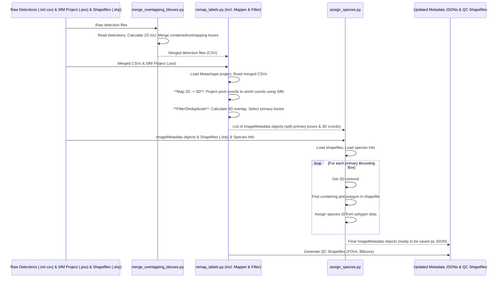

# Chapter 4: Bounding Box Processing & Labeling

Welcome back! In [Chapter 2: Plant Detection](02_plant_detection_.md), we used an AI model to draw boxes around potential plants in our 2D images. Then, in [Chapter 3: Structure from Motion (SfM) Pipeline](03_structure_from_motion__sfm__pipeline_.md), we created a 3D model of the scene and figured out exactly where the camera was for each photo.

Now, we have a bit of a puzzle:
*   We have lots of 2D bounding boxes, maybe multiple boxes in different photos showing the *same* plant.
*   These boxes are just coordinates on flat photos; they don't know their position in the real 3D world.
*   The boxes don't know *what kind* of plant they contain (e.g., corn, weed, cover crop).

This chapter is all about cleaning up this information, connecting it to the 3D world, and putting the right labels on everything.

## What Problem Are We Solving?

Imagine you're tracking wildlife with several cameras. You get pictures from different cameras showing what might be the same animal. You need to:
1.  **Consolidate:** Figure out which sightings actually belong to the *same* animal.
2.  **Clean Up:** Decide which photo gives the *best* view of that animal and discard blurry or partial views (redundant detections).
3.  **Locate:** Pinpoint the animal's location on a real map (not just on the photo).
4.  **Identify:** Put the correct species label on it (e.g., "Fox," "Deer").

That's exactly what we need to do with our plant bounding boxes! This "Bounding Box Processing & Labeling" step takes the raw detections and turns them into organized, meaningful data.

The goal is to refine the initial plant detections by:
*   Merging boxes that likely show the same plant.
*   Filtering out unnecessary or poor-quality boxes.
*   Calculating the real-world 3D coordinates for each plant box.
*   Assigning the correct species label based on where the plant is growing in the field.

## Key Concepts

Let's break down how we solve this puzzle.

### 1. Merging Overlapping Boxes (Initial Cleanup)

Sometimes, the plant detector might draw slightly different boxes around the same plant in a *single* image, or draw a box inside another box. The first step is often a simple merge based on overlap (Intersection over Union - IoU) *within the same image*. If two boxes overlap significantly, they are combined into one larger box. This simplifies the data before we do more complex steps.

*   **Script:** `src/merge_overlapping_bboxes.py`

### 2. Mapping 2D Boxes to 3D World Coordinates

This is where we connect the 2D detections ([Chapter 2: Plant Detection](02_plant_detection_.md)) with the 3D scene information ([Chapter 3: Structure from Motion (SfM) Pipeline](03_structure_from_motion__sfm__pipeline_.md)).

Remember how SfM calculated the precise 3D position and angle of the camera for each photo? And it created a 3D model of the ground? We use this information:
*   Take a 2D bounding box's corner coordinates (pixels on the image).
*   Use the camera's position and the 3D model.
*   Project a ray from the camera through the corner pixel onto the 3D model.
*   The point where the ray hits the 3D model gives us the real-world (X, Y, Z) coordinates for that corner.

Doing this for all corners gives us the bounding box's location and shape in the 3D world.

*   **Script:** `src/remap_labels.py` (specifically the `BBoxMapper` class inside)

### 3. Filtering Redundant Boxes (Deduplication)

Now that boxes have 3D coordinates, we can properly figure out which boxes from *different* images represent the same plant. If two boxes in 3D space overlap significantly, they likely correspond to the same physical plant.

But which box should we keep? We need to filter out the redundant ones. The `SemiF-Preprocessing` pipeline often selects the "primary" or "best" box based on rules like:
*   **Proximity to Camera:** The box captured when the camera was closest to the plant's 3D center might be clearer.
*   **Image Centrality:** Boxes closer to the center of the image might be less distorted.

Boxes deemed redundant are marked as not "primary".

*   **Script:** `src/filter_bboxes.py` (specifically the `BBoxFilter` class inside `remap_labels.py`)

### 4. Assigning Species Labels (Using Shapefiles)

Finally, we have clean, unique (primary) bounding boxes with known 3D locations. How do we label them with the correct plant species?

We use **Shapefiles**. A shapefile is like a digital map that outlines different areas or plots in the field. Each plot polygon in the shapefile has information attached to it, like the species that was planted there.

The process is simple:
1.  Take the 3D centroid (center point) of a primary bounding box.
2.  Check which plot polygon in the shapefile this 3D point falls inside.
3.  Retrieve the species information associated with that polygon.
4.  Assign the species ID (e.g., a numeric code or name like "GLMA4" for soybean) to the bounding box metadata.

*   **Script:** `src/assign_species.py`

## How It Works: Combining the Steps

These processing steps are typically run as separate tasks within the main pipeline execution ([Chapter 5: Pipeline Execution & Orchestration](05_pipeline_execution___orchestration_.md)).

1.  **Enable Tasks:** Ensure the relevant tasks are listed in your main configuration file (`conf/config.yaml`). The exact names might vary slightly, but look for tasks related to merging, remapping, filtering, and assigning species.

    ```yaml
    # --- File: conf/config.yaml ---
    # ... (other settings)

    tasks:
      # ... (Previous tasks like raw2jpg, detect_plants, autosfm) ...
      - merge_overlapping_bboxes # Initial 2D merge within images
      - remap_labels           # Includes 2D->3D mapping AND filtering/deduplication
      - assign_species         # Labels boxes based on shapefiles
      # ... (Subsequent tasks like reporting) ...

    # ... (Ensure paths to SfM project, shapefiles, species info are correct in conf/paths/default.yaml)
    ```

2.  **Run the Pipeline:** Execute the main pipeline script.

**Inputs:**
*   Bounding box data (often as `.csv` or `.txt` files from [Chapter 2: Plant Detection](02_plant_detection_.md)).
*   The Agisoft Metashape project file (`.psx`) generated by [Chapter 3: Structure from Motion (SfM) Pipeline](03_structure_from_motion__sfm__pipeline_.md).
*   Field layout shapefiles (`.shp`) defining plot boundaries and species.
*   Species information file (e.g., `species_info.json`) mapping species codes to names and IDs.

**Outputs:**
*   **Updated Metadata Files:** The primary output is usually a set of JSON files (often one per image) stored in a `metadata` directory within the batch folder. These files contain comprehensive information for each image, including camera details and a list of bounding boxes. Each bounding box annotation now includes:
    *   Local (2D pixel) coordinates.
    *   Global (3D world) coordinates.
    *   A flag indicating if it's the `is_primary` detection for that plant.
    *   The assigned `category_class_id` (species label).
    *   Lists of `overlapping_cutout_ids` to link detections of the same plant.
*   **Shapefiles:** Often, shapefiles visualizing the Field of View (FOV) of each image and the final, filtered 3D bounding boxes are generated for quality control.

## Under the Hood: The Processing Flow

Let's visualize the sequence of operations:



**Code Snippets Explained:**

1.  **Merging (`src/merge_overlapping_bboxes.py`):** This script reads the initial detection files (often converted to CSV) and uses functions like `iou` and `is_contained` to find boxes within the *same image* that overlap significantly or where one box is inside another. It merges these into a single bounding box.

    ```python
    # Simplified from src/merge_overlapping_bboxes.py
    def merge_bboxes_with_class(bboxes: List[Dict], iou_threshold: float = 0.5) -> List[Dict]:
        # ... (Graph setup to find connected/overlapping boxes) ...
        merged_boxes = []
        for component in nx.connected_components(G): # G is a graph of overlaps
            comp_boxes = [bboxes[i] for i in component]
            # Calculate the union of the box coordinates
            xmin = min(b['xmin'] for b in comp_boxes)
            # ... (calculate min ymin, max xmax, max ymax) ...
            # Keep track of the class (e.g., prefer 'colorchecker' if present)
            classes = [b['classname'] for b in comp_boxes]
            # ... (determine final classname, class ID, and confidence) ...
            merged_box = { 'xmin': xmin, # ... other fields ... }
            merged_boxes.append(merged_box)
        return merged_boxes

    # Main part reads CSV, calls merge_bboxes_with_class, saves new CSV
    # df = pd.read_csv(csv_path)
    # bboxes = df.to_dict(orient='records')
    # merged_bboxes = merge_bboxes_with_class(bboxes, iou_threshold=0.5)
    # merged_df = pd.DataFrame(merged_bboxes)
    # merged_df.to_csv(output_path, index=False)
    ```
    *Explanation:* This function takes a list of boxes for one image. It finds groups of boxes that overlap (using a graph `G`). For each group, it calculates a new box that encloses all of them and decides on the best label (e.g., if one box was 'colorchecker', the merged box is 'colorchecker').

2.  **Mapping 2D -> 3D (`src/remap_labels.py` - `BBoxMapper`):** This part uses the Metashape Python API to interact with the `.psx` project file created by the SfM step.

    ```python
    # Simplified from BBoxMapper._map_bbox in src/remap_labels.py
    import Metashape # Agisoft Metashape library

    def _map_bbox(self, bbox, image_id, chunk, surface, height, width):
        cam = self.camera_lookup.get(image_id) # Find the camera object in Metashape
        # ... (Error handling if camera not found) ...

        mapped_corners = []
        # Get 2D pixel coordinates (needs un-normalization)
        corner_coords = [
            (bbox.local_coordinates.top_left[0] * width, bbox.local_coordinates.top_left[1] * height),
            # ... (get other corners: top_right, bottom_left, bottom_right) ...
        ]

        for px, py in corner_coords:
            # Project a ray from camera center through pixel onto the 3D surface
            ray_target = cam.unproject(Metashape.Vector([px, py]))
            point_on_surface = surface.pickPoint(cam.center, ray_target)
            # ... (Error handling if projection fails) ...

            # Convert internal Metashape coordinates to the project's coordinate system (e.g., UTM)
            world_coord = chunk.transform.matrix.mulp(point_on_surface)
            geo_coord = chunk.crs.project(world_coord)
            mapped_corners.append([geo_coord.x, geo_coord.y]) # Store the X, Y world coordinates

        # Returns list like [[tl_x, tl_y], [tr_x, tr_y], [bl_x, bl_y], [br_x, br_y]]
        return [mapped_corners[0], mapped_corners[2], mapped_corners[1], mapped_corners[3]] # Adjust order
    ```
    *Explanation:* For each corner of the 2D box, this function uses Metashape's `unproject` and `pickPoint` tools. It simulates drawing a line from the camera's 3D position through the 2D pixel on the image until it hits the 3D ground model (`surface`). It then gets the real-world X, Y coordinates of that hit point.

3.  **Filtering/Deduplicating (`src/filter_bboxes.py`):** After mapping, this step compares boxes based on their 3D overlap and selects the primary one. (Note: In the current codebase, this logic is integrated within `src/remap_labels.py` after mapping).

    ```python
    # Simplified logic from BBoxFilter.select_best_bbox in src/filter_bboxes.py
    # (This logic is adapted inside src/remap_labels.py)
    def select_best_bbox(self):
        visited = set()
        primary_boxes = []
        primary_box_ids = set()

        for image in self.images: # self.images now contain BoundingBox objects with global_coordinates
            for box in image.annotations:
                if box.cutout_id in visited: continue

                # Find all boxes overlapping this one in 3D (using pre-calculated overlaps)
                all_overlapping_boxes = [box] + [self._get_box_by_id(bid) for bid in box.overlapping_cutout_ids]
                visited.update([b.cutout_id for b in all_overlapping_boxes])

                # Calculate distance from each box's 3D centroid to its camera's 3D position
                centers = np.array([self.image_map[b.image_id].camera_info.estimated_xyz for b in all_overlapping_boxes])
                centroids = np.array([b.global_coordinates.global_centroid for b in all_overlapping_boxes])
                distances = ((centroids - centers[:, :2])**2).sum(axis=-1) # Compare XY distance

                # The box with the minimum distance is chosen as primary
                best_idx = np.argmin(distances)
                best_box = all_overlapping_boxes[best_idx]
                best_box.is_primary = True

                # Add to list if not already added
                if best_box.cutout_id not in primary_box_ids:
                     primary_boxes.append(best_box)
                     primary_box_ids.add(best_box.cutout_id)
                
                # Mark others in the group as not primary
                for i, b in enumerate(all_overlapping_boxes):
                    if i != best_idx:
                        b.is_primary = False
    ```
    *Explanation:* This code looks at groups of bounding boxes that overlap in 3D. For each group, it calculates how far the center of the box (in 3D) was from the camera when the picture was taken. The box captured when the camera was closest is marked as `is_primary = True`, and all others in that group are marked `is_primary = False`.

4.  **Assigning Species (`src/assign_species.py`):** This script uses the `geopandas` library to work with shapefiles.

    ```python
    # Simplified from SpeciesAssigner._lookup_species_from_point in src/assign_species.py
    import geopandas as gpd
    from shapely.geometry import Point

    def _lookup_species_from_point(self, point: Point, bbox: dict, batch_id: str) -> dict:
        # self.polygons is a GeoDataFrame loaded from the shapefile
        # Check which polygon contains the point (bbox 3D centroid)
        contains_point = self.polygons["geometry"].contains(point)
        containing_polygon = self.polygons[contains_point]

        if not len(containing_polygon):
            # Handle cases where the point is outside any known plot
            log.warning(f"No polygon found for bbox {bbox['cutout_id']}. Using fallback.")
            return self.spec_dict["species"]["plant"] # Return default 'plant' info

        # Get species info stored in the polygon's attributes
        poly_species_code = containing_polygon["species"].values[0]

        # Look up full species details from our species_info dictionary
        species_details = self.spec_dict["species"].get(poly_species_code, self.spec_dict["species"]["plant"])
        return species_details

    # Main part iterates through metadata, gets 3D centroid (x, y), creates Point(x, y)
    # calls _lookup_species_from_point, and updates the bbox dictionary with the returned class_id.
    # metadata = self.read_json(filepath)
    # for bbox in metadata.get("annotations", []):
    #     if bbox.get("is_primary", False): # Only label primary boxes
    #         x, y = bbox["global_coordinates"]["global_centroid"]
    #         point = Point(x, y)
    #         species_info = self._determine_species(bbox, metadata["batch_id"]) # Calls lookup internally
    #         bbox["category_class_id"] = species_info.get("class_id")
    # self.save_json(filepath, metadata)
    ```
    *Explanation:* This function takes the 3D center point (`point`) of a primary bounding box. It checks which plot polygon in the loaded shapefile (`self.polygons`) contains this point. It then reads the species code (like "ZEA" for corn) attached to that polygon and uses it to look up the detailed species information (including the numeric `class_id`) from a master list (`self.spec_dict`). This `class_id` is then added to the bounding box's metadata.

## Conclusion

You've made it through the crucial cleanup and enrichment phase! We started with potentially messy, purely 2D bounding boxes from the detector. Now you understand how the `SemiF-Preprocessing` pipeline:
*   Merges simple overlapping boxes.
*   Uses the results from the [Structure from Motion (SfM) Pipeline](03_structure_from_motion__sfm__pipeline_.md) to map the 2D boxes into the 3D world.
*   Filters out redundant detections, keeping only the most representative ("primary") box for each plant.
*   Assigns an accurate species label to each primary box by checking its 3D location against field layout shapefiles.

This process transforms raw detections into organized, spatially referenced, and labeled data points, ready for analysis or further steps.

So, how do we actually run all these different steps (RAW conversion, detection, SfM, bounding box processing) together in the right order? The next chapter dives into how the entire pipeline is executed and managed.

Next: [Chapter 5: Pipeline Execution & Orchestration](05_pipeline_execution___orchestration_.md)

---

Generated by [AI Codebase Knowledge Builder](https://github.com/The-Pocket/Tutorial-Codebase-Knowledge)