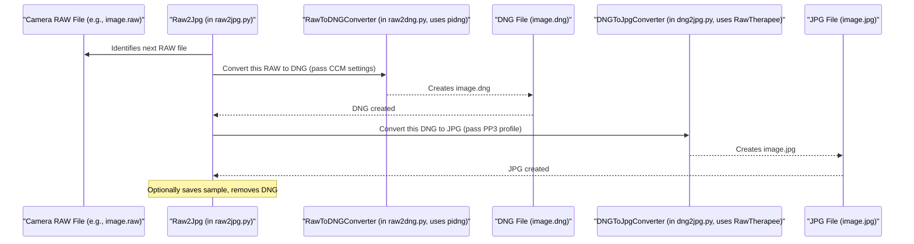

# Chapter 5: Image File Conversion (RAW to JPG)

Welcome to Chapter 5! In [Chapter 4: Image Processing Task Module](04_image_processing_task_module_.md), we learned how `SemiF-Preprocessing` organizes its work into "departments" or task modules, each handling a major stage of processing. We saw that each module, like the `correct` module, can perform a series of sub-tasks.

Now, we're going to zoom in on one very common and important sub-task, often the first step in image processing: **Image File Conversion (RAW to JPG)**.

Imagine you've just taken a lot of photos with a special scientific camera. These cameras often save images in a "RAW" format. Think of this process like visiting a photo development lab:
1.  You bring in your undeveloped **film negatives** (your camera's RAW files).
2.  The lab first creates a high-quality **master digital copy** from your negatives (these are called DNG files).
3.  Then, from this master copy, they produce easy-to-share **prints** (JPG files) that you can look at or send to others.

This chapter will explain how `SemiF-Preprocessing` does this digital "photo development."

## What's the Big Deal? RAW, DNG, and JPG Explained

When your camera captures an image, especially a scientific or high-quality one, it can save it in a few ways.

*   **RAW Files (Your "Film Negatives"):**
    *   These files (with extensions like `.CR2`, `.NEF`, `.ARW`, or sometimes just `.RAW`) are like the camera's "digital negatives."
    *   They contain the unprocessed, raw sensor data straight from the camera. This means they hold the maximum amount of information, which is great for scientific analysis or detailed editing.
    *   However, RAW files are often in a proprietary format (specific to the camera manufacturer). You might need special software to open them, and they are very large.

*   **DNG Files (Your "Master Digital Copy"):**
    *   DNG stands for **Digital Negative**. It's an open, publicly documented RAW image format created by Adobe.
    *   Converting proprietary RAW files to DNG is like creating a standardized, high-quality master copy. It's still a "negative" (it has lots of data) but in a more universally accessible format.
    *   The `SemiF-Preprocessing` project uses a tool called `pidng` (which itself often relies on the capabilities of `dcraw` behind the scenes) to convert your camera's specific RAW files into these DNG files.

*   **JPG Files (Your "Shareable Prints"):**
    *   JPG (or JPEG) is a very common image format you see everywhere on the web and in everyday use.
    *   JPG files are **compressed**, meaning they are much smaller in file size than RAW or DNG files. This makes them easy to share, view, and use in reports or presentations.
    *   However, this compression means some image information is lost (it's "lossy" compression). So, while JPGs are great for viewing, DNGs are better for archiving the original quality.
    *   In `SemiF-Preprocessing`, a powerful tool called `RawTherapee` is used to "develop" the DNG files into JPGs, applying various corrections and adjustments in the process.

So, the goal here is to take your camera's special RAW files, turn them into high-quality DNG masters, and then produce convenient JPG "prints" for general use.

## The Two-Step "Development" Process

This conversion happens in two main steps:

### Step 1: RAW to DNG (Creating the Master Copy)

*   **Input:** Your camera's proprietary RAW file (e.g., `IMG_0001.RAW`).
*   **Tool:** The system uses `pidng`, a Python library. This is handled by the `RawToDNGConverter` class within our project (you can find it in `src/tasks/correct_utils/raw2dng.py`).
*   **Process:** `pidng` reads the raw sensor data and other information (like camera model, settings) from your RAW file. It might also apply a **Color Correction Matrix (CCM)**. A CCM helps make the colors in the image look accurate, specific to your camera sensor. The name of this CCM file is often specified in your configuration (e.g., `cfg.ccm_name`).
*   **Output:** A DNG file (e.g., `IMG_0001.DNG`).

### Step 2: DNG to JPG (Producing the "Prints")

*   **Input:** The DNG file created in Step 1 (e.g., `IMG_0001.DNG`).
*   **Tool:** The system uses `RawTherapee`, a sophisticated open-source raw image processing program. This is handled by the `DNGToJpgConverter` class (in `src/tasks/correct_utils/dng2jpg.py`).
*   **Process:** `RawTherapee` takes the DNG file and applies a set of "development" instructions. These instructions are stored in a **processing profile file** (often with a `.pp3` extension). This profile tells RawTherapee how to adjust brightness, contrast, colors, sharpness, etc., to get a good-looking JPG. The name of this profile is specified in your configuration (e.g., `cfg.rt_pp3_name`).
*   **Output:** A JPG file (e.g., `IMG_0001.JPG`).

## How it Fits in the `SemiF-Preprocessing` Pipeline

As we saw in [Chapter 4: Image Processing Task Module](04_image_processing_task_module_.md), the overall pipeline is made of modules, and modules run sub-tasks. The "RAW to JPG" conversion is typically a sub-task named `raw2jpg` within the `correct` module.

You tell the pipeline to run this sub-task through the configuration file, usually `conf/config.yaml`.
Remember the `tasks` section?

```yaml
# conf/config.yaml (snippet)

tasks:
  # ... other modules ...
  correct:          # Sub-tasks for the 'correct' module
    - raw2jpg       # This is our RAW to JPG conversion sub-task!
    - update_exif   # Another sub-task (covered in Chapter 6)
  # ... other modules ...
```
When the `correct` module runs, it sees `raw2jpg` in its list of sub-tasks and executes the code responsible for this conversion.

## Key Settings: Your Instructions to the "Photo Lab"

You can control how this conversion happens using settings in your `conf/config.yaml` file, which you learned about in [Chapter 2: Configuration Management (Hydra)](02_configuration_management__hydra__.md). These settings are typically grouped under `raw2jpg` and some top-level keys:

```yaml
# conf/config.yaml (simplified snippet)

# Which batch of images are we working on?
batch_id: MY_FIELD_DAY_01 

# Settings specific to the RAW to JPG conversion sub-task
raw2jpg:
  jpg_samples: 5       # How many sample JPGs to create for a quick look (0 means none)
  resize_factor: 0.25  # If creating samples, make them 25% of original size
  remove_dngs: true    # After creating JPGs, should we delete the DNG files to save space?

# Name of the RawTherapee processing profile to use (without .pp3 extension)
rt_pp3_name: "default_semifield_profile" 

# Name of the Color Correction Matrix to use for RAW to DNG (without .npy extension)
ccm_name: "my_camera_model_ccm" 

# How many conversions to run at the same time (for speed)
max_workers: 4
```

Let's break these down:
*   `batch_id`: Tells the system which set of images to process.
*   `raw2jpg.jpg_samples`: If this is greater than 0, the system will create a few smaller "sample" JPGs. These are useful for quickly checking if the conversion looks okay without opening large files.
*   `raw2jpg.resize_factor`: If `jpg_samples` are being made, this controls their size. `0.25` means 25% of the original DNG's dimensions.
*   `raw2jpg.remove_dngs`: If `true`, the intermediate DNG files will be deleted after the JPGs are successfully created. This saves disk space, but you lose the "master digital copy." Set to `false` if you want to keep the DNGs.
*   `rt_pp3_name`: This tells `RawTherapee` which `.pp3` processing profile file to use. This file contains all the development settings (brightness, color, etc.).
*   `ccm_name`: This tells the RAW-to-DNG converter which Color Correction Matrix (`.npy` file) to use. This helps ensure colors are rendered accurately for your specific camera sensor.
*   `max_workers`: If you have many images, the system can convert several at once to speed things up. This sets how many can run in parallel.

These settings are accessed by the conversion scripts via the `cfg` object that Hydra provides.

## Under the Hood: A Peek into the "Photo Lab"

The main script for this sub-task is `src/tasks/correct_utils/raw2jpg.py`. It contains a class called `Raw2Jpg` that orchestrates the whole process.

When the `raw2jpg` sub-task is called, an instance of the `Raw2Jpg` class is created. It reads the configuration values we just discussed. Then, for each RAW file in your `batch_id`'s input folder, it performs the conversion.

Here's a conceptual flow of what happens for a single RAW image:



Let's look at simplified conceptual snippets of how these components work:

**1. The Orchestrator: `Raw2Jpg` in `src/tasks/correct_utils/raw2jpg.py`**
This class manages the overall process for each file.

```python
# src/tasks/correct_utils/raw2jpg.py (Conceptual Snippet)

# ... imports ...
from .raw2dng import RawToDNGConverter # For RAW -> DNG
from .dng2jpg import DNGToJpgConverter # For DNG -> JPG

class Raw2Jpg:
    def __init__(self, cfg: DictConfig):
        self.cfg = cfg  # Stores all configuration
        # ... (initializes paths using cfg.batch_id, cfg.paths, etc.) ...
        # ... (gets ccm_name, rt_pp3_name from cfg) ...
        self.local_ccm_path = Path(cfg.paths.image_development) / "color_matrices" / f"{cfg.ccm_name}.npy"
        self.local_pp3_path = Path(cfg.paths.image_development) / "dev_profiles" / f"{cfg.rt_pp3_name}.pp3"

    def convert_raw_to_jpg(self, raw_file_path: Path) -> bool:
        try:
            # Step 1: RAW to DNG
            raw_to_dng_tool = RawToDNGConverter(self.cfg.exif, self.cfg.batch_id, 
                                                self.lts_dir, self.developed_dng_dir, 
                                                self.local_ccm_path)
            raw_data_np_array = raw_to_dng_tool.load_raw_image(raw_file_path)
            dng_tags = raw_to_dng_tool.configure_dng_tags() # Prepare DNG metadata
            dng_file_path = raw_to_dng_tool.convert_to_dng(raw_data_np_array, dng_tags, raw_file_path)
            log.debug(f"Converted RAW to DNG: {raw_file_path.name} -> {dng_file_path.name}")

            # Step 2: DNG to JPG
            jpg_output_path = self.lts_jpg_dst / f"{dng_file_path.stem}.jpg"
            dng_to_jpg_tool = DNGToJpgConverter(dng_file_path, jpg_output_path, 
                                                 self.local_pp3_path, self.validate_rt_cli_script)
            # ... (RawTherapee validation happens here) ...
            is_converted = dng_to_jpg_tool.convert(validated_rt_cli_path)
            
            if is_converted:
                log.info(f"Converted DNG to JPG: {dng_file_path.name} -> {jpg_output_path.name}")
                # ... (code to save samples if self.cfg.raw2jpg.jpg_samples > 0) ...
                # ... (code to remove DNG if self.cfg.raw2jpg.remove_dngs is true) ...
            return is_converted
        except Exception as e:
            log.error(f"Failed to convert {raw_file_path.name}: {e}")
            return False

    # ... (a method like 'process_files' would loop through all raw files 
    #      and call convert_raw_to_jpg for each, possibly in parallel) ...
```
This simplified `convert_raw_to_jpg` method:
*   Takes a path to a single RAW file.
*   Uses `RawToDNGConverter` to turn it into a DNG file, using the configured CCM.
*   Then uses `DNGToJpgConverter` to turn that DNG into a JPG, using the configured RawTherapee profile (`.pp3`).
*   Handles optional steps like creating samples and cleaning up DNGs based on configuration.

**2. RAW to DNG: `RawToDNGConverter` in `src/tasks/correct_utils/raw2dng.py`**
This class uses the `pidng` library.

```python
# src/tasks/correct_utils/raw2dng.py (Conceptual Snippet)

from pidng.core import RAW2DNG, DNGTags # pidng library components

class RawToDNGConverter:
    def __init__(self, exif_cfg, batch_id, lts_dir, developed_dng_dir, ccm_file_path=None):
        # ... (stores configuration, ccm_file_path) ...
        self.ccm_file = ccm_file_path 
        self.developed_dng_dir = developed_dng_dir

    def load_raw_image(self, file_path):
        # ... (loads raw image data into a NumPy array) ...
        return raw_image_numpy_array

    def configure_dng_tags(self):
        # ... (sets up DNG metadata like camera model, image size, color info) ...
        # ... (loads CCM from self.ccm_file if it exists, and applies it to tags) ...
        return dng_tags_object
        
    def convert_to_dng(self, raw_image_numpy_array, dng_tags, raw_file_path_obj):
        pidng_converter = RAW2DNG()
        # Tells pidng where to save, not to compress, etc.
        pidng_converter.options(dng_tags, path=str(self.developed_dng_dir), compress=False)
        # Do the conversion!
        pidng_converter.convert(raw_image_numpy_array, filename=raw_file_path_obj.stem)
        return self.developed_dng_dir / f"{raw_file_path_obj.stem}.dng"
```
This class mainly:
*   Loads the raw image data.
*   Prepares DNG metadata (tags), including applying the specified Color Correction Matrix.
*   Uses `pidng.core.RAW2DNG().convert(...)` to do the actual conversion and save the DNG file.

**3. DNG to JPG: `DNGToJpgConverter` in `src/tasks/correct_utils/dng2jpg.py`**
This class calls the `RawTherapee` command-line tool.

```python
# src/tasks/correct_utils/dng2jpg.py (Conceptual Snippet)
import subprocess # To run external programs like RawTherapee

class DNGToJpgConverter:
    def __init__(self, dng_input_path, jpg_output_path, pp3_profile_path, validation_script_path):
        self.input_path = str(dng_input_path)    # Path to DNG
        self.output_path = str(jpg_output_path)  # Where to save JPG
        self.pp3_file = str(pp3_profile_path)    # Path to .pp3 RawTherapee profile
        # ... (validation_script_path is used to find RawTherapee executable) ...

    def convert(self, rawtherapee_cli_path: str) -> bool:
        if not rawtherapee_cli_path: # If RawTherapee wasn't found
            return False
        
        # Command to run RawTherapee:
        # -O output_path, -p pp3_profile, -j100 (JPG quality 100%), -c input_path
        command = [
            rawtherapee_cli_path,
            "-O", self.output_path,
            "-p", self.pp3_file,
            "-j100",        # Set JPG quality to 100%
            "-js3",         # Chroma subsampling setting for quality
            "-c", self.input_path
        ]
        try:
            # Run RawTherapee from the command line
            subprocess.run(command, check=True, capture_output=True, text=True)
            return True # Success!
        except subprocess.CalledProcessError as e:
            log.error(f"RawTherapee failed for {self.input_path}: {e}")
            return False # Failed
```
This class essentially:
*   Constructs a command to run `RawTherapee` from the terminal.
*   This command tells RawTherapee:
    *   The input DNG file (`self.input_path`).
    *   Where to save the output JPG (`self.output_path`).
    *   Which processing profile (`.pp3` file) to use (`self.pp3_file`).
    *   To save as JPG with high quality settings (`-j100`, `-js3`).
*   It then executes this command using Python's `subprocess.run()`.

## Putting It All Together: An Example

Let's say you have a RAW file named `FIELD_A_CAM1_001.RAW` and your configuration looks like the example snippet shown earlier (`remove_dngs: true`, `jpg_samples: 0`).

1.  The `raw2jpg` sub-task starts for `batch_id: MY_FIELD_DAY_01`.
2.  It finds `FIELD_A_CAM1_001.RAW`.
3.  **RAW to DNG:**
    *   `RawToDNGConverter` is called.
    *   It loads `FIELD_A_CAM1_001.RAW`.
    *   It applies settings from `cfg.exif` and the Color Correction Matrix specified by `cfg.ccm_name` (e.g., `my_camera_model_ccm.npy`).
    *   It saves `FIELD_A_CAM1_001.DNG` to a temporary DNGs folder for the batch (e.g., `.../MY_FIELD_DAY_01/dngs/FIELD_A_CAM1_001.DNG`).
4.  **DNG to JPG:**
    *   `DNGToJpgConverter` is called with `FIELD_A_CAM1_001.DNG`.
    *   It uses the RawTherapee processing profile specified by `cfg.rt_pp3_name` (e.g., `default_semifield_profile.pp3`).
    *   RawTherapee processes the DNG and saves `FIELD_A_CAM1_001.JPG` to the final image output folder (e.g., `.../MY_FIELD_DAY_01/images/FIELD_A_CAM1_001.JPG`).
5.  **Cleanup:**
    *   Since `cfg.raw2jpg.remove_dngs` is `true`, the `FIELD_A_CAM1_001.DNG` file is deleted from the temporary DNGs folder.
    *   Since `cfg.raw2jpg.jpg_samples` is `0`, no small sample JPG is created.

And voilà! Your RAW file has been "developed" into a shareable JPG, with a high-quality DNG master created (and then removed, in this case) along the way.

## Conclusion

You've now learned about the crucial **Image File Conversion (RAW to JPG)** process in `SemiF-Preprocessing`. This is like a digital photo lab that takes your camera's "film negatives" (RAW files), creates "master digital copies" (DNG files), and then produces "shareable prints" (JPG files).

Key takeaways:
*   RAW files are converted to DNGs using `pidng` (via `RawToDNGConverter`).
*   DNGs are then converted to JPGs using `RawTherapee` (via `DNGToJpgConverter`).
*   This process is usually a sub-task (like `raw2jpg`) within the `correct` [Image Processing Task Module](04_image_processing_task_module_.md).
*   You can control the conversion using various settings in your `conf/config.yaml` file, managed by [Hydra](02_configuration_management__hydra__.md), such as which color correction matrix (`ccm_name`) and RawTherapee profile (`rt_pp3_name`) to use.

Once we have our images in a nice, standard format like JPG, we often need to make sure their metadata (information embedded within the image file, like date, time, camera settings) is correct and up-to-date. That's what we'll explore next!

Next up: [Chapter 6: EXIF Data Management](06_exif_data_management_.md)

---

Generated by [AI Codebase Knowledge Builder](https://github.com/The-Pocket/Tutorial-Codebase-Knowledge)
