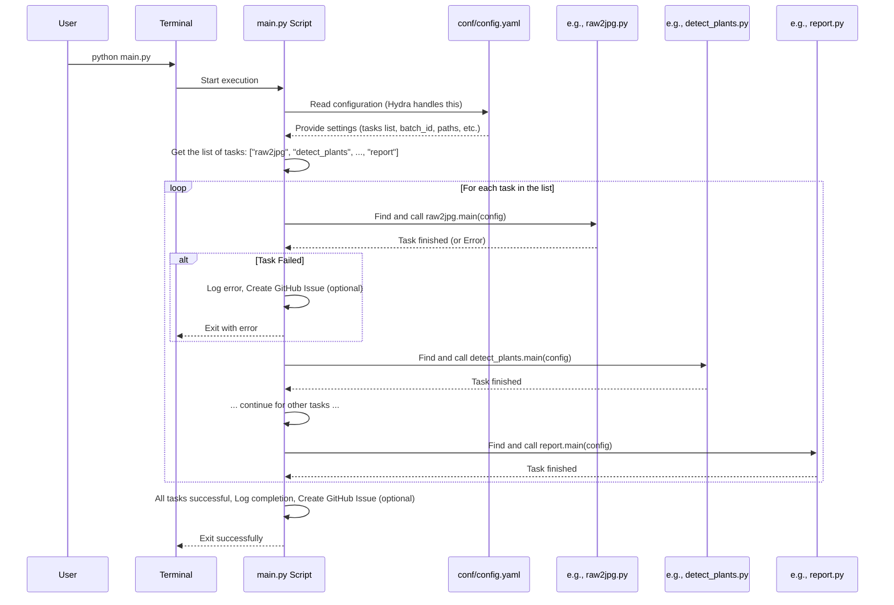
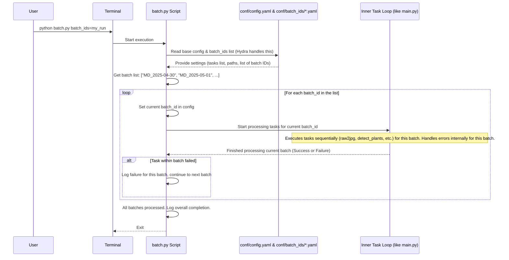

# Chapter 5: Pipeline Execution & Orchestration

Hi there! In the previous chapters, we explored several individual steps involved in processing our semi-field images:
*   Converting RAW images ([Chapter 1: RAW Image Processing & Conversion (RAW -> DNG -> JPG)](01_raw_image_processing___conversion__raw____dng____jpg__.md))
*   Detecting plants ([Chapter 2: Plant Detection](02_plant_detection_.md))
*   Building 3D models ([Chapter 3: Structure from Motion (SfM) Pipeline](03_structure_from_motion__sfm__pipeline_.md))
*   Cleaning up and labeling bounding boxes ([Chapter 4: Bounding Box Processing & Labeling](04_bounding_box_processing___labeling_.md))

Each of these is like a different station on an assembly line, performing a specific job. But how do we make sure the images move from one station to the next in the correct order? How do we start the whole assembly line and make sure it runs smoothly for a whole set (or "batch") of images?

That's what **Pipeline Execution & Orchestration** is all about!

## What Problem Are We Solving?

Imagine you have a detailed recipe with many steps: chop vegetables, marinate meat, preheat the oven, cook the meat, boil pasta, mix sauce, combine everything. You need to follow these steps in the *correct sequence* to get the final dish. You can't boil the pasta before you've even bought the ingredients!

Similarly, our image processing involves multiple steps (tasks) that often depend on each other. For example, you need to convert RAW images to JPGs *before* you can run plant detection on them.

The `SemiF-Preprocessing` pipeline needs a manager or a conductor to:
1.  Know the correct order of tasks to perform.
2.  Run each task one after the other.
3.  Handle any problems or errors that might occur during a task.
4.  Do this for a specific group (batch) of images collected on a certain day or time.
5.  Potentially repeat the whole process for *multiple* batches.

This chapter explains how the project manages this entire workflow using scripts like `main.py` and `batch.py`.

## Key Concepts

Let's look at the main ideas involved in running the pipeline.

### 1. Tasks: The Individual Steps

As we've seen in previous chapters, the pipeline is made up of individual **tasks**. Each task corresponds to a specific Python script (e.g., `src/raw2jpg.py`, `src/detect_plants.py`, `src/autosfm.py`). Think of these as the individual steps in our recipe or stations on our assembly line.

Examples:
*   `raw2jpg`: Converts RAW images to JPGs ([Chapter 1](01_raw_image_processing___conversion__raw____dng____jpg__.md)).
*   `detect_plants`: Finds plants in JPGs ([Chapter 2](02_plant_detection_.md)).
*   `autosfm`: Creates 3D models ([Chapter 3](03_structure_from_motion__sfm__pipeline_.md)).
*   `remap_labels`: Maps 2D boxes to 3D and filters them ([Chapter 4](04_bounding_box_processing___labeling_.md)).
*   `assign_species`: Labels plants with species ([Chapter 4](04_bounding_box_processing___labeling_.md)).
*   ...and others like `sync_from_remote`, `report`, `move_data`.

### 2. The Pipeline: The Sequence of Tasks

The **pipeline** is simply the ordered list of tasks we want to run for a given batch of images. We define this sequence in our main configuration file. It's like writing down the recipe steps in the correct order.

```yaml
# --- File: conf/config.yaml (Snippet) ---
# ... (other settings)

tasks:
  - sync_from_remote          # Step 1: Get data from remote storage
  - raw2jpg                 # Step 2: Convert RAW to JPG
  - update_exif             # Step 3: Add camera info
  - autosfm                 # Step 4: Build 3D model
  - detect_plants           # Step 5: Find plants in 2D
  - merge_overlapping_bboxes # Step 6: Clean up 2D boxes
  - remap_labels            # Step 7: Map boxes to 3D & filter
  - assign_species          # Step 8: Label boxes with species
  - inspect_images          # Step 9: (Optional) visual inspection
  - move_data               # Step 10: Move results to final storage
  - report                  # Step 11: Generate a summary report

# ... (other settings like batch_id)
```

The system will execute these tasks from top to bottom.

### 3. Orchestration: Managing the Flow

**Orchestration** is the act of managing this sequence. The orchestrator reads the `tasks` list and calls the corresponding Python script for each task, one by one. It ensures that Step 2 only starts after Step 1 is finished successfully. It also handles errors – if a step fails, it logs the error and usually stops the pipeline for that batch (and maybe even creates an automated issue report, as we'll see in [Chapter 9: Automated Issue Tracking (GitHub)](09_automated_issue_tracking__github__.md)).

### 4. `main.py`: Running a Single Batch

The `main.py` script is the primary orchestrator for processing **one single batch** of images. You tell it which batch to process by setting the `batch_id` in the configuration file.

```yaml
# --- File: conf/config.yaml (Snippet) ---
# ...
batch_id: MD_2025-04-30 # <<< main.py will process THIS batch
season: cool_season_covers_2024_2025
# ...
tasks:
  - raw2jpg
  - detect_plants
  # ... etc
# ...
```

When you run `python main.py`, it reads `conf/config.yaml`, finds the `batch_id` (e.g., `MD_2025-04-30`), and then executes the tasks listed under `tasks` *for that specific batch*.

### 5. `batch.py`: Running Multiple Batches

Sometimes, you might have several days' worth of data (multiple batches) to process. Running `main.py` manually for each one would be tedious. That's where `batch.py` comes in.

`batch.py` is designed to run the *entire pipeline* (defined by the `tasks` list) sequentially for **multiple batches**. You define the list of batches in a separate configuration file (e.g., `conf/batch_ids/my_batches.yaml`).

```yaml
# --- File: conf/batch_ids/cool_season_week1.yaml ---
batch_ids:
  - MD_2025-04-30
  - MD_2025-05-01
  - MD_2025-05-02
  - NC_2025-04-30
  - NC_2025-05-01
```

You then tell `batch.py` to use this list when you run it. It will process `MD_2025-04-30` completely, then `MD_2025-05-01`, then `MD_2025-05-02`, and so on.

### 6. Configuration (`conf/config.yaml` and Hydra)

How do `main.py` and `batch.py` know which tasks to run, which batch(es) to process, and where all the files are? They rely heavily on configuration files managed by a tool called **Hydra**. We'll dive deep into Hydra in the next chapter, but for now, just know that `conf/config.yaml` is the main control panel where you set the `tasks` list and the `batch_id` (for `main.py`). For `batch.py`, you specify the batch list via a command-line override that tells Hydra which batch list file to use (e.g., `batch_ids=cool_season_week1`).

[Chapter 6: Configuration Management (Hydra)](06_configuration_management__hydra__.md) will explain this in detail.

## How to Use It: Running the Pipeline

Let's see how you actually start the processing.

### 1. Configure Your Tasks and Batch

*   **Edit `conf/config.yaml`:**
    *   Make sure the `tasks:` list contains the steps you want to run, in the correct order.
    *   Set the `batch_id` to the specific batch you want to process if you plan to use `main.py`.
    *   Ensure other settings (like paths, season, etc.) are correct for your batch.

    ```yaml
    # --- File: conf/config.yaml ---
    # ...
    batch_id: MD_2025-04-30 # For main.py
    season: cool_season_covers_2024_2025
    # ...
    tasks:
      - sync_from_remote
      - raw2jpg
      - update_exif
      - autosfm
      - detect_plants
      - # ... other desired tasks
      - report
    # ...
    ```

*   **(Optional) Create a Batch List File:** If using `batch.py`, create a file like `conf/batch_ids/my_run.yaml` listing the batch IDs:

    ```yaml
    # --- File: conf/batch_ids/my_run.yaml ---
    batch_ids:
      - MD_2025-04-30
      - MD_2025-05-01
    ```

### 2. Execute from the Command Line

*   **To run a single batch (using `main.py`):**
    Open your terminal, navigate to the project's root directory (`SemiF-Preprocessing`), activate your Conda environment (`conda activate semifpre`), and run:

    ```bash
    python main.py
    ```
    *   **Input:** Reads settings from `conf/config.yaml`, including `batch_id` and the `tasks` list.
    *   **Output:** Executes the listed tasks for the specified `batch_id`. Processed data will be saved in the batch's directories (e.g., under `data/longterm_images2/semifield-developed-images/MD_2025-04-30/`). Log files will be created (usually under `logs/`).

*   **To run multiple batches (using `batch.py`):**
    Make sure you have a batch list file (e.g., `conf/batch_ids/my_run.yaml`). Then run:

    ```bash
    python batch.py batch_ids=my_run
    ```
    *   **Input:** Reads settings from `conf/config.yaml` (like the `tasks` list) but *overrides* the batch source using `batch_ids=my_run`. It reads the batch IDs from `conf/batch_ids/my_run.yaml`.
    *   **Output:** Executes the listed tasks sequentially for *each* batch ID found in `my_run.yaml`. Processed data and logs are generated for each batch.

## Under the Hood: How `main.py` Works

When you run `python main.py`, here's a simplified view of what happens:



**Code Insight (`main.py`):**

The core logic in `main.py` involves looping through the task names provided in the configuration and dynamically calling the `main()` function of the corresponding Python module.

```python
# --- File: main.py (Simplified) ---
import sys
from pathlib import Path
import logging
import hydra # Tool for managing configuration
from omegaconf import DictConfig, OmegaConf
from hydra.utils import get_method # Helper to find functions dynamically
# Import utility functions for error reporting etc.
from utils.utils import save_log_to_lts, create_issue

log = logging.getLogger(__name__)

@hydra.main(version_base="1.3", config_path="conf", config_name="config")
def main(cfg: DictConfig) -> None:
    """Main entry point for running the pipeline for ONE batch."""
    cfg = OmegaConf.create(cfg) # Finalize configuration object
    log.info(f"Starting pipeline for batch {cfg.batch_id} with tasks: {', '.join(cfg.tasks)}")

    # --- Loop through tasks defined in config.yaml ---
    for tsk in cfg.tasks:
        try:
            # Dynamically find the 'main' function in the task's module
            # e.g., if tsk is "raw2jpg", finds the main() function in raw2jpg.py
            log.info(f"Starting task: {tsk}")
            task_function = get_method(f"{tsk}.main") # e.g., raw2jpg.main

            # Execute the task's main function, passing the configuration
            task_function(cfg)

            log.info(f"Task completed successfully: {tsk}")

        except Exception as e:
            # --- Error Handling ---
            log.exception(f"Task failed: {tsk}") # Log the full error traceback
            log.error(f"Error details: {e}")

            if cfg.create_issue: # Check config if we should report failures
                save_log_to_lts(cfg) # Save logs for debugging
                log.info("Creating GitHub issue for task failure.")
                # Create an issue on GitHub (needs setup)
                create_issue(cfg.batch_id, user_id, issue_type="failure", tsk=tsk, error_msg=str(e))

            log.info("Exiting due to task failure.")
            sys.exit(1) # Stop the pipeline

    # --- Success ---
    log.info("All tasks completed successfully.")
    if cfg.create_issue: # Check config if we should report success
        log.info("Creating GitHub issue for successful run.")
        create_issue(cfg.batch_id, user_id, issue_type="report")

if __name__ == "__main__":
    main() # Start the process
```
*Explanation:* This script uses Hydra (`@hydra.main`) to load the configuration (`cfg`). It then iterates through the list `cfg.tasks`. For each task name (e.g., `"raw2jpg"`), it uses `get_method` to find the actual `main` function inside the `raw2jpg.py` file and runs it (`task_function(cfg)`). The `try...except` block catches any errors during a task's execution, logs them, optionally creates a GitHub issue, and then stops the entire pipeline (`sys.exit(1)`). If all tasks finish without errors, it logs success and might create a different GitHub issue.

## Under the Hood: How `batch.py` Works

`batch.py` adds an outer loop around the logic of `main.py`.



**Code Insight (`batch.py`):**

The script structure is very similar to `main.py`, but it adds an outer loop to iterate through the `batch_ids` obtained from the configuration.

```python
# --- File: batch.py (Simplified) ---
import sys
import hydra
from omegaconf import DictConfig, OmegaConf
import logging
from hydra.utils import get_method

log = logging.getLogger(__name__)

@hydra.main(version_base="1.3", config_path="conf", config_name="config")
def main(cfg: DictConfig):
    """Main entry point for running the pipeline for MULTIPLE batches."""
    cfg = OmegaConf.create(cfg)
    log.info(f"Starting batch pipeline with tasks: {', '.join(cfg.tasks)}")

    # Get the list of batch IDs from the configuration (e.g., from batch_ids=my_run)
    batch_ids = sorted(cfg.batch_ids)
    log.info(f"Processing {len(batch_ids)} batches: {', '.join(batch_ids)}")

    tasks = cfg.tasks # Get the list of tasks to run for each batch

    # --- Outer loop: Iterate through each batch ID ---
    for batch_id in batch_ids:
        log.info(f"--- Processing batch {batch_id} ---")
        # Update the configuration object with the current batch ID
        # This ensures tasks called below know which batch to work on
        cfg.batch_id = batch_id

        # --- Inner loop: Iterate through tasks for the current batch ---
        for task_name in tasks:
            try:
                log.info(f"Starting task: {task_name}")
                # Find and run the task's main function
                task_function = get_method(f"{task_name}.main")
                task_function(cfg) # Pass the config (which now includes the current batch_id)
                log.info(f"Task completed successfully: {task_name}")

            except Exception as e:
                # Log the error for this specific task and batch
                log.exception(f"Task failed: {task_name} for batch {batch_id}")
                # IMPORTANT: In this batch script, we typically log the error
                # but 'continue' to the next batch, rather than exiting.
                # Error reporting (like GitHub issues) might happen inside the task
                # or could be summarized at the end. Let's assume the task handles it or main.py logic would.
                log.warning(f"Skipping remaining tasks for batch {batch_id} due to error in {task_name}.")
                break # Stop processing tasks for THIS batch, move to the next batch_id

    log.info("--- Finished processing all batches. ---")

if __name__ == "__main__":
    main()
```
*Explanation:* This script also uses Hydra to load configuration. It specifically expects `cfg.batch_ids` to be a list (provided by setting `batch_ids=something` on the command line). It then loops through each `batch_id` in this list. Inside this loop, it sets `cfg.batch_id` so that subsequent tasks know which batch they are working on. The inner loop then iterates through the `cfg.tasks`, finding and calling each task's `main` function just like `main.py` does. If a task fails for a specific batch, it logs the error and typically `break`s out of the *inner* task loop (stopping further processing for that failed batch) but continues the *outer* loop to start processing the next `batch_id`.

## Conclusion

You now understand how the `SemiF-Preprocessing` project orchestrates its complex workflow! You've learned about:
*   Individual **tasks** (like `raw2jpg`, `detect_plants`).
*   The **pipeline** as an ordered sequence of these tasks defined in the configuration.
*   **Orchestration** as the process of managing this sequence.
*   `main.py` for running the pipeline on a **single batch**.
*   `batch.py` for running the pipeline sequentially across **multiple batches**.
*   How errors are generally handled (logging, potentially stopping, reporting).

This orchestration layer is crucial for automating the entire process, making it repeatable and manageable.

But how exactly do these scripts know *all* the details they need, like file paths, quality settings, specific model files, etc.? That's controlled by the configuration system, Hydra, which we'll explore next!

Next: [Chapter 6: Configuration Management (Hydra)](06_configuration_management__hydra__.md)

---

Generated by [AI Codebase Knowledge Builder](https://github.com/The-Pocket/Tutorial-Codebase-Knowledge)