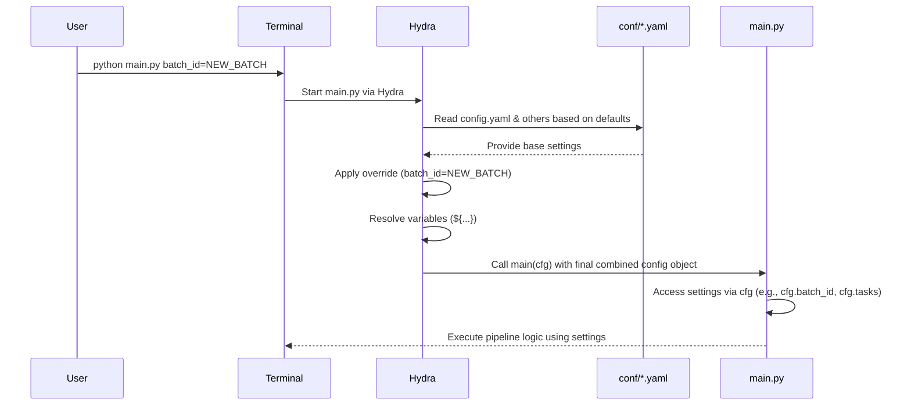

# Chapter 6: Configuration Management (Hydra)

Hi again! In the previous chapter, [Chapter 5: Pipeline Execution & Orchestration](05_pipeline_execution___orchestration_.md), we saw how scripts like `main.py` and `batch.py` run the different processing tasks in the correct order. They act like the manager of an assembly line.

But how does the manager know exactly *how* each station on the line should operate? For example:
*   Which camera profile (`.pp3`) should be used for developing images?
*   How high-quality should the 3D model be?
*   Which specific plant detection model file should be loaded?
*   Where should the input images be read from and the results saved to?

Manually changing these settings directly in the Python code for every experiment or batch would be messy and error-prone. We need a better way!

## What Problem Are We Solving?

Imagine you have a car dashboard. You have buttons and dials to control the radio station, air conditioning temperature, driving mode (Eco, Sport), windshield wipers, etc. You don't need to open the hood and rewire things just to change the radio station!

**Configuration Management** is like having that central dashboard for our `SemiF-Preprocessing` pipeline. We want a single place where we can easily view and change all the settings and parameters that control how the pipeline runs, without touching the underlying Python code.

This makes it super easy to:
*   Try different settings for an experiment (e.g., run SfM with "high" vs. "medium" quality).
*   Adjust settings for different batches of data (e.g., use a different color correction profile if the lighting changed).
*   Share your exact settings with colleagues so they can reproduce your results.

In `SemiF-Preprocessing`, we use a powerful tool called **Hydra** along with simple text files (YAML) to manage all these settings.

## Key Concepts

Let's understand the building blocks of configuration management with Hydra.

### 1. Configuration: The Settings

These are all the knobs, dials, and switches for our pipeline. They include things like:
*   File paths (where data lives, where to save results)
*   Task lists (which steps to run, like in [Chapter 5](05_pipeline_execution___orchestration_.md))
*   Algorithm parameters (e.g., `downscale` factor for SfM quality in [Chapter 3](03_structure_from_motion__sfm__pipeline_.md))
*   Model names (e.g., which detection model file from [Chapter 2](02_plant_detection_.md))
*   Flags (e.g., `remove_dngs: true` in [Chapter 1](01_raw_image_processing___conversion__raw____dng____jpg__.md))

### 2. YAML Files (`.yaml`): The Control Panel Layout

Instead of having physical dials, we write our settings down in simple, human-readable text files using a format called **YAML** (which stands for "YAML Ain't Markup Language"). YAML uses indentation (spaces) to organize settings in a hierarchy.

Here's a tiny example:

```yaml
# This is a comment
processing_settings:
  quality: high
  speed: medium
  remove_intermediate_files: true

paths:
  input_folder: /data/raw_images
  output_folder: /data/processed_results
```

*Explanation:* This YAML file defines two main sections: `processing_settings` and `paths`. Under `processing_settings`, we have settings like `quality` set to `high`. Under `paths`, we define `input_folder`. It's easy to read and write.

### 3. The `conf/` Directory: The Dashboard's Home

All the configuration files for `SemiF-Preprocessing` live inside a dedicated folder named `conf/` in the project's root directory. Think of this folder as the entire dashboard housing.

```
SemiF-Preprocessing/
├── conf/                 <-- Configuration lives here!
│   ├── config.yaml       <-- Main configuration file
│   ├── paths/
│   │   └── default.yaml  <-- Default path settings
│   ├── asfm/
│   │   ├── default.yaml  <-- Default SfM settings
│   │   └── fast.yaml     <-- Alternative "fast" SfM settings
│   ├── ccm/
│   │   └── NC_1740166530.yaml <-- Color Correction data
│   ├── batch_ids/
│   │   └── test.yaml     <-- List of test batch IDs
│   └── ... (other config files and folders)
├── src/                  <-- Python source code
├── main.py               <-- Main script for single batch
├── batch.py              <-- Main script for multiple batches
└── ... (other project files)
```

### 4. Hydra: The Dashboard's Brain

**Hydra** is the Python library that acts as the "brain" behind the dashboard. It does several clever things:
*   **Reads YAML:** It knows how to read and understand the structure of the `.yaml` files in the `conf/` directory.
*   **Composition:** It can combine settings from multiple files. For example, the main `config.yaml` might say "use the default paths from `paths/default.yaml` and the default SfM settings from `asfm/default.yaml`". Hydra pieces these together into one complete configuration.
*   **Makes Settings Available:** It passes all the combined settings neatly into our Python scripts (like `main.py`) so the code can easily access them.
*   **Command-Line Overrides:** It lets you *temporarily* change a setting directly from the command line when you run a script, without editing any files.

### 5. `config.yaml`: The Main Control File

`conf/config.yaml` is the starting point. When you run `python main.py`, Hydra looks at this file first. It often contains:
*   Basic settings like `batch_id` and `season`.
*   The list of `tasks` to run.
*   Crucially, a `defaults` list that tells Hydra which *other* configuration files to load and combine.

```yaml
# --- File: conf/config.yaml (Snippet) ---
defaults:
  - _self_            # Include settings defined directly in this file
  - paths: default     # Load settings from conf/paths/default.yaml
  - dng_tags: default  # Load settings from conf/dng_tags/default.yaml
  - ccm: NC_1740166530 # Load settings from conf/ccm/NC_1740166530.yaml
  - batch_ids: test    # Load settings from conf/batch_ids/test.yaml
  - asfm: default      # Load settings from conf/asfm/default.yaml
  # ... other defaults ...
  - override hydra/job_logging: custom # Use custom logging settings

# Settings defined directly in this file
batch_id: MD_2025-04-30
season: cool_season_covers_2024_2025
create_issue: true
timestamp: 1746025934 # Example setting

tasks:
  - sync_from_remote
  - raw2jpg
  # ... other tasks ...
  - report

rt_pp3_name: NC_2025-02-21 # RawTherapee profile name
# ... other settings ...
```

*Explanation:* The `defaults` list acts like instructions for Hydra. `paths: default` tells it to find `conf/paths/default.yaml` and load its contents under a `paths` section in the final configuration. `asfm: default` tells it to load `conf/asfm/default.yaml` under an `asfm` section.

### 6. Variables & Interpolation: Reusing Settings

Hydra lets you define a setting once and reuse it elsewhere using a special `${...}` syntax. This avoids repeating the same value in multiple places.

```yaml
# --- File: conf/paths/default.yaml (Snippet) ---
workdir: /home/mkutuga/SemiF-Preprocessing # Define workdir once
log_dir: ${paths.workdir}/.logs/            # Reuse workdir here
data_dir: ${paths.workdir}/data/             # Reuse workdir here
developed_dir: ${paths.data_dir}/longterm_images2/semifield-developed-images # Reuse data_dir
batch_dir: ${paths.developed_dir}/${batch_id} # Reuse developed_dir and batch_id from config.yaml
```

*Explanation:* `${paths.workdir}` tells Hydra: "Find the value of `workdir` inside the `paths` section and substitute it here." `${batch_id}` tells Hydra: "Find the value of `batch_id` (which is likely defined in `config.yaml`) and substitute it here." This makes configurations much cleaner and easier to update.

## How to Use It: Controlling the Pipeline

Let's say you want to change how the pipeline runs.

**Scenario 1: You want to process a different batch.**

1.  **Locate:** Open `conf/config.yaml`.
2.  **Modify:** Find the line `batch_id: MD_2025-04-30` and change it to the new batch ID, for example: `batch_id: NC_2025-05-15`.
3.  **Save:** Save the file.
4.  **Run:** Execute `python main.py`. Hydra will now use `NC_2025-05-15` wherever `${batch_id}` is referenced (like in `paths.batch_dir`).

**Scenario 2: You want to run a faster, lower-quality SfM.**

The project has pre-defined SfM settings in `conf/asfm/`. Let's assume `default.yaml` is high quality and `fast.yaml` is low quality.

1.  **Locate:** Open `conf/config.yaml`.
2.  **Modify:** Find the line `asfm: default` in the `defaults` list. Change it to `asfm: fast`.
3.  **Save:** Save the file.
4.  **Run:** Execute `python main.py`. Hydra will now load the settings from `conf/asfm/fast.yaml` instead of `conf/asfm/default.yaml`, applying the faster parameters to the `autosfm` task.

**Scenario 3: You want to *temporarily* change one specific setting for a single run.**

Maybe you just want to try changing the SfM alignment `downscale` factor to `8` for one quick test, without editing any files permanently.

1.  **Run with Override:** Go to your terminal and run `main.py`, but add the setting you want to change at the end, using dot notation:

    ```bash
    python main.py asfm.align_photos.downscale=8
    ```

    *Explanation:* `asfm.align_photos.downscale=8` tells Hydra: "For this run only, ignore whatever value is set for `downscale` under `align_photos` within the `asfm` configuration group, and use the value `8` instead."

This command-line override is very powerful for quick experiments! It doesn't change the `.yaml` files.

## Under the Hood: How Python Gets the Settings

How does a script like `main.py` actually get access to all these settings managed by Hydra?

1.  **The Decorator:** At the very top of the `main` function in `main.py` (and other task scripts), you'll see a line starting with `@`:

    ```python
    # --- File: main.py (Top part) ---
    import hydra
    from omegaconf import DictConfig

    # This "decorator" tells Python to use Hydra
    @hydra.main(version_base="1.3", config_path="conf", config_name="config")
    def main(cfg: DictConfig) -> None:
        # 'cfg' will hold all the configuration settings
        # ... rest of the function ...
    ```
    *Explanation:* The `@hydra.main(...)` line is a special instruction. It tells Python: "Before you run the `main` function, let Hydra take control. Hydra should look for configuration files starting in the `conf/` directory (`config_path="conf"`) and use `config.yaml` as the main entry point (`config_name="config"`)."

2.  **Hydra Works Its Magic:** When you run `python main.py`, Hydra activates. It reads `conf/config.yaml`, follows the `defaults` list to load and combine settings from other files (like `paths/default.yaml`, `asfm/default.yaml`), applies any command-line overrides, and resolves all the `${...}` variables.

3.  **The `cfg` Object:** Hydra bundles up the final, complete configuration into a special object. By convention, this object is passed as the first argument to the `main` function, and it's usually named `cfg`. The `cfg: DictConfig` part in `def main(cfg: DictConfig)` is a type hint indicating that `cfg` will hold the configuration dictionary.

4.  **Accessing Settings in Code:** Inside the `main` function (and any functions it calls), the Python code can access any setting using simple dot notation on the `cfg` object.

    ```python
    # --- Inside main.py's main function ---

    # Get the batch ID
    current_batch = cfg.batch_id
    log.info(f"Processing batch: {current_batch}")

    # Get the list of tasks
    tasks_to_run = cfg.tasks
    log.info(f"Tasks: {tasks_to_run}")

    # Get a nested setting for SfM
    sfm_quality_downscale = cfg.asfm.align_photos.downscale
    log.info(f"Using SfM alignment downscale: {sfm_quality_downscale}")

    # Check a boolean flag for RAW conversion
    should_remove_dngs = cfg.raw2jpg.remove_dngs
    if should_remove_dngs:
        log.info("Intermediate DNG files will be removed.")
    ```
    *Explanation:* The code accesses settings just like accessing items in nested dictionaries or objects: `cfg.batch_id`, `cfg.tasks`, `cfg.asfm.align_photos.downscale`, `cfg.raw2jpg.remove_dngs`. Hydra makes this seamless.

**Simplified Flow Diagram:**



## Conclusion

Configuration management might seem complex at first, but Hydra makes it incredibly powerful and organized for the `SemiF-Preprocessing` project. You've learned:
*   Why we separate configuration (settings) from code.
*   How settings are defined in human-readable YAML files (`.yaml`) within the `conf/` directory.
*   How Hydra reads these files, combines them based on `config.yaml`'s `defaults` list, and handles variables (`${...}`).
*   How to change pipeline behavior by editing YAML files or using temporary command-line overrides.
*   How Python scripts get access to these settings via the `@hydra.main` decorator and the `cfg` object.

This central "dashboard" approach keeps the pipeline flexible and makes it easy to manage different experiments and processing runs without digging into the code.

Now that we have our data processed and configured, how do we manage moving it between different storage locations (like your local machine and the long-term network storage)? The next chapter covers data movement.

Next: [Chapter 7: Data Synchronization & Movement](07_data_synchronization___movement_.md)

---

Generated by [AI Codebase Knowledge Builder](https://github.com/The-Pocket/Tutorial-Codebase-Knowledge)