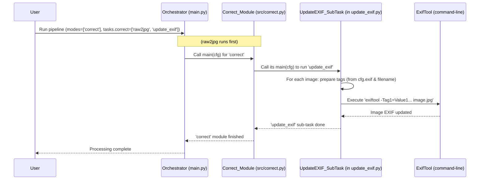

# Chapter 6: EXIF Data Management

Welcome to Chapter 6! In the [previous chapter, Chapter 5: Image File Conversion (RAW to JPG)](05_image_file_conversion__raw_to_jpg_.md), we learned how `SemiF-Preprocessing` takes raw camera images and "develops" them into standard JPG files. Now that we have these nice JPGs, we need to make sure they carry all the correct information about themselves. This is where **EXIF Data Management** comes in.

Imagine each photo you take has its own "birth certificate" and "ID card" rolled into one. This certificate tells you:
*   When and where it was "born" (taken).
*   What "equipment" was used (camera model, lens).
*   The "conditions" at birth (camera settings like shutter speed, aperture).

This information is called **EXIF data**. "EXIF" stands for Exchangeable Image File Format, and it's a standard way to embed metadata (data about data) directly into image files.

**What problem does EXIF Data Management solve?**
Sometimes, this "birth certificate" might have a mistake (like your camera's clock being wrong), or it might be missing some important details (like who took the photo or what project it belongs to). Our EXIF Data Management system is like the **official records keeper** for these photo IDs. It ensures:
1.  **Accuracy:** Each photo carries correct information about when and how it was taken.
2.  **Completeness:** Important details can be added if they are missing.
3.  **Consistency:** All photos in a batch can have uniform project-related information.

This is crucial because many downstream processes, like building 3D models (which we'll see in [Chapter 7: AutoSfM (Structure from Motion) Pipeline](07_autosfm__structure_from_motion__pipeline_.md)), rely on accurate EXIF data.

## What Information is in EXIF Data?

EXIF data can store a lot of information. Some common examples include:
*   **Date and Time:** `DateTimeOriginal` (when the photo was taken), `SubSecTimeOriginal` (fractions of a second).
*   **Camera Information:** `Make` (e.g., "Sony"), `Model` (e.g., "ILCE-7RM3").
*   **Camera Settings:** `ExposureTime` (shutter speed), `FNumber` (aperture), `ISO`.
*   **Lens Information:** `FocalLength`.
*   **GPS Data:** Latitude, longitude, altitude (if your camera has GPS).
*   **Copyright and Author:** `Copyright`, `Artist`.
*   **Image Description:** A custom note about the image.

## How `SemiF-Preprocessing` Manages EXIF Data

In `SemiF-Preprocessing`, managing EXIF data is typically handled by a sub-task called `update_exif`. This sub-task is often part of the `correct` [Image Processing Task Module](04_image_processing_task_module_.md), running after images have been converted to JPG.

```yaml
# conf/config.yaml (snippet)
# ...
tasks:
  correct:
    - raw2jpg       # We learned about this in Chapter 5
    - update_exif   # This is our EXIF management sub-task!
# ...
```

The `update_exif` sub-task primarily uses a very powerful command-line tool called **ExifTool**. Our Python scripts in `SemiF-Preprocessing` prepare instructions and then tell ExifTool to apply these changes to the image files.

### Configuring EXIF Updates

You can tell `SemiF-Preprocessing` what EXIF data to add or change through the configuration files, which are managed by [Hydra (see Chapter 2)](02_configuration_management__hydra__.md). There's usually a dedicated section or file for EXIF settings, for example, `conf/exif/default.yaml`, which gets loaded into `cfg.exif`.

Here's a simplified example of what your EXIF configuration might look like:

```yaml
# conf/exif/default.yaml (or part of config.yaml under 'exif:')
# These are standard EXIF tag groups and tags.

# General image information
IFD0:
  Make: "Our Awesome Research Camera Inc." # Camera Manufacturer
  Model: "SciCam v2.1"                     # Camera Model
  Artist: "Dr. Data Scientist"             # Who took the photo
  Copyright: "University of Research, 2024. All rights reserved."

# More specific EXIF data
ExifIFD:
  ImageDescription: "Photos for Project Alpha, Plot 7"
  # DateTimeOriginal is often set automatically from filename (see below)

# GPS Information (if you want to add it manually or correct it)
GPS:
  GPSLatitudeRef: "N"
  GPSLatitude: [30, 15, 50.5] # Degrees, Minutes, Seconds
  GPSLongitudeRef: "W"
  GPSLongitude: [96, 20, 10.2]
```
When the `update_exif` sub-task runs, it will read these values from the `cfg.exif` object and use ExifTool to write them into the EXIF data of your JPG images.

## Key EXIF Operations in `SemiF-Preprocessing`

Our system focuses on two main EXIF management tasks:

### 1. Correcting Timestamps from Filenames

Sometimes, images from scientific equipment might have filenames that include a very precise timestamp, like `FIELD_A_1678886400.RAW` where `1678886400` is an "epoch timestamp" (the number of seconds since January 1st, 1970). This filename timestamp might be more accurate than the camera's internal clock.

The `update_exif` sub-task can read this epoch timestamp from the filename, convert it into a standard date and time format, and write it to the `DateTimeOriginal` and `SubSecDateTimeOriginal` EXIF tags. This ensures your photos have the most accurate "birth date."

The script `src/tasks/correct_utils/update_exif.py` has a helper function for this:

```python
# src/tasks/correct_utils/update_exif.py (Simplified concept)
import datetime
import pytz # For handling timezones

def epoch_to_exif_datetime_eastern(epoch: int) -> str:
    """
    Convert epoch timestamp to EXIF-compliant datetime string in US Eastern Time.
    """
    eastern = pytz.timezone('US/Eastern') # Define the timezone
    # Convert epoch to a datetime object, then adjust to Eastern Time
    dt = datetime.datetime.fromtimestamp(epoch, tz=pytz.utc).astimezone(eastern)

    # Format for EXIF: YYYY:MM:DD HH:MM:SS.ss-HH:MM (with timezone offset)
    base = dt.strftime("%Y:%m:%d %H:%M:%S")
    fractional = f"{dt.microsecond // 10000:02d}" # Two digits for subseconds
    offset = dt.strftime("%z") # Timezone offset like -0400 or -0500
    
    return f"{base}.{fractional}{offset[:3]}:{offset[3:]}"

# Example usage:
# epoch_time = 1678886400 # Represents a specific moment
# exif_timestamp = epoch_to_exif_datetime_eastern(epoch_time)
# print(exif_timestamp) 
# Output might be: "2023:03:15 10:00:00.00-04:00" (depending on actual date and DST)
```
This function takes the numeric epoch time, converts it to a human-readable date and time in the US Eastern timezone (which also handles Daylight Saving Time automatically), and formats it perfectly for EXIF.

### 2. Adding Custom and Fixed EXIF Tags

Using the configuration we saw earlier (e.g., `cfg.exif.IFD0.Artist`), you can set various EXIF tags to specific values for all images in a batch. This is great for adding consistent project information, author details, or copyright notices.

The `update_exif.py` script takes the nested dictionary from the configuration and "flattens" it into a format that ExifTool understands.

```python
# src/tasks/correct_utils/update_exif.py (Simplified concept)

def flatten_exif_dict(config_exif_section: dict) -> dict:
    """Flatten a nested EXIF dictionary for exiftool usage."""
    items = {}
    # 'config_exif_section' would be like cfg.exif from Hydra
    for group_name, tags_in_group in config_exif_section.items():
        for tag_name, tag_value in tags_in_group.items():
            if tag_value is not None and tag_value != "": # Only add if value exists
                items[tag_name] = tag_value # ExifTool uses direct tag names
    return items

# Example:
# configured_tags = {
#   "IFD0": {"Artist": "Dr. Data", "Copyright": "Research Uni 2024"},
#   "ExifIFD": {"ImageDescription": "Test Plot A"}
# }
# flat_tags = flatten_exif_dict(configured_tags)
# print(flat_tags)
# Output: {'Artist': 'Dr. Data', 'Copyright': 'Research Uni 2024', 'ImageDescription': 'Test Plot A'}
```
This `flat_tags` dictionary is then used to build the command for ExifTool.

## Under the Hood: How `update_exif` Works

When the `update_exif` sub-task is triggered for a batch of images, here's a simplified step-by-step of what happens:

1.  **Check for ExifTool:** The script first ensures that `ExifTool` is installed and accessible on your system. `SemiF-Preprocessing` even includes a helper script (`scripts/setup_exiftool.sh`) to install it if missing.
2.  **Find Images:** It locates the directory containing the JPG images for the current `batch_id` (using path configurations from [Chapter 3: Data Synchronization and Path Management](03_data_synchronization_and_path_management_.md)).
3.  **Load EXIF Configuration:** It reads the desired EXIF tag values from the Hydra configuration object (`cfg.exif`).
4.  **Process Each Image:** For every JPG image in the directory:
    a.  **Prepare Tags:** It creates a list of tags to update. This includes:
        *   The custom tags from your configuration (flattened as shown above).
        *   The `SubSecDateTimeOriginal` tag, calculated from the filename's epoch timestamp (if the filename follows the pattern).
    b.  **Build ExifTool Command:** It constructs a command-line instruction for `ExifTool`. This command looks something like:
        `exiftool -overwrite_original -Artist="Dr. Data" -Copyright="Research Uni 2024" -SubSecDateTimeOriginal="2023:03:15 10:00:00.00-04:00" "path/to/your/image.jpg"`
    c.  **Execute Command:** It runs this command using Python's `subprocess` module. ExifTool then directly modifies the image file to update its EXIF data.
    d.  **Log Results:** It logs whether the update was successful or if any errors occurred.

This process is often done in parallel for multiple images to speed things up, using Python's `ProcessPoolExecutor`.

### Visualizing the Process

Here’s a simplified diagram showing the interaction:



### A Glimpse into the Code (`_update_exif_worker`)

The core logic for updating a single image happens in a worker function within `src/tasks/correct_utils/update_exif.py`. Here's a very simplified version:

```python
# src/tasks/correct_utils/update_exif.py (Highly Simplified Worker Concept)
import subprocess
import logging

log = logging.getLogger(__name__)

# (epoch_to_exif_datetime_eastern and flatten_exif_dict would be defined elsewhere)

def _update_exif_for_single_image(image_file_path, base_configured_tags):
    # 'image_file_path' is something like Path("path/to/MY_IMAGE_1678886400.jpg")
    # 'base_configured_tags' is the flattened dict from cfg.exif
    
    img_stem = image_file_path.stem # e.g., "MY_IMAGE_1678886400"
    all_tags_for_exiftool = base_configured_tags.copy()

    try:
        # Attempt to get epoch from filename like "NAME_EPOCH"
        epoch_from_filename = int(img_stem.split("_")[-1]) # Gets the last part
        if str(epoch_from_filename).isdigit() and len(str(epoch_from_filename)) == 10:
            # Convert epoch to EXIF formatted string
            datetime_original = epoch_to_exif_datetime_eastern(epoch_from_filename)
            # ExifTool needs quotes if the value has spaces or special chars
            all_tags_for_exiftool["SubSecDateTimeOriginal"] = f"'{datetime_original}'" 
    except (ValueError, IndexError):
        log.warning(f"Could not parse epoch from filename: {image_file_path.name}")

    # Start building the command for ExifTool
    # -overwrite_original tells ExifTool to modify the file in place
    command = ["exiftool", "-overwrite_original"] 
    
    for key, value in all_tags_for_exiftool.items():
        # Add each tag and its value to the command
        # Example: -Artist="Dr. Data"
        command.append(f"-{key}={value}") 
    
    command.append(str(image_file_path)) # Finally, add the image file path

    try:
        log.info(f"Running ExifTool for {image_file_path.name}")
        # Execute the command
        result = subprocess.run(command, capture_output=True, text=True, check=False)
        
        if result.returncode == 0:
            log.info(f"EXIF updated successfully for {image_file_path.name}.")
        else:
            log.error(f"EXIF update failed for {image_file_path.name}: {result.stderr.strip()}")
            
    except Exception as e:
        log.error(f"Exception during EXIF update for {image_file_path.name}: {e}")

# In the main part of update_exif.py:
# 1. Get all image file paths.
# 2. Load and flatten cfg.exif into 'base_configured_tags'.
# 3. Loop through image_paths, calling _update_exif_for_single_image for each
#    (often using multiprocessing to do many at once).
```
This snippet shows the key steps:
1.  It tries to extract an epoch timestamp from the filename and converts it.
2.  It builds a list of command-line arguments for `ExifTool`, including `-overwrite_original` (to modify the file directly), all the configured tags (like `-Artist="Dr. Data"`), and the special `SubSecDateTimeOriginal` tag.
3.  It runs `ExifTool` using `subprocess.run()`.

## What About Reading EXIF or Other Tools?

While the `update_exif` sub-task primarily *writes and updates* EXIF using `ExifTool`, other parts of `SemiF-Preprocessing` might also interact with EXIF data. For example, the image resizing code (found in `src/tasks/auto_sfm/resize.py`, used later in the AutoSfM pipeline) uses a Python library called `piexif`.

`piexif` can read and write EXIF data directly within Python. It's often used when Python code is already manipulating the image (like resizing it with Pillow/PIL library) and wants to preserve or slightly modify EXIF data at the same time.

```python
# Conceptual use of piexif (not directly from update_exif.py)
from PIL import Image
import piexif

try:
    # Open an image
    img = Image.open("my_photo.jpg")
    
    # Load existing EXIF data
    exif_dict = piexif.load(img.info.get("exif", b'')) # Get EXIF bytes, or empty if none
    
    # You could modify exif_dict here, e.g.:
    # exif_dict["0th"][piexif.ImageIFD.Artist] = "A. Python Programmer".encode('utf-8')

    # To save the image with (potentially modified) EXIF:
    # exif_bytes = piexif.dump(exif_dict)
    # img.save("my_photo_with_exif.jpg", exif=exif_bytes)
    
    # Print the artist from the 0th IFD (Image File Directory)
    if piexif.ImageIFD.Artist in exif_dict["0th"]:
        artist = exif_dict["0th"][piexif.ImageIFD.Artist].decode('utf-8')
        # print(f"Artist: {artist}")
except Exception as e:
    # print(f"Error: {e}")
    pass # Handle errors
```
The `fix_exif_types` function you might see in `src/tasks/auto_sfm/resize.py` is a helper to ensure that the EXIF data is in the correct format before `piexif.dump()` tries to write it, as `piexif` can be particular about data types for certain tags.

So, while `ExifTool` (via `update_exif.py`) is the main "manager" for batch EXIF updates and corrections based on project-wide configuration, `piexif` is a handy tool for more surgical EXIF handling within other Python image processing steps.

## Conclusion

You've now learned about **EXIF Data Management** in `SemiF-Preprocessing`. You understand that EXIF data is like a photo's "ID card," containing vital information about its origin and settings.

Key takeaways:
*   EXIF data includes timestamps, camera settings, GPS, and more.
*   Managing EXIF ensures accuracy, completeness, and consistency, which is vital for scientific image processing.
*   The `update_exif` sub-task (usually in the `correct` module) is the primary way `SemiF-Preprocessing` handles this, using the powerful `ExifTool` command-line utility.
*   You can control which EXIF tags are added or updated through the [Hydra configuration files](02_configuration_management__hydra__.md) (e.g., `cfg.exif`).
*   Common operations include correcting `DateTimeOriginal` from epoch timestamps in filenames and adding custom project-specific tags.
*   Other tools like the Python `piexif` library are used in different parts of the project for specific EXIF manipulations, like preserving data during image resizing.

With well-managed EXIF data, our images are not just pixels; they are rich information packages ready for further analysis. One of the most exciting analyses is creating 3D models from these images, which is what we'll explore next.

Next up: [Chapter 7: AutoSfM (Structure from Motion) Pipeline](07_autosfm__structure_from_motion__pipeline_.md)

---

Generated by [AI Codebase Knowledge Builder](https://github.com/The-Pocket/Tutorial-Codebase-Knowledge)
