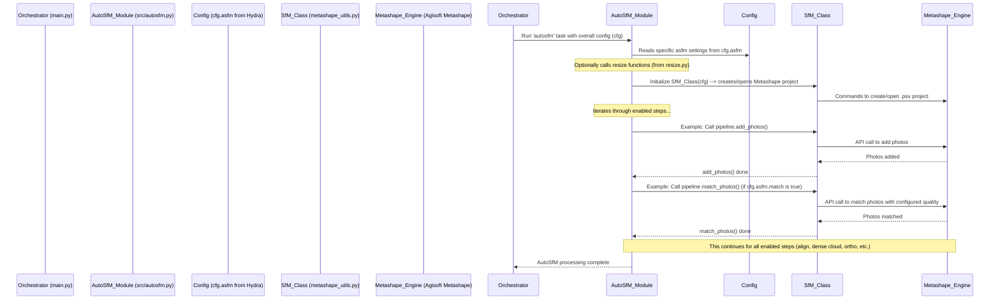

# Chapter 7: AutoSfM (Structure from Motion) Pipeline

Welcome to Chapter 7! In [Chapter 6: EXIF Data Management](06_exif_data_management_.md), we learned how `SemiF-Preprocessing` ensures our images have accurate "ID cards" (EXIF data). With our images correctly formatted ([Chapter 5: Image File Conversion (RAW to JPG)](05_image_file_conversion__raw_to_jpg_.md)) and their metadata in order, we're ready for one of the most exciting parts of the `SemiF-Preprocessing` project: creating 3D models from these 2D images!

Imagine you've taken dozens or even hundreds of photos of a plant, a small field plot, or a section of a greenhouse, capturing it from many different angles. How can you turn these flat pictures into a 3D digital replica that you can measure, analyze, and inspect from any viewpoint on your computer? This is the magic of **Structure from Motion (SfM)**, and our project has a powerful sub-pipeline to automate this: the **AutoSfM (Structure from Motion) Pipeline**.

Think of the AutoSfM pipeline as a **specialized 3D scanning and modeling department** within our image processing factory. You feed it a series of photographs, and it works to reconstruct a detailed 3D digital version of the object or scene. This is incredibly useful for:
*   Measuring plant height, width, or volume.
*   Creating accurate maps (orthomosaics) of an area.
*   Monitoring changes over time by comparing 3D models from different dates.

The AutoSfM pipeline in `SemiF-Preprocessing` primarily uses a professional photogrammetry software called **Agisoft Metashape** to do the heavy lifting. Our scripts automate the many steps involved in a typical Metashape workflow.

## What is Structure from Motion (SfM)?

At its heart, Structure from Motion is a technique that infers 3D information from 2D images. If you take pictures of an object from multiple viewpoints, SfM algorithms can:
1.  Identify common points or features across these images.
2.  Figure out where each photo was taken from (the camera positions).
3.  Calculate the 3D coordinates of those common points.

The result is a "point cloud" – a collection of 3D points representing the surface of the object or scene. From this point cloud, we can then create more complex 3D representations like textured meshes, elevation models, and orthomosaics.

## The AutoSfM Workflow: Key Steps

The AutoSfM pipeline in `SemiF-Preprocessing` automates a sequence of steps, mostly orchestrated by `src/autosfm.py` which controls Agisoft Metashape through its Python API (managed by the `SfM` class in `src/tasks/auto_sfm/metashape_utils.py`). Here are the main stages:

1.  **Check for Existing Results & Setup:** Before starting, the pipeline can check if this batch has already been processed to avoid redoing work. It also sets up necessary configurations and paths.
2.  **Resize Photos (Optional):** To speed up processing, especially with very high-resolution images, photos can be downscaled. EXIF data is carefully preserved during this step (as discussed in [Chapter 6: EXIF Data Management](06_exif_data_management_.md)).
3.  **Add Photos to Project:** The (possibly resized) images are loaded into a new or existing Agisoft Metashape project file (`.psx`).
4.  **Detect Markers (Optional):** If you've placed special targets (Ground Control Points or GCPs) with known real-world coordinates in your scene, Metashape can detect them in the images.
5.  **Import Marker References (Optional):** The known 3D coordinates of these markers are imported. This is crucial for creating geographically accurate and correctly scaled models.
6.  **Match Photos:** Metashape finds thousands of matching points (tie points) between overlapping images.
7.  **Align Photos:** Using the tie points, Metashape calculates the position and orientation of each camera and generates a sparse 3D point cloud.
8.  **Optimize Cameras:** Camera parameters and alignment are refined to minimize errors, often using the GCPs as a reference.
9.  **Build Depth Maps:** For each aligned camera, Metashape calculates depth information, essentially figuring out how far away each pixel is.
10. **Build Dense Cloud:** Using the depth maps, a much more detailed 3D point cloud (the "dense cloud") is created.
11. **Build Model (Mesh):** A 3D mesh (a surface made of interconnected polygons, like triangles) is generated from the dense point cloud. This gives us a solid 3D representation.
12. **Build DEM (Digital Elevation Model):** A raster grid representing ground elevation is created.
13. **Build Orthomosaic:** An accurate, distortion-free, and georeferenced map-like image is generated by stitching and correcting the original photos.
14. **Export Results:** Various outputs like the dense cloud, mesh, DEM, orthomosaic, and processing reports are exported.

This is a complex sequence, but `SemiF-Preprocessing` automates it for you!

## How AutoSfM is Activated

The AutoSfM pipeline is a "mode" that you can activate in your `conf/config.yaml` file, as we learned in [Chapter 1: Pipeline Orchestration](01_pipeline_orchestration_.md).

```yaml
# conf/config.yaml (snippet)

# ... other settings ...

modes:
  # - sync
  # - correct
  - asfm      # Activate the AutoSfM pipeline!
  # - label
  # - deliver

# ... other settings ...
```
Within the `tasks` section, you'll usually see the `asfm` mode linked to a single main sub-task, also named `autosfm`, which points to the `src/autosfm.py` script:
```yaml
# conf/config.yaml (snippet)

tasks:
  # ...
  asfm:
    - autosfm   # This tells the system to run src/autosfm.py
  # ...
```
When `main.py` encounters `asfm` in the `modes` list, it will execute the `autosfm` sub-task, which is the main function in `src/autosfm.py`.

## Configuring the AutoSfM Pipeline

You have a lot of control over how the AutoSfM pipeline runs. Most of these settings are defined in configuration files within the `conf/asfm/` directory, such as `default.yaml` (for high-quality processing) or `fast.yaml` (for quicker, lower-quality previews). These are loaded by [Hydra (Chapter 2)](02_configuration_management__hydra__.md) and accessible via `cfg.asfm`.

Here's a very simplified glimpse of what you might find in `conf/asfm/default.yaml`:

```yaml
# conf/asfm/default.yaml (highly simplified snippet)

# --- Which steps to run? ---
resize_photos: True         # Enable/disable photo resizing
detect_markers: True        # Enable/disable marker detection
match: True                 # Enable/disable photo matching
align: True                 # Enable/disable photo alignment
build_depth: True           # Enable/disable depth map generation
build_dense: True           # Enable/disable dense cloud generation
build_model: True           # Enable/disable 3D model (mesh) generation
build_dem: True             # Enable/disable DEM generation
build_ortho: True           # Enable/disable orthomosaic generation
export_report: True         # Enable/disable PDF report export

# --- Quality-related settings (examples) ---
downscale:
  enabled: True             # Is photo resizing active?
  factor: 0.75              # Resize to 75% of original size (1.0 is full size)

align_photos:
  downscale: 4              # Image downscaling for alignment (0=highest, 8=lowest quality)
  # Lower numbers for downscale mean higher accuracy but slower processing.

depth_map:
  enabled: True
  downscale: 4              # Quality for depth maps (1=highest, 16=lowest)
```
These boolean flags (like `match: True`) determine if a particular step in the Metashape workflow will be executed. The `downscale` parameters control the trade-off between processing speed and output quality/accuracy. `0` or `1` usually means highest quality/accuracy, while larger numbers (like `4` or `8`) mean faster processing but potentially lower quality.

You can often override these settings from your main `config.yaml` or even the command line if you're experimenting. For example, to run with faster alignment settings for a quick test:
```bash
python main.py batch_id=MY_TEST_BATCH modes=[asfm] asfm.align_photos.downscale=8 asfm.depth_map.downscale=8
```

## Under the Hood: The Scripts in Charge

Two main Python files orchestrate the AutoSfM process:

1.  **`src/autosfm.py` (The Conductor):**
    *   This script's `main(cfg)` function is the entry point called by the pipeline orchestrator.
    *   It first performs some setup, like creating necessary directories and loading specific configurations for the `batch_id`.
    *   It then creates an instance of the `SfM` class (from `metashape_utils.py`).
    *   Crucially, it steps through the AutoSfM workflow, checking the boolean flags in `cfg.asfm` to decide whether to call the corresponding method in the `SfM` class.

    Here's a highly simplified conceptual look at `src/autosfm.py`:
    ```python
    # src/autosfm.py (Highly Simplified Concept)
    import logging
    from omegaconf import DictConfig
    
    # The SfM class comes from metashape_utils.py
    from src.tasks.auto_sfm.metashape_utils import SfM 
    # Functions for resizing images
    from src.tasks.auto_sfm.resize import resize_photo_diretory, resize_masks
    
    log = logging.getLogger(__name__)
    
    def main(cfg: DictConfig) -> None:
        log.info(f"Starting AutoSfM pipeline for batch: {cfg.batch_id}")
        # ... (Initial config setup, path creations - e.g., using create_config(cfg)) ...
    
        # Resize images if enabled
        if cfg.asfm.resize_photos and cfg.asfm.downscale.enabled:
            log.info("Resizing images...")
            resize_photo_diretory(cfg) # Resizes photos
            if cfg.asfm.use_masking:
                resize_masks(cfg) # Resizes masks if they exist and are used
    
        # Initialize the Metashape pipeline interface
        pipeline = SfM(cfg) # Creates an SfM object to talk to Metashape
    
        # --- Sequentially execute Metashape steps based on config ---
        if cfg.asfm.add_photos_and_masks:
            log.info("Adding photos (and masks if enabled)...")
            pipeline.add_photos()
            if cfg.asfm.use_masking:
                pipeline.add_masks()
        
        if cfg.asfm.detect_markers:
            log.info("Detecting markers...")
            pipeline.detect_markers()

        if cfg.asfm.import_references:
            log.info("Importing marker references...")
            pipeline.import_reference()

        if cfg.asfm.match:
            log.info("Matching photos...")
            pipeline.match_photos()
        
        # ... and so on for align_photos, optimize_cameras, build_depth, etc. ...

        if cfg.asfm.build_ortho and cfg.asfm.orthomosaic.enabled:
            log.info("Building orthomosaic...")
            pipeline.build_ortomosaic() # Note: Metashape uses 'ortomosaic'

        if cfg.asfm.export_report:
            log.info("Exporting report...")
            pipeline.export_report()
            
        log.info("AutoSfM pipeline finished.")
    ```
    This shows how `src/autosfm.py` acts as a conductor, deciding which parts of the "Metashape symphony" to play based on your configuration.

2.  **`src/tasks/auto_sfm/metashape_utils.py` (The Metashape Expert - `SfM` class):**
    *   This file contains the `SfM` class. An instance of this class represents your Metashape project for the current batch.
    *   Each method in the `SfM` class (e.g., `add_photos()`, `match_photos()`, `build_dense_cloud()`) is a wrapper around specific Agisoft Metashape Python API calls. It translates the settings from your `cfg.asfm` configuration into commands that Metashape understands.

    Here's a very conceptual snippet of what a method in the `SfM` class might look like:
    ```python
    # src/tasks/auto_sfm/metashape_utils.py (Highly Simplified Concept of SfM class)
    import logging
    import Metashape as ms # Agisoft Metashape's Python module
    from pathlib import Path
    
    log = logging.getLogger(__name__)
    
    class SfM:
        def __init__(self, cfg):
            self.cfg = cfg
            self.doc = ms.Document() # Create a Metashape document
            # ... (code to open an existing project or save a new one at cfg.paths.proj_path) ...
            # ... (if no chunk exists, self.doc.addChunk()) ...
            self.chunk = self.doc.chunk # Get the active part of the project
    
        def add_photos(self):
            # Get list of photo file paths (e.g., from cfg.paths.down_photos)
            photo_files = [str(p) for p in Path(self.cfg.paths.down_photos).glob("*.jpg")]
            if photo_files:
                self.chunk.addPhotos(photo_files)
                log.info(f"Added {len(photo_files)} photos to Metashape project.")
                self.doc.save() # Save project after significant steps
            else:
                log.warning("No photos found to add.")
    
        def match_photos(self):
            # Get settings from cfg.asfm.align_photos (e.g., downscale factor)
            match_quality = self.cfg.asfm.align_photos.downscale 
            # Metashape parameters often use different names or enum values
            # e.g., Metashape.HighAccuracy, Metashape.MediumAccuracy based on 'match_quality'
            
            log.info(f"Matching photos with quality setting: {match_quality}")
            self.chunk.matchPhotos(
                downscale=match_quality, 
                # ... other parameters like generic_preselection, filter_mask ...
                # progress=some_callback_function # For showing progress
            )
            self.doc.save()
            
        # ... many other methods like align_photos, build_dense_cloud, etc. ...
    ```
    This `SfM` class is where the actual interaction with Agisoft Metashape happens. It takes care of setting the right parameters for each Metashape function based on your configuration.

### Visualizing the AutoSfM Flow

Here's a diagram showing how the different parts work together:



## Outputs of the AutoSfM Pipeline

After the AutoSfM pipeline successfully completes, you'll find several valuable outputs in your batch's directory structure (managed by settings in `cfg.paths`, see [Chapter 3: Data Synchronization and Path Management](03_data_synchronization_and_path_management_.md)). These typically include:

*   **Metashape Project File:** A `.psx` file (e.g., in `cfg.paths.proj_path`). This contains the entire Metashape project, allowing you to open it manually in Metashape for further inspection or modification.
*   **Reference Files (CSVs):**
    *   `gcp_ref.csv`: Information about detected Ground Control Points and their errors.
    *   `cam_ref.csv`: Estimated positions and orientations of all cameras.
    *   `err_ref.csv`: Overall error statistics.
    *   `fov_ref.csv`: Calculated field of view (ground footprint) for each camera.
*   **3D Data:**
    *   Dense Point Cloud (often exported in formats like `.las` or `.ply`).
    *   3D Model/Mesh (formats like `.obj` or `.ply`).
*   **Raster Products (GeoTIFFs):**
    *   Digital Elevation Model (DEM) (`.tif` file, e.g., in `cfg.paths.dem_path`).
    *   Orthomosaic (`.tif` file, e.g., in `cfg.paths.ortho_path`).
*   **Processing Report:** A PDF report generated by Metashape summarizing the project and its quality metrics (e.g., in `cfg.paths.pdf_report`).

These outputs are the "finished products" from our 3D modeling department, ready for analysis or use in other software.

## Conclusion

You've now explored the **AutoSfM (Structure from Motion) Pipeline**, a powerful part of `SemiF-Preprocessing` that turns 2D images into rich 3D data and maps. You've learned:

*   It uses Structure from Motion principles, primarily with Agisoft Metashape, to reconstruct 3D scenes.
*   The pipeline involves many automated steps, from adding photos and detecting markers to building dense clouds, meshes, DEMs, and orthomosaics.
*   It's activated as an `asfm` mode, with its behavior controlled by settings in `conf/asfm/*.yaml` files (managed by [Hydra](02_configuration_management__hydra__.md)).
*   The `src/autosfm.py` script conducts the workflow, calling methods of the `SfM` class in `src/tasks/auto_sfm/metashape_utils.py` which, in turn, interacts with Metashape.
*   It produces a variety of valuable outputs, including 3D models, point clouds, orthomosaics, and reports.

This automated 3D reconstruction capability is a cornerstone of analyzing physical characteristics from images. As we work with all this complex data (images, paths, configurations, 3D model parameters), it becomes important to have clear and structured ways to represent this information in our Python code. That's what we'll delve into next.

Next up: [Chapter 8: Data Representation (Dataclasses)](08_data_representation__dataclasses__.md)

---

Generated by [AI Codebase Knowledge Builder](https://github.com/The-Pocket/Tutorial-Codebase-Knowledge)
