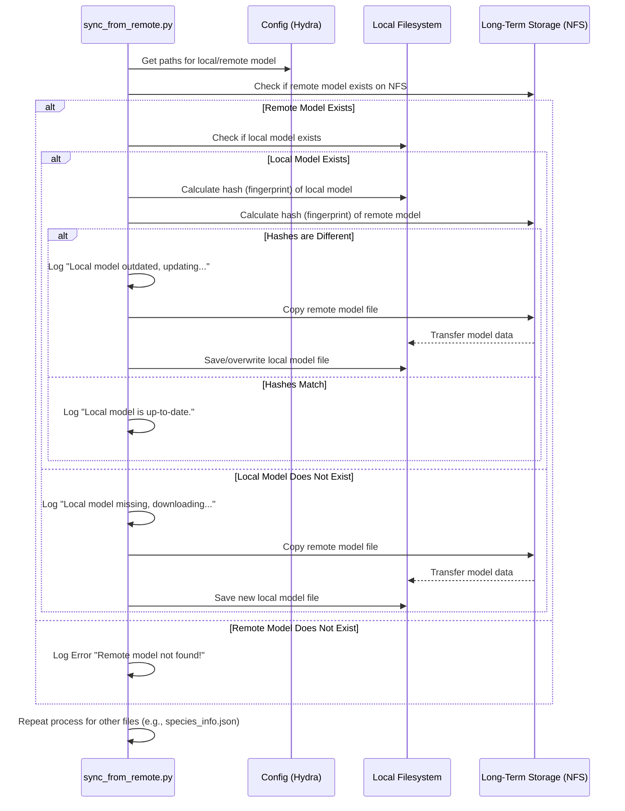
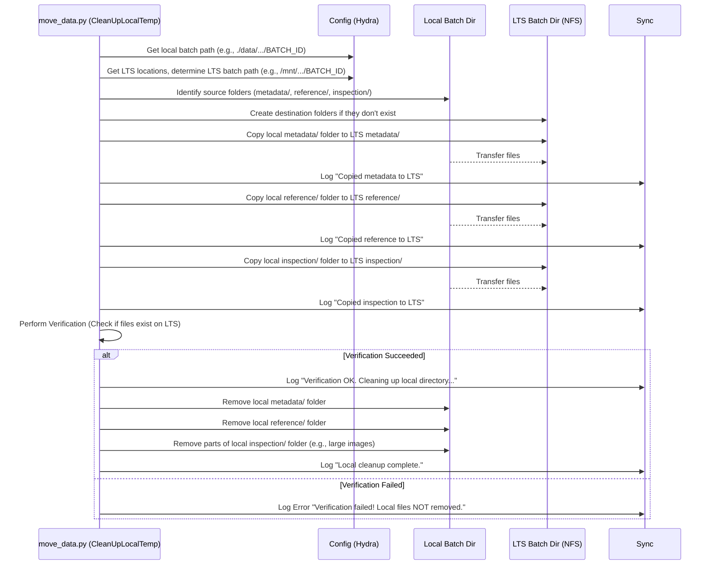

# Chapter 7: Data Synchronization & Movement

Welcome back! In [Chapter 6: Configuration Management (Hydra)](06_configuration_management__hydra__.md), we learned how the `SemiF-Preprocessing` pipeline uses configuration files (like a central dashboard) to manage all its settings – things like file paths, quality parameters, and which tasks to run.

Now that we know *how* the pipeline is configured, let's think about the data itself. Where does the data live? How does it get to the right place at the right time? Processing terabytes of image data involves moving files around, sometimes between different storage systems. This chapter explores how the pipeline manages this **Data Synchronization & Movement**.

## What Problem Are We Solving?

Imagine you're a chef preparing a large feast. You have a huge walk-in pantry and refrigerator (Long-Term Storage, LTS) where all your bulk ingredients are stored safely. But for cooking, you need a clean, accessible countertop (your local computer's disk) where you can chop vegetables, mix ingredients, and have everything within easy reach. You wouldn't want to run back to the walk-in fridge for every single carrot!

Similarly, our image processing pipeline deals with large amounts of data. The raw images and final results are often stored on a central, shared network drive (like an NFS mount, our "pantry"). However, running the processing directly on files over the network can be slow. It's often much faster to:

1.  **Bring necessary ingredients to the countertop:** Copy essential files like the latest AI models or configuration data from the central LTS to your local machine *before* processing starts. This is **Synchronization**.
2.  **Cook on the countertop:** Perform the heavy processing steps (like RAW conversion, 3D modeling, plant detection) using the local files, generating intermediate and final results locally.
3.  **Put leftovers and finished dishes away:** Move the important final results (like labeled metadata, quality reports, logs) back to the central LTS for long-term storage, backup, and sharing. This is **Movement**.
4.  **Clean the countertop:** Remove the temporary local copies of intermediate data to free up space.

This chapter explains how the `SemiF-Preprocessing` pipeline acts as a data logistics manager, ensuring data is where it needs to be, when it needs to be there.

## Key Concepts

Let's break down the main ideas behind data management in the pipeline.

### 1. Local Processing vs. Long-Term Storage (LTS)

*   **Local Storage:** This is typically the hard drive on the computer where you are running the pipeline scripts.
    *   **Pros:** Fast access speeds, ideal for computation-intensive tasks.
    *   **Cons:** Limited capacity, not automatically backed up, harder to share directly with others.
    *   *Analogy:* Your kitchen countertop – great for active work, but limited space.
*   **Long-Term Storage (LTS):** This is usually a large, shared network file system (NFS) accessible by multiple users and potentially backed up regularly.
    *   **Pros:** Large capacity, centralized access, better for collaboration and archiving.
    *   **Cons:** Slower access speeds compared to local disk, especially for many small file operations.
    *   *Analogy:* Your pantry or large refrigerator – stores a lot, safe for the long term, but slower to access items.

The pipeline aims to get the best of both worlds by using local storage for active processing and LTS for initial sources and final archiving.

### 2. Synchronization (`sync_from_remote` task)

Before the main processing starts, we need to make sure our local "countertop" has the latest versions of essential "ingredients" that are stored in the LTS "pantry". This is handled by the `sync_from_remote` task.

What does it synchronize?
*   **AI Models:** The plant detection model file (`last.pt` from [Chapter 2](02_plant_detection_.md)).
*   **Metadata Files:** Information about plant species (`species_info.json` used in [Chapter 4](04_bounding_box_processing___labeling_.md)).
*   **Calibration Files:** Potentially camera calibration profiles (`.pp3` from [Chapter 1](01_raw_image_processing___conversion__raw____dng____jpg__.md)) or Ground Control Point files ([Chapter 3](03_structure_from_motion__sfm__pipeline_.md)), although these might be handled differently depending on the setup.

How does it work?
1.  It looks at the configuration ([Chapter 6](06_configuration_management__hydra__.md)) to find the paths for both the local version and the LTS version of a file (e.g., `local_detection_model` and `lts_detection_model`).
2.  It checks if the local file exists.
3.  If the local file exists, it compares it to the remote file. A common way is to calculate a "fingerprint" (a cryptographic hash, like SHA-256) for both files. If the fingerprints match, the files are identical.
4.  If the local file doesn't exist, or if its fingerprint doesn't match the remote file's fingerprint, the task copies the file from LTS to the local machine, overwriting the old local version if necessary.

This ensures that the pipeline always uses the correct, up-to-date versions of these critical files.

*   **Script:** `src/sync_from_remote.py`

### 3. Local Processing

Once synchronization is done, most of the core pipeline tasks ([Chapter 5](05_pipeline_execution___orchestration_.md)) run primarily using local paths defined in the configuration (e.g., `${paths.batch_dir}` often points to a location under `${paths.data_dir}` on the local machine). This includes:
*   Reading input JPGs (which might have been generated locally by `raw2jpg`).
*   Running `autosfm` ([Chapter 3](03_structure_from_motion__sfm__pipeline_.md)), which generates large temporary files.
*   Running `detect_plants` ([Chapter 2](02_plant_detection_.md)), reading JPGs and writing detection `.txt` files locally.
*   Running `remap_labels` and `assign_species` ([Chapter 4](04_bounding_box_processing___labeling_.md)), reading local detections and SfM data, and writing updated metadata files locally (often to `${paths.batch_dir}/metadata/`).

### 4. Data Movement (`move_data` task)

After the processing for a batch is complete, the important final results need to be moved from the local "countertop" back to the LTS "pantry" for safekeeping and sharing. This is handled by the `move_data` task.

What does it move?
*   **Final Metadata:** The enriched JSON files containing bounding box information, 3D coordinates, and species labels (e.g., from the local `metadata/` directory).
*   **Reference Files:** Camera position and GCP reference files generated by SfM (e.g., from the local `reference/` directory).
*   **Quality Control & Reports:** Inspection images, PDF reports, and log files (e.g., from the local `inspection/` directory and the run's log directory).

How does it work?
1.  It identifies the source directories on the local machine (e.g., `paths.batch_dir / "metadata"`).
2.  It determines the corresponding destination directories on LTS (often constructed based on the batch ID, like `/mnt/lts_drive/semifield-developed-images/YOUR_BATCH_ID/metadata`).
3.  It copies the entire directories (or specific files) from the local source to the LTS destination.

*   **Script:** `src/move_data.py`

### 5. Cleanup (Part of `move_data` task)

Once the data has been successfully copied to LTS, we don't necessarily need to keep the large temporary files and intermediate results on the local machine. The `move_data` task often includes logic to clean up the local batch directory.

How does it work?
1.  **(Optional but Recommended) Verification:** It might perform checks to ensure the files were copied correctly to LTS (e.g., comparing file counts or sizes).
2.  **Deletion:** If verification passes (or is skipped), it removes the temporary files and directories from the local `${paths.batch_dir}` to free up disk space. Important final outputs needed for reports might be kept locally temporarily or copied to a separate local results area.

This cleanup step is crucial for preventing the local disk from filling up when processing many batches.

## How to Use It

Data synchronization and movement are usually handled by including specific tasks in the pipeline sequence defined in your main configuration file.

1.  **Configure Tasks:** Make sure `sync_from_remote` is listed near the beginning of your `tasks` list in `conf/config.yaml`, and `move_data` is listed near the end.

    ```yaml
    # --- File: conf/config.yaml (Snippet) ---
    # ...
    tasks:
      - sync_from_remote          # <<< Step 1: Get necessary files from LTS
      - raw2jpg                 # Run processing locally
      - update_exif
      - autosfm
      - detect_plants
      - merge_overlapping_bboxes
      - remap_labels
      - assign_species
      - inspect_images          # (Optional QC steps)
      - report                  # Generate final report
      - move_data               # <<< Step N: Move results to LTS & cleanup local
    # ...
    ```

2.  **Configure Paths:** Ensure the paths defined in `conf/paths/default.yaml` correctly point to both your local working directories and the corresponding LTS locations. Hydra uses these paths to tell the scripts where to read from and write to.

    ```yaml
    # --- File: conf/paths/default.yaml (Snippet) ---

    # Local base directory
    workdir: /home/user/SemiF-Preprocessing # Local project location
    data_dir: ${paths.workdir}/data/         # Local data cache

    # Example: Batch data processed locally
    developed_dir: ${paths.data_dir}/longterm_images2/semifield-developed-images
    batch_dir: ${paths.developed_dir}/${batch_id} # LOCAL path for active processing

    # Example: Detection Model paths
    local_detection_model: ${paths.data_dir}/semifield-tools/detection_model/last.pt
    lts_detection_model: /mnt/research-projects/s/screberg/longterm_images2/semifield-tools/models/plant_detector/train22/weights/last.pt # NFS path

    # Example: Species info paths
    local_species_info: ${paths.semif_util_dir}/species_information/species_info.json
    lts_species_info: /mnt/research-projects/s/screberg/longterm_images2/semifield-utils/species_information/species_info.json # NFS path

    # LTS base locations (used by scripts to find the right NFS mount)
    lts_locations:
      - /mnt/research-projects/s/screberg/longterm_images
      - /mnt/research-projects/s/screberg/longterm_images2
    # ...
    ```

3.  **Run the Pipeline:** Execute the pipeline using `python main.py` or `python batch.py` as described in [Chapter 5: Pipeline Execution & Orchestration](05_pipeline_execution___orchestration_.md). The `sync_from_remote` task will run first, followed by the local processing tasks, and finally the `move_data` task will archive results and clean up.

## Under the Hood: `sync_from_remote.py`

This script ensures your local copies of essential files match the "master" copies on LTS.

**Simplified Flow:**



**Code Insight (`sync_from_remote.py`):**

The script defines helper functions to calculate file hashes and compare them. The main part iterates through a dictionary of files to check.

```python
# --- File: src/sync_from_remote.py (Simplified) ---
import hashlib
import logging
import shutil
from pathlib import Path
import hydra
from omegaconf import DictConfig

log = logging.getLogger(__name__)

# Helper to calculate a file's "fingerprint" (SHA-256 hash)
def compute_file_hash(filepath: Path) -> str:
    hash_func = hashlib.sha256()
    with filepath.open("rb") as f:
        # Read file in chunks to handle large files
        for chunk in iter(lambda: f.read(65536), b""):
            hash_func.update(chunk)
    return hash_func.hexdigest() # Returns the fingerprint string

# Helper to compare local and remote file fingerprints
def files_are_identical(local_file: Path, remote_file: Path) -> bool:
    if not local_file.exists() or not remote_file.exists():
        return False # Can't compare if one is missing
    local_hash = compute_file_hash(local_file)
    remote_hash = compute_file_hash(remote_file)
    return local_hash == remote_hash # True if fingerprints match

# Helper to copy file from remote to local
def update_file(local_file: Path, remote_file: Path):
    log.info(f"Updating {local_file} from {remote_file}")
    local_file.parent.mkdir(parents=True, exist_ok=True) # Ensure local dir exists
    shutil.copy2(remote_file, local_file) # Copy file and metadata
    log.info(f"Update complete: {local_file}")

@hydra.main(version_base="1.3", config_path="../conf", config_name="config")
def main(cfg: DictConfig) -> None:
    log.info("Starting file synchronization check...")
    # Define the files we need to check (paths from config)
    files_to_sync = {
        "detection_model": {
            "local": Path(cfg.paths.local_detection_model),
            "remote": Path(cfg.paths.lts_detection_model),
        },
        "species_info": {
            "local": Path(cfg.paths.species_info),
            "remote": Path(cfg.paths.lts_species_info),
        }
        # Potentially add other files like PP3, GCP references etc. here
    }

    for name, paths in files_to_sync.items():
        local = paths["local"]
        remote = paths["remote"]

        if not remote.exists():
            log.error(f"Remote file {remote} needed for {name} does not exist! Skipping.")
            continue # Cannot sync if the source is missing

        if not local.exists():
            log.warning(f"Local file {local} for {name} not found. Downloading...")
            update_file(local, remote) # Download if missing locally
        elif not files_are_identical(local, remote):
            log.warning(f"Local {name} is outdated. Updating...")
            update_file(local, remote) # Update if different
        else:
            log.info(f"Local {name} is up-to-date.")

    log.info("File synchronization complete.")
```
*Explanation:* The script checks predefined pairs of local and remote files (like the detection model). It uses `compute_file_hash` to get a unique fingerprint for each file. If the local file is missing or its fingerprint doesn't match the remote one, `update_file` is called, which uses `shutil.copy2` to copy the file from the LTS path to the local path.

## Under the Hood: `move_data.py`

This script takes the results generated locally during processing and archives them to LTS, then cleans up the local space.

**Simplified Flow:**



**Code Insight (`move_data.py`):**

The script often uses a class (like `CleanUpLocalTemp`) to manage the paths and logic. It relies heavily on the `shutil` library for copying and deleting directories.

```python
# --- File: src/move_data.py (Simplified using CleanUpLocalTemp class) ---
import logging
import shutil
from pathlib import Path
import hydra
from omegaconf import DictConfig
# Helper to find the correct LTS base path
from utils.utils import find_lts_dir
# Used to get the current run's log file path
from hydra.core.hydra_config import HydraConfig

log = logging.getLogger(__name__)

class CleanUpLocalTemp:
    def __init__(self, cfg: DictConfig, batch_id: str):
        self.cfg = cfg
        self.batch_id = batch_id

        # Get local processing directory path from config
        self.local_batch_dir = Path(cfg.paths.batch_dir)

        # Construct the corresponding LTS directory path
        lts_base = find_lts_dir(batch_id, cfg.paths.lts_locations, developed=True, jpgs=True)
        self.lts_batch_dir = lts_base / "semifield-developed-images" / batch_id

        # Define source (local) and destination (LTS) paths for key results
        self.src_metadata = self.local_batch_dir / "metadata"
        self.dst_metadata = self.lts_batch_dir / "metadata"
        # ... (define src/dst for reference/, inspection/, etc.) ...
        self.src_inspection_dir = Path(cfg.paths.inspection_dir)
        self.dst_inspection_dir = self.lts_batch_dir / "inspection"
        self.src_log_path = Path(HydraConfig.get().runtime.output_dir) / f"{self.batch_id}.log"


    def move_data_to_lts(self):
        """Copy result directories from local to LTS."""
        log.info(f"Moving results for batch {self.batch_id} to {self.lts_batch_dir}")

        # Ensure destination parent directories exist
        self.dst_metadata.parent.mkdir(parents=True, exist_ok=True)
        self.dst_inspection_dir.parent.mkdir(parents=True, exist_ok=True)
        # ...

        # Copy metadata folder
        if self.src_metadata.exists():
            # Copy entire directory tree, overwrite if destination exists
            shutil.copytree(str(self.src_metadata), str(self.dst_metadata), dirs_exist_ok=True)
            log.info(f"Copied {self.src_metadata.name} to LTS.")
        else:
            log.warning(f"Local {self.src_metadata.name} not found. Skipping move.")

        # Copy inspection folder (including the log file)
        if self.src_inspection_dir.exists():
             # First copy the log file into the local inspection dir
             if self.src_log_path.exists():
                  shutil.copy(str(self.src_log_path), str(self.src_inspection_dir))
             # Now copy the whole inspection dir to LTS
             shutil.copytree(str(self.src_inspection_dir), str(self.dst_inspection_dir), dirs_exist_ok=True)
             log.info(f"Copied {self.src_inspection_dir.name} (with log) to LTS.")
        else:
             log.warning(f"Local {self.src_inspection_dir.name} not found. Skipping move.")

        # ... (copy reference folder similarly) ...

    def verify_copy(self) -> bool:
        """Basic check: Does the destination metadata folder exist on LTS?"""
        # (A more robust check would compare file counts or hashes)
        if self.dst_metadata.exists() and self.dst_inspection_dir.exists():
             log.info("Basic verification passed: Result folders exist on LTS.")
             return True
        else:
             log.error("Verification failed: Result folders missing on LTS!")
             return False

    def cleanup_local_dir(self):
        """Remove processed data folders from the local directory."""
        if not self.verify_copy():
            log.error("Verification failed. Will not remove local files.")
            return

        log.info(f"Cleaning up local directory: {self.local_batch_dir}")
        folders_to_remove = ["metadata", "reference", "autosfm", "images", "dngs", "pngs"] # Example list
        for folder_name in folders_to_remove:
             local_path = self.local_batch_dir / folder_name
             if local_path.exists():
                  try:
                       shutil.rmtree(local_path) # Remove directory and all contents
                       log.info(f"Removed local folder: {folder_name}")
                  except Exception as e:
                       log.error(f"Failed to remove {local_path}: {e}")
        # Clean specific large files from inspection if needed
        # e.g., shutil.rmtree(self.local_batch_dir / "inspection" / "prediction_images")


@hydra.main(version_base="1.3", config_path="../conf", config_name="config")
def main(cfg: DictConfig):
    log.info("Starting data movement and cleanup.")
    cleaner = CleanUpLocalTemp(cfg, cfg.batch_id)
    try:
        cleaner.move_data_to_lts()  # Copy results to LTS
        cleaner.cleanup_local_dir() # Remove local copies after verification
        log.info("Data movement and cleanup finished.")
    except Exception as e:
        log.error(f"Error during move/cleanup: {e}", exc_info=True)
        raise

if __name__ == "__main__":
    main()
```
*Explanation:* The `CleanUpLocalTemp` class gets the local and LTS paths from the configuration. The `move_data_to_lts` method uses `shutil.copytree` to copy entire directories (like `metadata/`) from the local processing location to the corresponding LTS location. The `cleanup_local_dir` method first calls `verify_copy` (which should ideally check if files were copied successfully) and if verification passes, it uses `shutil.rmtree` to delete the temporary local folders, freeing up disk space.

## Conclusion

You've now learned about the important "data logistics" handled by the `SemiF-Preprocessing` pipeline. You understand:
*   The difference between fast **local storage** (for processing) and large, safe **Long-Term Storage (LTS)** (for archiving).
*   How the `sync_from_remote` task ensures necessary files (models, species info) are copied *from* LTS *to* local before processing starts.
*   How the `move_data` task copies final results (metadata, reports, logs) *from* local *to* LTS after processing.
*   How `move_data` also cleans up temporary local files to save space.

This careful management of data ensures that processing is efficient (using local speed) while results are safely stored and accessible long-term (using LTS).

With the data processed, labeled, and archived, how do we check the quality of the results and generate summaries? The next chapter dives into reporting and quality control.

Next: [Chapter 8: Reporting & Quality Control (QC)](08_reporting___quality_control__qc__.md)

---

Generated by [AI Codebase Knowledge Builder](https://github.com/The-Pocket/Tutorial-Codebase-Knowledge)