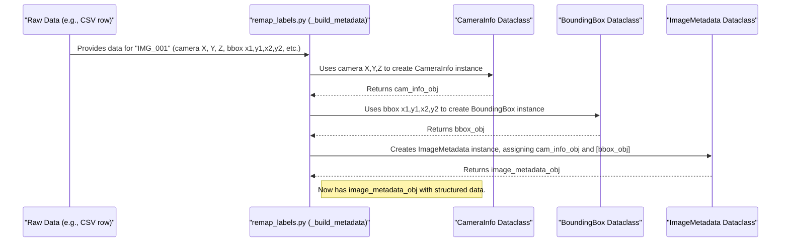

# Chapter 8: Data Representation (Dataclasses)

In the [previous chapter, Chapter 7: AutoSfM (Structure from Motion) Pipeline](07_autosfm__structure_from_motion__pipeline_.md), we saw how `SemiF-Preprocessing` can create amazing 3D models and maps from our 2D images. As you can imagine, this process, along with other steps like image correction and analysis, involves handling a *lot* of different pieces of information for each image and each detected object within it.

How do we keep all this information organized and make sure everyone (and every part of our software) is talking about the same thing in the same way? This is where **Data Representation using Dataclasses** comes in.

## What's the Problem? The Need for Standardized Forms

Imagine you're part of a team collecting information about plants.
*   Alice records camera details on a napkin: "Sony cam, sunny day, around noon."
*   Bob uses a spreadsheet, but his columns are "Camera_Make", "Camera_Model", "Time_of_Day".
*   Charlie just writes a sentence: "Used the usual drone camera, model X, on 2024-08-15, good lighting."

When you try to combine all this information, it's a mess! Everyone recorded similar things, but in different ways. It would be much easier if everyone used the **same standardized form**.

In software, especially in a big project like `SemiF-Preprocessing`, we face a similar challenge. We need to store information about:
*   Image metadata (camera type, settings, when it was taken).
*   Bounding box coordinates (where a plant is in an image).
*   Camera information (its precise location in 3D space, its lens properties).
*   EXIF details (data embedded in the image file itself).

If each part of our pipeline stores this information in its own unique way, it becomes very difficult to pass data between different steps and ensure consistency.

**Dataclasses in Python are like these standardized forms or templates.** They allow us to define a clear, consistent structure for different types of data. For example, every time we record information about a camera, we use the `CameraInfo` "form," ensuring all necessary details are captured in a consistent format.

## What is a Python Dataclass?

At its simplest, a Python **dataclass** is a special kind of class that is primarily used to store data. Python makes it very easy to create them. You just define the "fields" your form should have, along with the type of information each field holds.

Let's look at a very basic example, not from our project, just to see the idea:

```python
from dataclasses import dataclass

@dataclass
class SimplePoint:
    x: int  # This field should be an integer
    y: int  # This field should also be an integer
    label: str # This field should be text (a string)

# Now we can create a 'SimplePoint' using our new "form"
point1 = SimplePoint(x=10, y=20, label="Start Point")
point2 = SimplePoint(x=5, y=15, label="End Point")

print(point1)
print(f"Point 1's x-coordinate is: {point1.x}")
```

Output:
```
SimplePoint(x=10, y=20, label='Start Point')
Point 1's x-coordinate is: 10
```

What makes `@dataclass` special?
*   `@dataclass` is a "decorator" that automatically adds useful methods to your class, like a method to initialize it (`__init__`) and a method to print it nicely (`__repr__`). You don't have to write them yourself!
*   `x: int`, `y: int`, `label: str` are "type hints." They tell us (and Python tools) what kind of data each field expects. This helps catch errors and makes the code easier to understand.

## Dataclasses in `SemiF-Preprocessing`

Our project, `SemiF-Preprocessing`, uses dataclasses extensively to ensure all the complex information we handle is well-structured. You can find most of these "standardized forms" defined in the file `src/utils/datasets.py`.

Let's look at a few examples, simplified for clarity:

### 1. `BBoxCoordinates`: For Storing Bounding Box Corners

When we detect a plant in an image, we draw a box around it. This box has corners. `BBoxCoordinates` is a dataclass to store the (x, y) positions of these corners.

```python
# Found in: src/utils/datasets.py (simplified)
from dataclasses import dataclass
from typing import List # To specify a list of items

@dataclass
class BBoxCoordinates:
    top_left: List[float]      # e.g., [x1, y1]
    top_right: List[float]     # e.g., [x2, y1]
    bottom_left: List[float]   # e.g., [x1, y2]
    bottom_right: List[float]  # e.g., [x2, y2]
    local_centroid: List[float]# e.g., [centerX, centerY]
    is_normalized: bool        # Are coords 0-1 or pixel values?
```
This "form" tells us that any `BBoxCoordinates` object will have fields for `top_left`, `top_right`, etc., and what type of data they should hold (a list of floating-point numbers for coordinates, and a boolean True/False for `is_normalized`).

### 2. `CameraInfo`: For Storing Details About a Camera

When we process images, especially for 3D modeling ([Chapter 7: AutoSfM (Structure from Motion) Pipeline](07_autosfm__structure_from_motion__pipeline_.md)), we need to know a lot about the camera.

```python
# Found in: src/utils/datasets.py (simplified)
# (Assuming FOV and CameraCoefficients are also defined dataclasses)

@dataclass
class FOV: # Simplified for this example
    width: float
    height: float
    # ... other FOV details

@dataclass
class CameraCoefficients: # Simplified
    f: float  # Focal length
    cx: float # Principal point x
    cy: float # Principal point y
    # ... other lens distortion coefficients

@dataclass
class CameraInfo:
    aligned: bool
    fov: FOV  # Notice: This field is another dataclass!
    estimated_xyz: List[float] # Camera's 3D position [X, Y, Z]
    estimated_yaw: float
    estimated_pitch: float
    estimated_roll: float
    camera_coefficients: CameraCoefficients # Another nested dataclass
    # ... other camera details like pixel size, focal length ...
```
The `CameraInfo` dataclass is more complex. It not only has simple fields like `aligned` (a boolean) or `estimated_xyz` (a list of numbers), but it also has fields (`fov` and `camera_coefficients`) that are *themselves other dataclasses*. This is like having a main form that includes sections which are smaller, specialized forms.

### 3. `BoundingBox`: For Storing All Info About One Detected Object

This dataclass brings together information about a detected object (like a plant), including its coordinates.

```python
# Found in: src/utils/datasets.py (simplified)
# (Assuming BBoxCoordinates and GlobalCoordinates are defined dataclasses)

@dataclass
class GlobalCoordinates: # Simplified
    top_left: List[float] # Global (e.g., GPS) coordinates
    area_sqm: float
    # ... other global coordinate details

@dataclass
class BoundingBox:
    is_primary: bool            # Is this the best view of this plant?
    cutout_id: str              # A unique ID for this detection
    category_class_id: int      # What type of plant is it (a number code)?
    local_coordinates: BBoxCoordinates   # Nested dataclass for image pixel coords
    global_coordinates: GlobalCoordinates # Nested dataclass for world coords (optional)
    overlapping_cutout_ids: List[str] = field(default_factory=list) # Other boxes it overlaps with
    # ... other details like if a cutout image exists ...
```
Here, `BoundingBox` uses our `BBoxCoordinates` "form" for its `local_coordinates` and a `GlobalCoordinates` "form" for `global_coordinates`. The `field(default_factory=list)` for `overlapping_cutout_ids` means if we don't provide this list when creating a `BoundingBox`, it will automatically be an empty list.

### 4. `ImageMetadata`: The Master Form for an Image

Finally, `ImageMetadata` is a top-level dataclass that gathers almost all information related to a single image.

```python
# Found in: src/utils/datasets.py (simplified)
# (Assuming ExifMeta, CameraInfo, and BoundingBox are defined)

@dataclass
class ExifMeta: # Simplified
    Make: str
    Model: str
    DateTime: str
    # ... other EXIF tags

@dataclass
class ImageMetadata:
    image_id: str
    batch_id: str
    camera_info: CameraInfo             # Nested CameraInfo form
    annotations: List[BoundingBox]      # A list of BoundingBox forms for all detected objects
    Exif_meta: ExifMeta                 # Nested EXIF details form
    fullres_width: int
    fullres_height: int
    # ... other image-level details like season, version, etc.
```
An `ImageMetadata` object holds the `image_id`, `batch_id`, all the `CameraInfo`, a list of all `BoundingBox` detections in that image, and more. It's like the main folder for an image, containing all its related "forms."

## Using Dataclasses: Filling Out the Forms

Now that we have these "standardized forms," how do we use them? When our scripts process data (e.g., reading from a CSV file, getting output from Metashape), they create instances of these dataclasses and fill in the fields.

Let's imagine a part of our code in `src/tasks/label_utils/remap_labels.py` (which we'll explore more in the next chapter) is processing data for an image named "IMG_001.JPG". It might do something like this:

```python
# Conceptual usage based on src/tasks/label_utils/remap_labels.py

# --- First, create the smaller "forms" (dataclasses) ---

# Bounding box pixel coordinates
local_coords1 = BBoxCoordinates(
    top_left=[100.0, 50.0], top_right=[150.0, 50.0],
    bottom_left=[100.0, 80.0], bottom_right=[150.0, 80.0],
    local_centroid=[125.0, 65.0], is_normalized=False
)

# Information about the first detected plant in this image
plant_box1 = BoundingBox(
    is_primary=True, cutout_id="IMG_001_plant1", category_class_id=1,
    local_coordinates=local_coords1, # Use the local_coords1 we just made
    # global_coordinates would be filled if available
)

# Camera details (simplified)
cam_fov = FOV(width=0.8, height=0.6)
cam_coeffs = CameraCoefficients(f=3000.0, cx=1920.0, cy=1080.0)
cam_info_for_img1 = CameraInfo(
    aligned=True, fov=cam_fov, estimated_xyz=[1.0, 2.5, 1.8],
    estimated_yaw=5.2, estimated_pitch=0.1, estimated_roll=-0.05,
    camera_coefficients=cam_coeffs
)

# --- Then, create the main "ImageMetadata" form ---
image_data_obj = ImageMetadata(
    image_id="IMG_001", batch_id="MyExperiment_2024-08-15",
    camera_info=cam_info_for_img1,   # Use the cam_info_for_img1
    annotations=[plant_box1],       # Put plant_box1 in the list of annotations
    Exif_meta=ExifMeta(Make="Sony", Model="Alpha1", DateTime="2024:08:15 10:00:00"),
    fullres_width=7680, fullres_height=4320
)

# Now we can easily access structured information:
print(f"Image ID: {image_data_obj.image_id}")
print(f"Camera X position: {image_data_obj.camera_info.estimated_xyz[0]}")
print(f"First plant's top-left X: {image_data_obj.annotations[0].local_coordinates.top_left[0]}")
```

Output:
```
Image ID: IMG_001
Camera X position: 1.0
First plant's top-left X: 100.0
```
By creating an `ImageMetadata` object, the script bundles all related information together in a predictable way. If another part of the pipeline receives this `image_data_obj`, it knows exactly what fields to expect (e.g., `image_data_obj.camera_info.fov`) and what type of data they hold.

## Why is This So Helpful?

Using dataclasses like this throughout `SemiF-Preprocessing` provides several key benefits:

1.  **Consistency:** Every time we deal with, say, camera information, it's structured as a `CameraInfo` object. No more guessing field names or data types.
2.  **Clarity:** When you read the code, the dataclass definitions clearly document what kind of data is being passed around. It's self-explanatory.
3.  **Reduced Errors:** If you accidentally try to assign text to a field that expects a number, tools can sometimes warn you. It also helps prevent typos in field names.
4.  **Ease of Development:** Dataclasses reduce the amount of "boilerplate" code (like `__init__` methods) you need to write.
5.  **Better Collaboration:** When different developers work on different parts of the pipeline, dataclasses provide a shared understanding of data structures.

## Under the Hood: How Dataclasses Are Used

Let's look at how a script like `src/tasks/label_utils/remap_labels.py` might create these dataclass instances. Imagine it has read some data from a CSV file or from Metashape's output. The `_build_metadata` method in that script is responsible for taking this raw data and populating our dataclass "forms".

Here's a simplified conceptual flow:



Inside `_build_metadata` in `src/tasks/label_utils/remap_labels.py`, you'd see code that does something conceptually like this:

```python
# Simplified from src/tasks/label_utils/remap_labels.py _build_metadata method

def _build_single_image_metadata_object(image_id_from_data, raw_data_rows_for_this_image):
    # Assume raw_data_rows_for_this_image is a list of data records for this image_id
    
    # 1. Extract camera information from raw data
    #    (e.g., from the first row, as camera info is per-image)
    first_row = raw_data_rows_for_this_image[0]
    cam_fov_data = FOV(width=first_row['fov_w'], height=first_row['fov_h']) # Get from data
    cam_coeffs_data = CameraCoefficients(f=first_row['f'], cx=first_row['cx'], cy=first_row['cy'])
    
    camera_details = CameraInfo(
        aligned=first_row['is_aligned_in_metashape'],
        fov=cam_fov_data,
        estimated_xyz=[first_row['cam_X'], first_row['cam_Y'], first_row['cam_Z']],
        estimated_yaw=first_row['cam_yaw'],
        estimated_pitch=first_row['cam_pitch'],
        estimated_roll=first_row['cam_roll'],
        camera_coefficients=cam_coeffs_data
    )

    # 2. Create BoundingBox objects for each detection in the image
    all_bboxes_for_this_image = []
    for row_data in raw_data_rows_for_this_image:
        if row_data['xmin'] is not None: # Check if detection data exists
            local_coords = BBoxCoordinates(
                top_left=[row_data['xmin'], row_data['ymin']],
                # ... (fill other BBoxCoordinates fields from row_data)
                local_centroid=[(row_data['xmin'] + row_data['xmax']) / 2, (row_data['ymin'] + row_data['ymax']) / 2],
                is_normalized=row_data['are_coords_normalized']
            )
            
            one_bbox = BoundingBox(
                is_primary=False, # This might be determined later
                cutout_id=f"{image_id_from_data}_{row_data['detection_id']}",
                category_class_id=row_data['plant_type_code'],
                local_coordinates=local_coords
                # global_coordinates would be added in a later step if available
            )
            all_bboxes_for_this_image.append(one_bbox)

    # 3. Create the main ImageMetadata object
    #    (Some ExifMeta fields might come from config or file reading)
    exif_details = ExifMeta(Make="Unknown", Model="Unknown", DateTime="Unknown")

    final_image_object = ImageMetadata(
        image_id=image_id_from_data,
        batch_id="some_batch_id_from_config", # cfg.batch_id
        camera_info=camera_details,
        annotations=all_bboxes_for_this_image,
        Exif_meta=exif_details,
        fullres_width=3840, # Example, could be from cfg.exif.ImageWidth
        fullres_height=2160
    )
    return final_image_object
```
This function takes raw input (like `image_id_from_data` and `raw_data_rows_for_this_image`), extracts the relevant pieces, and uses them to "fill out" the `CameraInfo`, `BoundingBox`, and finally `ImageMetadata` dataclass "forms." The result is a neatly structured `final_image_object`.

Other parts of the pipeline (like `src/tasks/label_utils/filter_bboxes.py` which deals with removing duplicate bounding boxes) will then work with these structured `ImageMetadata` objects. This makes their job much easier because they know exactly where to find the data they need (e.g., `image.annotations[0].local_coordinates.top_left`).

It's worth noting that while these dataclasses define the structure of our *application data* (like image details), the project's *configuration data* (settings for how the pipeline runs) is managed by [Hydra (Chapter 2)](02_configuration_management__hydra__.md), which uses its own system (OmegaConf objects) that behaves similarly to dataclasses.

## Conclusion

You've now learned about **Data Representation using Dataclasses** in `SemiF-Preprocessing`. They are like standardized digital forms that help us:
*   Define a clear structure for various types of data (e.g., `CameraInfo`, `BoundingBox`, `ImageMetadata`).
*   Ensure consistency across different parts of the pipeline.
*   Make code easier to read, write, and maintain.

By using dataclasses, we transform raw, sometimes messy, information into well-organized objects that our Python scripts can work with reliably. This is a fundamental concept for building robust and maintainable software.

In the next chapter, we'll see these dataclasses in action as we dive into how the project processes bounding boxes, including how it remaps their coordinates from image space to real-world space.

Next up: [Chapter 9: Bounding Box Processing and Remapping](09_bounding_box_processing_and_remapping_.md)

---

Generated by [AI Codebase Knowledge Builder](https://github.com/The-Pocket/Tutorial-Codebase-Knowledge)
