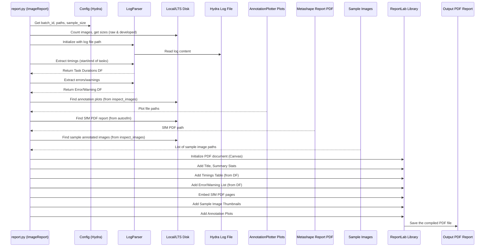

# Chapter 8: Reporting & Quality Control (QC)

Hi there! In the last chapter, [Chapter 7: Data Synchronization & Movement](07_data_synchronization___movement_.md), we saw how the `SemiF-Preprocessing` pipeline manages the logistics of moving data between your local computer and long-term storage (LTS). We made sure the necessary files were synchronized before processing and the final results were safely archived afterward.

But wait! Before we declare victory and move on, how do we know if the processing actually *worked* correctly? Did the 3D models come out okay? Are the plant labels accurate? And how can we get a quick summary of what happened during the processing of a batch?

This is where **Reporting & Quality Control (QC)** comes in. It's like the final inspection and documentation step.

## What Problem Are We Solving?

Imagine you baked a batch of dozens of cookies using a complex recipe (our pipeline). Before you serve them or store them away, you'd probably want to:

1.  **Check a few:** Look at some cookies closely. Are they burnt? Undercooked? Do they look right? (This is **Quality Control**).
2.  **Write down notes:** Record how long they baked, the oven temperature used, any problems encountered (like spilling the flour), and maybe take a picture of the finished batch. (This is **Reporting**).

Similarly, after processing a batch of hundreds or thousands of images through the `SemiF-Preprocessing` pipeline, we need to:

1.  **Perform Quality Control (QC):** Check a sample of the processed images and data to catch potential problems like:
    *   Poor image quality (blurry, bad colors).
    *   Inaccurate plant detections or bounding boxes.
    *   Errors in the 3D reconstruction.
    *   Incorrect species labels assigned to plants.
    *   Issues with cleanliness in the images (e.g., tools left in view).
2.  **Generate a Summary Report:** Create a concise document (usually a PDF) that summarizes the entire processing run for that batch, including:
    *   Basic statistics (how many images, total data size).
    *   How long each processing step took.
    *   Any errors or warnings encountered.
    *   Thumbnails of sample output images.
    *   Key results from the 3D modeling (SfM) step.

This chapter explains how the pipeline automates the creation of these summary reports and provides tools for humans to perform visual quality checks.

## Key Concepts

Let's break down the components of reporting and QC.

### 1. The Batch Summary Report (PDF)

Think of this as the "report card" for a processing batch. It's a PDF document automatically generated by the `report` task. It gathers information from various sources:

*   **File System:** Counts the number of raw and processed images, calculates their total size.
*   **Log Files:** Extracts timestamps to calculate how long each task took (like `raw2jpg`, `autosfm`). It also pulls out any `ERROR` or `WARNING` messages logged during the run.
*   **Processed Data:** Takes information from the [Structure from Motion (SfM) Pipeline](03_structure_from_motion__sfm__pipeline_.md) output (like accuracy reports from Metashape) and potentially annotation summary plots (like species counts).
*   **Sample Images:** Includes thumbnail images showing examples of the processed outputs (like the orthomosaic or sample annotated images).

This PDF provides a quick, high-level overview of whether the batch processed successfully and efficiently.

*   **Script:** `src/report.py`

### 2. Quality Control (QC): Why We Need Human Eyes

Computers are great at processing large amounts of data consistently, but they aren't perfect at judging "quality" in the way humans are. Sometimes subtle things go wrong:
*   The color correction might look slightly off.
*   A bounding box might be drawn around a shadow instead of a plant.
*   A plant might be mislabeled because it grew slightly outside its designated plot area.
*   Someone might have left a tool or dropped soil in the imaging area, confusing the algorithms.

QC involves a human visually inspecting a *sample* of the results to catch these kinds of issues that the automated steps might miss.

### 3. The Interactive Inspection Tool (`inspect_images` task)

Manually opening hundreds of images and their corresponding data files would be very slow. The `inspect_images` task provides a helper tool to make this easier. When enabled and run, it typically does the following:

1.  **Pre-generates Samples:** Creates annotated versions of a random sample of images (e.g., drawing the final bounding boxes and labels onto the JPGs) and saves them in the `inspection/remapped_samples/` folder.
2.  **Generates Plots:** Creates summary plots based on all annotations (e.g., histograms of plant sizes, counts per species, density maps) using `AnnotationPlotter` and saves them in `inspection/plots/`.
3.  **(Optional) Interactive Review:** If configured (`inspection.inspect: true`), it launches an interactive window (using OpenCV).
    *   It displays the pre-generated sample images one by one.
    *   The user can look at the image and the overlaid annotations (boxes, labels).
    *   The user presses keys (e.g., '1' for Pass, '2' for Bad Quality, '3' for Cleanliness Issue, etc.) to flag the quality of each sample image.
    *   These flags are saved to a CSV file (e.g., `inspection/{batch_id}_label_inspection.csv`).

This tool streamlines the process of visually checking a representative subset of the processed data.

*   **Script:** `src/inspect_images.py`

### 4. Documenting Issues (Connecting to Issue Tracking)

What happens when the QC review finds problems? Simply noting them down isn't enough. These issues need to be tracked and potentially fixed.
*   The inspection tool prompts the user to report flagged images.
*   The project uses GitHub Issues for this. The QC reviewer manually creates an issue summarizing the findings (potentially using a template like `.github/ISSUE_TEMPLATE/image_review_issue.yaml`).
*   This creates a record of the problem, allowing the team to discuss it, decide if data needs reprocessing, or if algorithms need improvement. (We'll cover automated issue creation more in [Chapter 9: Automated Issue Tracking (GitHub)](09_automated_issue_tracking__github__.md)).

## How to Use It: Generating Reports and Performing QC

Reporting and inspection are typically run as the final tasks in the pipeline.

1.  **Configure Tasks:** Ensure `inspect_images` and `report` are included in the `tasks` list in `conf/config.yaml`, usually after all the main processing steps and before `move_data` (or sometimes after, if reports are generated locally and then moved). You can also control the interactive review via `inspection.inspect`.

    ```yaml
    # --- File: conf/config.yaml (Snippet) ---
    # ...
    tasks:
      # ... (sync, raw2jpg, autosfm, detect_plants, remap_labels, assign_species) ...
      - inspect_images  # <<< Generates samples & plots, optionally runs interactive review
      - report          # <<< Generates the final PDF summary report
      - move_data       # Moves results (including reports/QC files) to LTS
      # ...

    inspection:
      inspect: false # Set to true to run the interactive review window
      use_lts_images: false # Set true to run inspection using images already on LTS

    report:
      save2lts: true # Should the final PDF report be copied to LTS?
      sample_size: 96 # How many random sample images to include in the PDF?
      reviewers: # Default GitHub usernames for issue assignment (used in Chapter 9)
        github:
          MD: mkutu
          NC: mkutu
          default: mkutu
    # ...
    ```

2.  **Configure Paths:** Make sure the output paths for inspection (`inspection_dir`) and the SfM PDF report (`pdf_report`) are correctly defined in `conf/paths/default.yaml`. The reporting script will look for inputs (like logs, SfM reports, sample images) in their respective configured locations.

    ```yaml
    # --- File: conf/paths/default.yaml (Snippet) ---
    # ...
    # SfM PDF report (Input for summary PDF)
    pdf_report: ${paths.inspection_dir}/${batch_id}_asfm_report.pdf
    # Main batch inspection directory (Output location for QC results, plots, samples)
    inspection_dir: ${paths.batch_dir}/inspection
    # ...
    ```

3.  **Run the Pipeline:** Execute the pipeline using `python main.py` or `python batch.py` ([Chapter 5: Pipeline Execution & Orchestration](05_pipeline_execution___orchestration_.md)).
    *   The `inspect_images` task will run, generating sample images with bounding boxes (in `inspection/remapped_samples/`) and summary plots (in `inspection/plots/`). If `inspection.inspect: true`, it will then open the interactive review window.
    *   The `report` task will run afterward, gathering all the statistics, timings, errors, plots, and sample images, and compiling them into `inspection/{batch_id}_report.pdf`.
    *   Finally, `move_data` ([Chapter 7](07_data_synchronization___movement_.md)) will typically copy the entire `inspection/` directory (containing the PDF report, QC results CSV, plots, and samples) to LTS.

**Inputs:**
*   Processed data from previous steps (metadata JSONs, SfM outputs).
*   Log files from the current pipeline run (Hydra logs).
*   Configuration files.

**Outputs:**
*   **PDF Summary Report:** `inspection/{batch_id}_report.pdf`. Contains stats, timings, errors, SfM summary pages, sample images, annotation plots.
*   **QC Results CSV:** `inspection/{batch_id}_label_inspection.csv` (if interactive review is run). Contains user flags for inspected sample images.
*   **Sample Annotated Images:** `inspection/remapped_samples/*.jpg`. Images with bounding boxes drawn on them.
*   **Annotation Summary Plots:** `inspection/plots/*.png`. Visualizations of annotation data (counts, sizes, density).

## Under the Hood: `report.py` Script

This script acts like a journalist, gathering information from different sources and assembling it into the final PDF report.

**Simplified Flow:**



**Code Insight (`report.py` - `ImageReport` class):**

The `ImageReport` class orchestrates the report generation. It calculates stats, uses helper classes like `LogParser`, and leverages the `reportlab` library to build the PDF page by page.

```python
# --- File: src/report.py (Simplified ImageReport methods) ---
import logging
from pathlib import Path
import random
# Libraries for creating PDFs
from reportlab.pdfgen import canvas
from reportlab.lib.pagesizes import letter
from reportlab.platypus import Table, TableStyle
from reportlab.lib import colors
# Used for getting log file path
from hydra.core.hydra_config import HydraConfig
# Our custom log parser
from src.report import LogParser # Assumes LogParser is in the same file or imported

log = logging.getLogger(__name__)

class ImageReport:
    def __init__(self, cfg):
        self.batch_id = cfg.batch_id
        # ... (Initialize paths from cfg: upload_dir, developed_dir, output_report_dir) ...
        self.output_report_dir = Path(cfg.paths.inspection_dir)
        self.output_report_dir.mkdir(parents=True, exist_ok=True)
        self.plot_file_base = self.output_report_dir / "plots" # Where plots are saved
        self.local_sample_dir = self.output_report_dir / "remapped_samples" # Where samples are saved
        # ... (Get image file lists) ...
        self.log_parser = LogParser(cfg, self.output_report_dir) # Initialize log parser
        self.sample_size = cfg.report.sample_size

    # --- Methods to calculate statistics ---
    def calculate_total_images(self) -> int:
        # Count .RAW files in upload directory
        raw_files = list(self.upload_directory.glob("*.RAW"))
        return len(raw_files)

    def calculate_total_size(self) -> int:
        # Sum sizes of .RAW files
        raw_files = list(self.upload_directory.glob("*.RAW"))
        return sum(image.stat().st_size for image in raw_files)

    # ... (Other calculation methods: developed size, avg size, first/last upload) ...

    # --- Main PDF generation method ---
    def generate_pdf_report(self):
        pdf_output_path = self.output_report_dir / f"{self.batch_id}_report.pdf"
        # Initialize ReportLab Canvas (the PDF document)
        c = canvas.Canvas(str(pdf_output_path), pagesize=letter)
        c.setFont("Helvetica", 12)

        # --- Page 1: Summary ---
        c.drawString(50, 750, f"SemiField Collection Report")
        c.drawString(50, 730, f"Batch ID: {self.batch_id}")
        # Add calculated stats (total images, sizes, etc.)
        c.drawString(50, 710, f"Total Raw Images: {self.calculate_total_images()}")
        # ... add more stats ...

        # Get and add module timings from LogParser
        module_timings_df = self.log_parser.extract_module_timings()
        if not module_timings_df.empty:
            # ... (Code to format timings into a ReportLab Table) ...
            # Example: table_data = [["Module", "Duration"]] + [...]
            # table = Table(table_data)
            # table.setStyle(...)
            # table.drawOn(c, 50, 110) # Draw table at specific coords
            pass # Simplified for brevity

        # --- Page 2 onwards: SfM Report Pages ---
        # (Code to find the Metashape PDF report generated by autosfm)
        ms_report_path = Path(self.cfg.paths.pdf_report) # Path from config
        # (Code to embed pages from ms_report_path into the current PDF)
        # This often involves using PyMuPDF (fitz) to render pages as images
        # then drawing those images onto the ReportLab canvas
        # Example (conceptual):
        # pages = extract_pdf_pages_as_images(ms_report_path)
        # for page_img_path in pages:
        #     c.showPage() # New page in our report
        #     c.drawImage(page_img_path, ...) # Draw the SfM page image

        # --- Sample Images Pages ---
        if self.local_sample_dir.exists():
            sample_images = sorted(list(self.local_sample_dir.glob("*.jpg")))
            num_samples = min(self.sample_size, len(sample_images))
            selected_images = random.sample(sample_images, num_samples)
            # ... (Code to loop through selected_images) ...
            # ... (For each group of N images, start c.showPage()) ...
            # ... (Draw image thumbnails using c.drawImage() in a grid layout) ...
            pass # Simplified for brevity

        # --- Analysis Plots Pages ---
        c.showPage()
        c.drawString(50, 750, "Analysis Plots")
        # (Code to find plot images like species_counts.png, area_log_scaled_histograms.png)
        # (Draw plots using c.drawImage())
        plot_path = self.plot_file_base / "species_counts.png"
        if plot_path.exists():
             c.drawImage(str(plot_path), 50, 400, width=250, preserveAspectRatio=True)
        # ... Draw other plots ...

        # --- Errors/Warnings Page ---
        errors_df = self.log_parser.extract_error_blocks()
        if not errors_df.empty:
            c.showPage()
            c.drawString(50, 750, "Errors and Warnings")
            # ... (Code to format errors_df into text lines or a table) ...
            # ... (Draw the error list using c.drawString() for each error) ...
            pass # Simplified for brevity

        # --- Save the final PDF ---
        c.save()
        log.info(f"PDF report saved to {pdf_output_path.relative_to(Path.cwd())}")

    def generate_report(self):
        """Generates plots and the main PDF report."""
        log.info(f"Generating report for batch: {self.batch_id}")
        # ... (Maybe generate plots if not done by inspect_images) ...
        self.generate_pdf_report()
        self.log_parser.copy_log_file() # Copy log to inspection dir
        log.info(f"Completed report for batch: {self.batch_id}")

```
*Explanation:* The `ImageReport` class has methods to calculate statistics by looking at files (`calculate_total_images`, etc.). The main `generate_pdf_report` method uses the `reportlab` library (`canvas`) to create a PDF document. It draws strings (`c.drawString`) for text, creates tables (`Table`) for formatted data (like timings), and draws images (`c.drawImage`) for plots, sample thumbnails, and embedded pages from other reports (like the SfM report). It relies on the `LogParser` helper class to get timing and error information from the run's log file.

## Under the Hood: `inspect_images.py` Script

This script prepares images for visual review, optionally runs an interactive session, and generates summary plots of the annotation data.

**Simplified Flow:**

```mermaid
sequenceDiagram
    participant Inspect as inspect_images.py (ImageReviewer)
    participant Cfg as Config (Hydra)
    participant Disk as Local Disk (Images, Metadata)
    participant Plotter as AnnotationPlotter
    participant OpenCV as OpenCV Library
    participant User as Human Reviewer
    participant QC_CSV as QC Results CSV File
    participant SamplesDir as inspection/remapped_samples/
    participant PlotsDir as inspection/plots/

    Inspect->>Cfg: Get paths, sample size, inspect flag
    Inspect->>Disk: Get list of all image paths
    Inspect->>Disk: Load metadata for images
    Inspect->>SamplesDir: Generate annotated sample images (using OpenCV drawing functions)
    Inspect-->>SamplesDir: Save sample JPGs
    Inspect->>Plotter: Initialize AnnotationPlotter
    Plotter->>Disk: Load all annotation data from metadata JSONs
    Plotter->>PlotsDir: Generate summary plots (counts, histograms, density)
    Plotter-->>PlotsDir: Save plot PNGs

    alt inspection.inspect is True
        Inspect->>OpenCV: Initialize display window
        Inspect->>SamplesDir: Load first sample image
        loop For each sample image
            Inspect->>OpenCV: Display image
            OpenCV-->>User: Show image
            User->>OpenCV: Press key (1=Pass, 2=Issue, etc.)
            OpenCV-->>Inspect: Return key pressed
            alt Key is 'Quit'
                Inspect->>OpenCV: Close window
                break
            end
            Inspect->>QC_CSV: Append [batch_id, img_name, flag, timestamp, user]
            Inspect->>SamplesDir: Load next sample image
        end
        Inspect->>Inspect: Ask user to confirm saving QC_CSV
    end

```

**Code Insight (`inspect_images.py` - `ImageReviewer` class):**

The `ImageReviewer` class handles selecting samples, displaying them with annotations, and recording user feedback.

```python
# --- File: src/inspect_images.py (Simplified ImageReviewer methods) ---
import logging
import cv2 # OpenCV for image display and drawing
import pandas as pd
from pathlib import Path
import random
# Assumes AnnotationPlotter is defined elsewhere or imported
# from src.inspect_images import AnnotationPlotter

log = logging.getLogger(__name__)

LABEL_OPTIONS = { "1": "Pass", "2": "Preprocessing Quality", "3": "Cleanliness", "0": "Other", "q": "Quit", "b": "Back"}

class ImageReviewer:
    def __init__(self, cfg):
        self.cfg = cfg
        self.batch_id = cfg.batch_id
        # ... (Initialize paths: image_dir, metadata_dir, inspection_dir, csv_file, remapped_sample_dir) ...
        self.remapped_sample_dir = Path(cfg.paths.inspection_dir) / "remapped_samples"
        self.remapped_sample_dir.mkdir(parents=True, exist_ok=True)
        self.image_dir = Path(cfg.paths.batch_dir) / "images" # Assuming original JPGs are here
        self.metadata_dir = Path(cfg.paths.batch_dir) / "metadata"
        self.csv_file = Path(cfg.paths.inspection_dir) / f"{self.batch_id}_label_inspection.csv"
        self.images = self._get_image_paths() # Get list of images to potentially sample
        self.results = self._load_existing_results() # Load previous QC flags if any
        # ... (get species info mapping) ...

    def _get_image_paths(self) -> list[Path]:
        # Logic to select a subset of images for review
        all_images = sorted(self.image_dir.glob("*.jpg"))
        sample_size = 75 # Or from cfg.sample_size
        return random.sample(all_images, min(len(all_images), sample_size))

    def _load_existing_results(self):
        if self.csv_file.exists():
            return pd.read_csv(self.csv_file).values.tolist()
        return []

    def _save_results(self):
        df = pd.DataFrame(self.results, columns=['BatchID', 'ImageID', 'Selection', 'Timestamp', 'User', 'LTSLocation'])
        df.to_csv(self.csv_file, index=False)

    def _create_bboxes_on_image(self, img_path, preview_only=False):
        # --- This method generates the annotated sample image ---
        save_path = self.remapped_sample_dir / img_path.name
        if save_path.exists() and not preview_only: # Don't redraw if it exists unless just previewing
             log.debug(f"Sample exists: {save_path}")
             return True
        
        image = cv2.imread(str(img_path))
        metadata_path = self.metadata_dir / img_path.with_suffix(".json").name
        # ... (Error checking: image loaded? metadata exists?) ...
        with open(metadata_path, 'r') as f: metadata = json.load(f)

        # --- Drawing Loop ---
        for bbox_data in metadata.get("annotations", []):
            # Get coordinates (x,y,w,h might be normalized or pixel based)
            x, y, w, h = bbox_data["bbox_xywh"] # Example structure
            # ... (Convert coords to pixel values if needed, calculate x1,y1,x2,y2) ...
            x1, y1, x2, y2 = int(x), int(y), int(x+w), int(y+h) # Simplified example

            # Draw rectangle on image using OpenCV
            cv2.rectangle(image, (x1, y1), (x2, y2), (0, 255, 0), 2) # Green box

            # Get label info (species, area, primary status)
            label_text = f"{bbox_data.get('species_name', 'Unknown')} P:{bbox_data.get('is_primary', False)}"
            # Draw text label near the box using OpenCV
            cv2.putText(image, label_text, (x1, y1 - 10), cv2.FONT_HERSHEY_SIMPLEX, 0.5, (255, 255, 255), 1)
        # --- End Drawing Loop ---

        # Save the annotated image to the samples directory
        cv2.imwrite(str(save_path), image)
        if not preview_only:
             cv2.imshow("Inspection Viewer", image) # Display if not just previewing
        return True

    def generate_all_sample_images(self):
         log.info(f"Generating annotated samples in {self.remapped_sample_dir}")
         for img_path in self.images: # Or a selected subset
              self._create_bboxes_on_image(img_path, preview_only=True) # Generate without display
         log.info("Sample generation complete.")


    def review_images(self):
        """Runs the interactive review loop."""
        self.generate_all_sample_images() # Ensure samples are created first
        sample_paths = sorted(list(self.remapped_sample_dir.glob("*.jpg")))
        if not sample_paths: return

        print("--- Starting Interactive Review ---")
        print("Press keys: ", LABEL_OPTIONS)
        cv2.namedWindow("Inspection Viewer")
        index = 0
        while index < len(sample_paths):
            img_path = sample_paths[index]
            image = cv2.imread(str(img_path)) # Load pre-annotated sample
            cv2.imshow("Inspection Viewer", image)

            key = cv2.waitKey(0) & 0xFF # Wait indefinitely for key press
            key_char = chr(key)

            if key_char == 'q': break # Quit
            if key_char == 'b': # Back
                if index > 0: self.results.pop(); index -= 1
                continue
            if key_char in LABEL_OPTIONS:
                label = LABEL_OPTIONS[key_char]
                # Append result: [batch_id, image_name, flag, time, user, lts_path]
                self.results.append([self.batch_id, img_path.stem, label, "timestamp", "user", "lts_path"])
                index += 1
            else:
                print("Invalid key.")
        # --- End Loop ---
        cv2.destroyAllWindows()
        self._save_results() # Save the QC flags to CSV
        # ... (Code to prompt user about reporting flagged images on GitHub) ...
        
# --- Main execution block (simplified) ---
@hydra.main(...)
def main(cfg: DictConfig):
    log.info("Starting inspection preparation...")
    image_reviewer = ImageReviewer(cfg)
    image_reviewer.generate_all_sample_images() # Create annotated samples

    plotter = AnnotationPlotter(cfg) # Assuming this class exists
    plotter.plot_summary() # Create summary plots

    if cfg.inspection.inspect: # Check config flag
        image_reviewer.review_images() # Start interactive session
    log.info("Inspection preparation/session complete.")

```
*Explanation:* The `ImageReviewer` prepares for QC. `_create_bboxes_on_image` reads an image and its metadata, draws the bounding boxes and labels using OpenCV functions (`cv2.rectangle`, `cv2.putText`), and saves this annotated image. `generate_all_sample_images` calls this for a sample of images. If interactive mode is enabled (`cfg.inspection.inspect: true`), `review_images` displays these saved annotated samples using `cv2.imshow`, waits for user input using `cv2.waitKey`, and records the chosen flag (like "Pass", "Cleanliness") in the `self.results` list, which is then saved to a CSV. The `AnnotationPlotter` class (code not fully shown) would load data from all metadata JSONs and use libraries like `matplotlib` or `seaborn` to create plots saved to disk.

## Conclusion

Great! You've reached the final checkup stage. You now understand the importance of Reporting and Quality Control (QC) in the `SemiF-Preprocessing` pipeline. You've learned about:
*   **Summary PDF Reports:** Automatically generated documents summarizing batch statistics, timings, errors, and sample outputs.
*   **Visual QC:** The need for human inspection to catch subtle errors.
*   **Interactive Inspection Tool:** A helper tool (`inspect_images`) to display annotated sample images and allow users to flag quality issues.
*   **Annotation Plots:** Automatically generated visualizations summarizing the characteristics of the detected and labeled plants.

This combination of automated reporting and human-in-the-loop QC ensures that the final data products are not only generated but also verified for quality and well-documented before being used for scientific analysis.

But what happens when QC *does* find an issue? How can we formally track these problems and ensure they get addressed? The next chapter explores how we can connect these findings to an automated issue tracking system.

Next: [Chapter 9: Automated Issue Tracking (GitHub)](09_automated_issue_tracking__github__.md)

---

Generated by [AI Codebase Knowledge Builder](https://github.com/The-Pocket/Tutorial-Codebase-Knowledge)