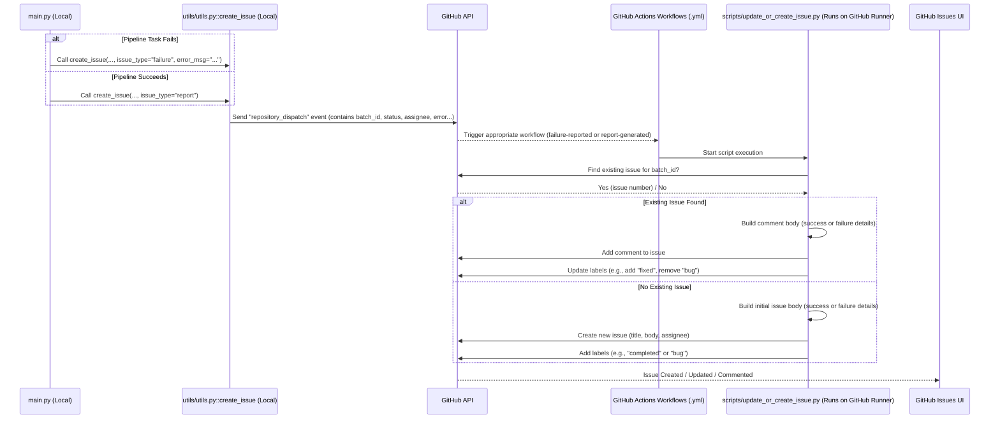

# Chapter 9: Automated Issue Tracking (GitHub)

Welcome to the final chapter! In [Chapter 8: Reporting & Quality Control (QC)](08_reporting___quality_control__qc__.md), we saw how the pipeline generates summary reports and provides tools for checking the quality of the processed data. That's great for understanding what happened *after* a run. But how can the team stay informed about the status of processing batches *as they happen*, especially if something goes wrong?

This chapter introduces the **Automated Issue Tracking** system built using GitHub.

## What Problem Are We Solving?

Imagine a busy factory floor where products (our processed image batches) move through an assembly line (our pipeline). How does the factory manager know when a batch is finished successfully? And more importantly, how are they immediately notified if a machine breaks down and stops the line?

Manually checking the status of every batch constantly would be inefficient. We need an automated system to raise flags – both for successes and failures.

The `SemiF-Preprocessing` pipeline includes an automated system that connects directly to the project's GitHub repository. It acts like an automated assistant:
*   When a pipeline run for a batch **succeeds**, it automatically creates a "Report Ready" issue on GitHub, linking to the results and assigning it for review.
*   When a pipeline task **fails**, it automatically creates a "Failure" issue, detailing the error message, indicating which task failed, and assigning it to someone for investigation.

This ensures that the team has immediate **visibility** into the status of each processing batch and clear **accountability** for reviewing successful runs or fixing failures.

## Key Concepts

Let's look at the pieces that make this automated system work.

### 1. GitHub Issues: The Communication Hub

You might know GitHub as a place to store code. But it also has a built-in **Issues** tracker. Think of it like a shared to-do list or message board for the project team. Each item (issue) can have a title, description, labels (like "bug" or "report"), assignees (who's responsible), and comments for discussion.

Our automated system uses GitHub Issues as the place to post notifications about pipeline runs.

### 2. Success Issues ("Report Ready")

When the entire pipeline for a batch (like `MD_2025-05-10`) finishes all tasks successfully (as defined in `conf/config.yaml`), the system automatically creates a new GitHub Issue.

*   **Title:** Typically includes the `batch_id` (e.g., `MD_2025-05-10: Preprocessing Status`).
*   **Body:** Contains a message indicating success, links to the generated PDF report ([Chapter 8: Reporting & Quality Control (QC)](08_reporting___quality_control__qc__.md)) and log files stored on LTS ([Chapter 7: Data Synchronization & Movement](07_data_synchronization___movement_.md)), and instructions for the manual review process.
*   **Assignee:** Automatically assigns the issue to the designated reviewer for that batch type (configured in `config.yaml`).
*   **Labels:** Often tagged with labels like "completed" or "report".

This tells the assigned person: "Hey, batch MD_2025-05-10 is done! Please review the report."

### 3. Failure Issues ("Task Failed")

If any task in the pipeline (e.g., `autosfm`) fails due to an error, the system immediately stops processing that batch and creates a different kind of GitHub Issue.

*   **Title:** Same as the success issue (e.g., `MD_2025-05-10: Preprocessing Status`). If an issue already exists for this batch, it comments on the existing one.
*   **Body:** Clearly states which **task failed** (e.g., `autosfm`), includes the **error message** encountered, provides a link to the full log file on LTS for debugging, and assigns it for investigation.
*   **Assignee:** Assigns the issue to the designated person.
*   **Labels:** Tagged with labels like "bug" or "failed".

This alerts the assigned person: "Warning! Task 'autosfm' failed for batch MD_2025-05-10. Here's the error. Please investigate."

### 4. GitHub Actions & Workflows: The Automation Engine

How does the pipeline automatically create these issues? It uses **GitHub Actions**. These are automated processes that can be triggered by events happening in your GitHub repository.

Our pipeline uses a specific trigger called `repository_dispatch`. When the pipeline finishes (success or failure), the main script sends a special signal (`repository_dispatch`) to GitHub. This signal contains information like the `batch_id`, whether it succeeded or failed, the error message (if any), and who to assign the issue to.

GitHub Actions **workflows** (defined in `.yml` files inside the `.github/workflows/` directory) listen for these signals:
*   `create_report_issue.yml`: Listens for the "success" signal (`report-generated`).
*   `create_failure_issue.yml`: Listens for the "failure" signal (`failure-reported`).

When triggered, these workflows run a Python script (`scripts/update_or_create_issue.py`) that uses the GitHub API to create or update the appropriate issue.

### 5. Authentication (`REPORT_BOT_PAT`)

To create issues on GitHub automatically, the script needs permission. This is handled using a **Personal Access Token (PAT)** with the necessary permissions (repo access, issue creation). This token is stored securely as a GitHub Secret named `REPORT_BOT_PAT` within the repository or organization settings and is made available to the GitHub Actions workflow. The local script (`utils/utils.py`) also needs access to a PAT, typically read from a secure local file (`pipeline_keys.yaml`) specified in the config, to send the initial trigger event.

## How to Use It

This system is designed to work mostly automatically in the background!

1.  **Enable Issue Creation:** In your main configuration file (`conf/config.yaml`), ensure the `create_issue` flag is set to `true`.

    ```yaml
    # --- File: conf/config.yaml (Snippet) ---
    # ...
    create_issue: true # <<< Set to true to enable automatic issue creation
    # ...
    ```

2.  **Configure Reviewers:** Set the default GitHub usernames for who should be assigned the issues for different batch types (e.g., based on the state prefix like 'MD' or 'NC').

    ```yaml
    # --- File: conf/config.yaml (Snippet) ---
    # ...
    report:
      save2lts: true
      sample_size: 96
      reviewers: # GitHub usernames for assignment
        github:
          MD: UserA   # Issues for MD batches assigned to UserA
          NC: UserB   # Issues for NC batches assigned to UserB
          default: UserA # Fallback assignee
    # ...
    ```

3.  **Ensure PAT is Available:**
    *   **For GitHub Actions:** Make sure the `REPORT_BOT_PAT` secret is correctly configured in your GitHub repository/organization settings. This allows the *workflow* to create the issue.
    *   **For Local Trigger:** Ensure the `GITHUB_PAT` is present in the `pipeline_keys.yaml` file specified by `cfg.paths.pipeline_keys`. This allows the *local script* (`main.py`) to send the initial trigger signal to GitHub Actions.

    ```yaml
    # --- File: conf/paths/default.yaml (Snippet) ---
    pipeline_keys: ${paths.workdir}/.keys/pipeline_keys.yaml # Path to the key file
    ```

    ```yaml
    # --- Example: .keys/pipeline_keys.yaml ---
    # Store sensitive keys here, DO NOT commit this file to Git!
    GITHUB_PAT: "ghp_YourPersonalAccessTokenHere"
    # ... other keys ...
    ```

4.  **Run the Pipeline:** Execute the pipeline as usual using `python main.py` or `python batch.py` ([Chapter 5: Pipeline Execution & Orchestration](05_pipeline_execution__orchestration_.md)).
    *   **On Success:** When all tasks complete, `main.py` will call the `create_issue` utility function, which triggers the `report-generated` event. The `create_report_issue.yml` workflow will run `scripts/update_or_create_issue.py`, which creates or updates the GitHub issue with success details and assigns it to the configured reviewer.
    *   **On Failure:** If any task fails, the `except` block in `main.py` will call the `create_issue` utility function, triggering the `failure-reported` event. The `create_failure_issue.yml` workflow will run `scripts/update_or_create_issue.py`, creating or updating the issue with failure details (task name, error message) and assigning it.

**Input:**
*   Pipeline status (success/failure).
*   Configuration settings (`create_issue` flag, reviewer assignments).
*   `batch_id`.
*   Error message and task name (on failure).
*   `GITHUB_PAT` (locally) and `REPORT_BOT_PAT` (in GitHub Secrets).

**Output:**
*   A new or updated GitHub Issue in the project repository.

## Under the Hood: The Automation Flow

Let's trace the steps when a pipeline run finishes for a batch:



**Code Snippets Explained:**

1.  **Triggering from `main.py`:** When a run finishes or fails, `main.py` calls `create_issue`.

    ```python
    # --- File: main.py (Simplified Error Handling & Success) ---
    # ... inside the task loop ...
        except Exception as e:
            log.exception(f"Task failed: {tsk}")
            if cfg.create_issue: # Check the flag from config.yaml
                save_log_to_lts(cfg) # Save logs first
                log.info("Creating GitHub issue for task failure.")
                # Trigger GitHub issue creation for failure
                create_issue(cfg.batch_id, user_id, issue_type="failure", tsk=tsk, error_msg=str(e))
            sys.exit(1) # Stop pipeline for this batch
    # ... after the loop if all tasks succeeded ...
    log.info("All tasks completed successfully.")
    if cfg.create_issue: # Check the flag
        log.info("Creating GitHub issue for successful run.")
        # Trigger GitHub issue creation for success
        create_issue(cfg.batch_id, user_id, issue_type="report")
    ```
    *Explanation:* If the `create_issue` flag in the configuration (`cfg`) is true, this code calls the `create_issue` helper function (defined in `utils/utils.py`) with different arguments depending on whether a task failed (`issue_type="failure"`) or the whole pipeline succeeded (`issue_type="report"`).

2.  **Sending the Trigger (`utils/utils.py`):** The `create_issue` function builds the payload and uses `curl` (via `subprocess`) to send the `repository_dispatch` event to GitHub.

    ```python
    # --- File: src/utils/utils.py (Simplified create_issue function) ---
    import subprocess
    import json
    import os

    def create_issue(batch_id, user_id, issue_type, tsk: str = None, error_msg: str = None):
        """Triggers a GitHub Actions workflow via repository_dispatch."""
        if issue_type == "report":
            event_type = "report-generated"
            payload = { "batch_id": batch_id, "assignee": user_id }
        elif issue_type == "failure":
            event_type = "failure-reported"
            payload = {
                "batch_id": batch_id, "assignee": user_id,
                "task_name": tsk, "error_msg": error_msg
            }
        else: return # Unknown type

        trigger_payload = { "event_type": event_type, "client_payload": payload }
        github_pat = os.environ.get("GITHUB_PAT") # Expect PAT in environment (set in main.py)
        if not github_pat:
            log.error("GITHUB_PAT not found in environment. Cannot trigger issue creation.")
            return

        try:
            # Use curl command to send the event to GitHub API
            subprocess.run([
                "curl", "-L", "-X", "POST",
                "https://api.github.com/repos/precision-sustainable-ag/SemiF-Preprocessing/dispatches",
                "-H", f"Authorization: Bearer {github_pat}",
                "-H", "Accept: application/vnd.github+json",
                "-H", "X-GitHub-Api-Version: 2022-11-28",
                "-d", json.dumps(trigger_payload)
            ], check=True, capture_output=True) # capture_output hides curl's verbose output
            log.info(f"Successfully triggered GitHub Action workflow: {event_type} for {batch_id}")
        except subprocess.CalledProcessError as e:
            log.error(f"Failed to trigger GitHub Action: {e}\n{e.stderr.decode()}")
        except Exception as e:
            log.error(f"An unexpected error occurred triggering GitHub Action: {e}")

    ```
    *Explanation:* This function constructs a `trigger_payload` containing the `event_type` ("report-generated" or "failure-reported") and the necessary data (`batch_id`, assignee, error info). It then uses the `curl` command-line tool (via `subprocess.run`) to send this payload as a POST request to the GitHub API's `dispatches` endpoint for the repository. This is what triggers the GitHub Action workflow. It requires the `GITHUB_PAT` environment variable to be set for authentication.

3.  **GitHub Actions Workflow (`.github/workflows/create_*.yml`):** These YAML files define when the workflow runs and what steps it takes.

    ```yaml
    # --- File: .github/workflows/create_report_issue.yml (Simplified) ---
    name: Create Inspection Report Issue

    on:
      repository_dispatch: # Triggered by the event sent from create_issue()
        types: [report-generated] # Only runs for the "report-generated" type

    jobs:
      create-issue:
        runs-on: ubuntu-latest
        steps:
        - uses: actions/checkout@v4 # Check out the code
        - uses: actions/setup-python@v5 # Set up Python
        - run: pip install requests # Install needed library

        - name: Update or Create Success Issue
          env:
            GH_TOKEN: ${{ secrets.REPORT_BOT_PAT }} # Use PAT from Secrets
            BATCH_ID: ${{ github.event.client_payload.batch_id }} # Get data from trigger payload
            ASSIGNEE: ${{ github.event.client_payload.assignee }}
            REPO: ${{ github.repository }}
            IS_SUCCESS: "true" # Indicate this is a success case
          run: python scripts/update_or_create_issue.py # Run the script
    ```
    *Explanation:* This workflow file tells GitHub: When a `repository_dispatch` event with type `report-generated` happens, run a job on an Ubuntu machine. The job checks out the code, sets up Python, installs the `requests` library, and then executes the Python script `scripts/update_or_create_issue.py`. It passes information from the triggering event (like `batch_id`, `assignee`) and the `REPORT_BOT_PAT` secret as environment variables to the script. The `create_failure_issue.yml` file is very similar but triggers on `failure-reported` and sets `IS_SUCCESS: "false"`.

4.  **Creating/Updating the Issue (`scripts/update_or_create_issue.py`):** This script handles the interaction with the GitHub API to manage the issues.

    ```python
    # --- File: scripts/update_or_create_issue.py (Simplified Main Logic) ---
    import os
    import requests # Library to make HTTP requests to GitHub API

    # --- Get info from environment variables set by the workflow ---
    TOKEN = os.environ["GH_TOKEN"]
    REPO = os.environ["REPO"] # e.g., "precision-sustainable-ag/SemiF-Preprocessing"
    BATCH_ID = os.environ["BATCH_ID"]
    ASSIGNEE = os.environ["ASSIGNEE"]
    IS_SUCCESS = os.environ.get("IS_SUCCESS", "false").lower() == "true"
    TASK_NAME = os.environ.get("TASK_NAME", "Unknown") # Only present on failure
    ERROR_MSG = os.environ.get("ERROR_MSG", "No message provided") # Only present on failure
    # ... (Define API endpoint and headers) ...
    GITHUB_API = "https://api.github.com"
    HEADERS = {"Authorization": f"token {TOKEN}", ...}

    def find_existing_issue(batch_id_title):
        # ... (Code to search open issues for title: f"{batch_id_title}: Preprocessing Status") ...
        # ... (Returns issue number if found, else None) ...
        pass # Simplified

    def comment_on_issue(issue_number, message):
        # ... (Code to post a comment using GitHub API) ...
        pass # Simplified

    def create_issue(title, body, assignee):
        # ... (Code to create a new issue using GitHub API) ...
        pass # Simplified

    def add_label(issue_number, label):
        # ... (Code to add a label like "bug" or "completed") ...
        pass # Simplified
        
    def remove_label(issue_number, label):
        # ... (Code to remove a label) ...
        pass # Simplified

    # --- Main Script Logic ---
    issue_title = f"{BATCH_ID}: Preprocessing Status"
    existing_issue_num = find_existing_issue(issue_title)

    if existing_issue_num:
        print(f"Found existing issue #{existing_issue_num} for {BATCH_ID}")
        # If issue exists, just add a comment and update labels
        if IS_SUCCESS:
            message = f"✅ Run Succeeded. Report is ready for review. @{ASSIGNEE}"
            comment_on_issue(existing_issue_num, message)
            remove_label(existing_issue_num, "bug") # Remove bug label if it was there
            add_label(existing_issue_num, "fixed") # Add fixed label
        else:
            message = f"❌ Task `{TASK_NAME}` Failed!\nError: ```{ERROR_MSG}``` @{ASSIGNEE}"
            comment_on_issue(existing_issue_num, message)
            add_label(existing_issue_num, "bug") # Ensure bug label is present
    else:
        print(f"Creating new issue for {BATCH_ID}")
        # If issue doesn't exist, create it
        if IS_SUCCESS:
            body = f"✅ Batch {BATCH_ID} processed successfully. Report ready. @{ASSIGNEE}\n[Link to Report] (...)" # Add links
            create_issue(issue_title, body, ASSIGNEE)
            # Need to find the new issue number to add labels (omitted for simplicity)
            # add_label(new_issue_num, "completed")
        else:
            body = f"❌ Task `{TASK_NAME}` failed for {BATCH_ID}.\nError: ```{ERROR_MSG}``` @{ASSIGNEE}\n[Link to Log] (...)" # Add links
            create_issue(issue_title, body, ASSIGNEE)
            # add_label(new_issue_num, "bug")
    ```
    *Explanation:* This script, running within the GitHub Action, first checks if an issue with the title `"{BATCH_ID}: Preprocessing Status"` already exists. If it does, it posts a comment indicating the latest status (success or failure) and updates the labels (e.g., removing "bug" and adding "fixed" if a previously failed run now succeeds). If no issue exists, it creates a new one with the appropriate title, body (including links and assignee mention), and adds initial labels ("completed" for success, "bug" for failure).

## Conclusion

Congratulations on completing the tutorial! You've now seen the final piece of automation in the `SemiF-Preprocessing` pipeline: **Automated Issue Tracking**. You understand:
*   How the system uses **GitHub Issues** to notify the team about batch processing status.
*   The difference between **success ("report") issues** and **failure issues**.
*   How **GitHub Actions** workflows are triggered by the pipeline to automate issue creation.
*   How this system enhances **visibility** and **accountability**.

By automatically flagging successes and failures, this system helps the team manage the processing workflow efficiently, ensuring that results are reviewed promptly and problems are investigated quickly. This robust automation allows researchers to focus more on the science and less on managing the data processing mechanics.

We hope this tutorial series has given you a clear understanding of the different components of the `SemiF-Preprocessing` project and how they work together to transform raw field images into valuable research data!

---

Generated by [AI Codebase Knowledge Builder](https://github.com/The-Pocket/Tutorial-Codebase-Knowledge)