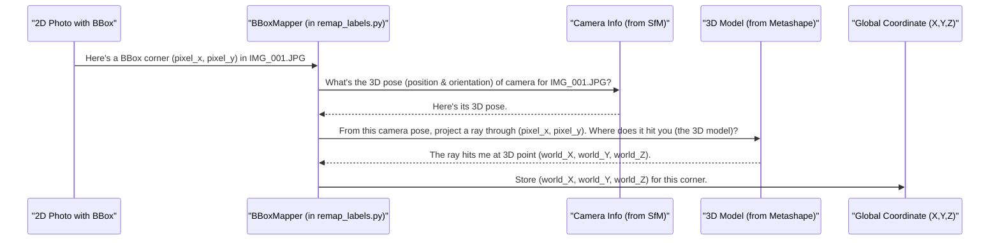

# Chapter 9: Bounding Box Processing and Remapping

Welcome to Chapter 9! In [Chapter 8: Data Representation (Dataclasses)](08_data_representation__dataclasses_.md), we learned how `SemiF-Preprocessing` uses standardized "forms" called dataclasses to keep all our image and detection information organized. Now, we're going to see how we use this organized information to do something really cool: figure out exactly where on Earth each plant in our drone photos is located, and what kind of plant it is!

This whole process is called **Bounding Box Processing and Remapping**. Think of it like an advanced mapping service specifically for plants:
1.  First, it **finds** plants in aerial photos (that's "detection").
2.  Then, it **cleans up** any messy or overlapping outlines around the plants (that's "merging").
3.  Next, it uses a 3D terrain model (from our [Chapter 7: AutoSfM (Structure from Motion) Pipeline](07_autosfm__structure_from_motion__pipeline_.md)) to pinpoint each plant's precise **location on Earth** (that's "remapping").
4.  Finally, it tries to **identify** what kind of plant each one is (that's "assigning species").

Imagine you have a drone photo of a field. You see a particular plant in the photo. You want to know:
*   Not just "it's in the middle of the photo," but "it's at GPS coordinates X, Y, Z."
*   Not just "it's a plant," but "it's a corn plant" or "it's a soybean plant."

This chapter will guide you through how `SemiF-Preprocessing` achieves this.

## The "Label" Mode: Our Plant Identification Department

This complex task of finding, locating, and identifying plants is typically handled by the `label` [Image Processing Task Module](04_image_processing_task_module_.md). When you want to run this process, you'd include `label` in your `modes` list in `conf/config.yaml`:

```yaml
# conf/config.yaml (snippet)
modes:
  # ... other modes like sync, correct, asfm ...
  - label     # Activate plant detection, remapping, and species assignment
  # - deliver
```

The `label` module then performs a series of sub-tasks, often defined in the `tasks` section of your configuration:

```yaml
# conf/config.yaml (snippet)
tasks:
  # ... other task configurations ...
  label:
    - detect_plants             # 1. Find plants in images
    - merge_overlapping_bboxes  # 2. Clean up the detection outlines
    - remap_labels              # 3. Pinpoint their real-world location
    - assign_species            # 4. Identify the plant species
```

Let's look at each of these steps.

## Step 1: Finding the Plants (Detection)

First, we need to find where the plants are in our 2D images. This is usually done using a machine learning model, like a YOLO (You Only Look Once) model, that has been trained to recognize plants.

*   **Tool:** The sub-task `detect_plants` typically uses code found in `src/tasks/label_utils/detect_plants.py`.
*   **Input:** JPG images (from [Chapter 5: Image File Conversion (RAW to JPG)](05_image_file_conversion__raw_to_jpg_.md)).
*   **Process:** The model scans each image and draws bounding boxes (rectangles) around areas it thinks are plants.
*   **Output:** For each image, a list of initial bounding boxes, often saved to text files or CSVs. These boxes are just coordinates (like top-left x,y and bottom-right x,y) in pixels within that specific image.

This initial detection can sometimes be a bit messy. A single plant might get multiple, slightly different boxes, or boxes might overlap a lot.

## Step 2: Cleaning Up the Outlines (Merging Bounding Boxes)

Because the initial detection might not be perfect, the next step is to clean up these bounding boxes. If several boxes are largely overlapping, they probably refer to the same plant. We need to merge them into a single, more representative box.

*   **Tool:** The `merge_overlapping_bboxes` sub-task, often implemented in `src/tasks/label_utils/merge_overlapping_bboxes.py`.
*   **Input:** The initial (potentially messy) bounding boxes from the detection step.
*   **Process:**
    1.  For any two boxes, calculate how much they overlap. A common way to measure this is "Intersection over Union" (IoU). IoU is the area of overlap divided by the total area covered by both boxes.
    2.  If the IoU is above a certain threshold (e.g., 50% overlap), the boxes are considered to be for the same object and are merged. Merging usually means creating a new, larger box that encompasses both.
*   **Output:** A cleaner set of bounding boxes for each image, where redundant overlaps have been reduced.

Here's a tiny conceptual idea of an IoU calculation:

```python
# Simplified IoU concept (actual code is more complex)
def calculate_iou(boxA_coords, boxB_coords):
    # boxA_coords = [xmin1, ymin1, xmax1, ymax1]
    # boxB_coords = [xmin2, ymin2, xmax2, ymax2]

    # Calculate intersection area
    inter_xmin = max(boxA_coords[0], boxB_coords[0])
    inter_ymin = max(boxA_coords[1], boxB_coords[1])
    inter_xmax = min(boxA_coords[2], boxB_coords[2])
    inter_ymax = min(boxA_coords[3], boxB_coords[3])
    
    inter_area = max(0, inter_xmax - inter_xmin) * max(0, inter_ymax - inter_ymin)

    # Calculate areas of individual boxes
    areaA = (boxA_coords[2] - boxA_coords[0]) * (boxA_coords[3] - boxA_coords[1])
    areaB = (boxB_coords[2] - boxB_coords[0]) * (boxB_coords[3] - boxB_coords[1])
    
    # Calculate union area
    union_area = areaA + areaB - inter_area
    
    if union_area == 0:
        return 0.0
    return inter_area / union_area

# Example:
box1 = [0, 0, 10, 10] # A 10x10 box at origin
box2 = [5, 5, 15, 15] # Another 10x10 box, overlapping
iou_score = calculate_iou(box1, box2)
# print(f"IoU score: {iou_score}") # Would be around 0.14 (25 / (100 + 100 - 25))
```
This simplified function shows the basic idea: measure overlap relative to total area. The `merge_overlapping_bboxes.py` script uses this kind of logic to decide which boxes to combine.

## Step 3: Pinpointing on the Map (Remapping to 3D Global Coordinates)

Now we have clean 2D bounding boxes in our images. But we want to know where these plants are in the real world! This is where "remapping" comes in. We use the 3D model of the area (which we created in [Chapter 7: AutoSfM (Structure from Motion) Pipeline](07_autosfm__structure_from_motion__pipeline_.md)) to project our 2D image coordinates into 3D global coordinates (like latitude, longitude, and altitude, or local X, Y, Z from a site origin).

*   **Tool:** The `remap_labels` sub-task, primarily using the `BBoxMapper` class within `src/tasks/label_utils/remap_labels.py`.
*   **Input:**
    *   Our cleaned 2D bounding boxes. These are usually part of `ImageMetadata` objects, stored in the `local_coordinates` field of each `BoundingBox` dataclass (see [Chapter 8: Data Representation (Dataclasses)](08_data_representation__dataclasses_.md)).
    *   The Agisoft Metashape project (`.psx` file) containing the 3D model and aligned camera information for the batch.
*   **Process:**
    1.  For each corner of a 2D bounding box in an image:
    2.  The `BBoxMapper` uses Metashape's Python API.
    3.  It finds the specific camera that took that image and its 3D position/orientation.
    4.  It "draws a ray" from the camera's 3D position, through the 2D pixel coordinate of the bounding box corner, and sees where this ray hits the 3D model of the ground or plants.
    5.  The 3D coordinates of this intersection point on the model are the global coordinates for that corner.
    6.  Repeat for all corners to get the 3D outline of the plant.
*   **Output:** The `ImageMetadata` objects are updated. For each `BoundingBox`, the `global_coordinates` field is now filled with these real-world 3D coordinates.

### Walkthrough: Remapping a Single Bounding Box Corner

Let's visualize how `BBoxMapper` finds the global coordinate for one corner of a bounding box:



### Conceptual Code for Remapping

Inside `src/tasks/label_utils/remap_labels.py`, the `BBoxMapper` class has a method like `_map_bbox` that interacts with Metashape. Here's a highly simplified idea of what it does for one corner:

```python
# Conceptual and highly simplified from BBoxMapper._map_bbox
# Needs Metashape library and a loaded project/chunk
# import Metashape # Assume this is imported

def get_global_coord_for_pixel(metashape_camera, metashape_chunk, metashape_surface_model, pixel_x, pixel_y):
    # 'metashape_camera' is the Metashape.Camera object for the image
    # 'metashape_chunk' is the active part of the Metashape project
    # 'metashape_surface_model' is the 3D model (e.g., chunk.model)
    
    if metashape_camera is None or not metashape_camera.transform:
        # print("Camera not aligned or not found.")
        return None

    # Unproject the 2D pixel to a 3D ray direction from the camera
    # (Metashape.Vector needs to be used)
    # ray_target_in_camera_space = metashape_camera.unproject(Metashape.Vector([pixel_x, pixel_y]))
    
    # Find where this ray intersects the 3D surface model
    # intersection_point_on_model = metashape_surface_model.pickPoint(metashape_camera.center, ray_target_in_camera_space)
    
    # if intersection_point_on_model is None:
    #     # print("Ray did not hit the model.")
    #     return None
        
    # Transform point from local model coordinates to global (georeferenced) coordinates
    # global_coordinates_vec = metashape_chunk.transform.matrix.mulp(intersection_point_on_model)
    # georeferenced_coords = metashape_chunk.crs.project(global_coordinates_vec) # e.g., Lat/Lon or UTM
    
    # return [georeferenced_coords.x, georeferenced_coords.y, georeferenced_coords.z] # Or just x,y
    pass # Actual implementation uses Metashape API calls like above

# Example (conceptual usage):
# Assume cam, chunk, model are loaded Metashape objects
# pixel_coords_x = 150.5 
# pixel_coords_y = 300.2
# world_coords = get_global_coord_for_pixel(cam, chunk, model, pixel_coords_x, pixel_coords_y)
# if world_coords:
#    print(f"Pixel ({pixel_coords_x},{pixel_coords_y}) maps to {world_coords}")
```
The actual code uses the `Metashape` Python API to perform these `unproject`, `pickPoint`, and `project` operations. This step effectively "drapes" the 2D bounding box onto the 3D surface, giving us its real-world footprint. The results are stored in the `global_coordinates` field of our `BoundingBox` dataclass instances.

After remapping, we might find that some bounding boxes, when viewed in their global 3D context, are actually duplicates of the same plant seen from different photos. The `src/tasks/label_utils/filter_bboxes.py` script (often run as part of `remap_labels` or a separate sub-task) handles this "global deduplication" by comparing the 3D footprints and selecting the best, "primary" view of each plant.

## Step 4: Identifying the Plant (Assigning Species Labels)

We now have clean bounding boxes with precise real-world locations! The final step is to figure out what species each plant is.

*   **Tool:** The `assign_species` sub-task, typically implemented in `src/tasks/label_utils/assign_species.py`.
*   **Input:**
    *   `ImageMetadata` objects with `BoundingBox.global_coordinates` filled.
    *   Plot maps or shapefiles. These are digital maps that define areas where specific plant species were sown or are expected to be. For example, a shapefile might outline "Plot A: Corn", "Plot B: Soybeans".
    *   A species information file (e.g., a JSON file from `cfg.paths.species_info`) that links species names to numerical class IDs.
*   **Process:**
    1.  For each plant's global coordinates (usually the centroid of its 3D bounding box):
    2.  Check if these coordinates fall inside any of the known species polygons from the plot map/shapefile.
    3.  If a match is found, assign the corresponding species label and class ID to the plant's `BoundingBox` dataclass.
    4.  If no match is found, or if the plot map indicates "mixed species," it might be labeled as "unknown plant" or a generic "plant" category.
*   **Output:** The `ImageMetadata` objects are further updated. The `BoundingBox.category_class_id` field (and possibly a species name field) is now set for each detected plant.

### Conceptual Code for Species Assignment

The `SpeciesAssigner` class in `src/tasks/label_utils/assign_species.py` might have a method like this:

```python
# Conceptual and highly simplified from SpeciesAssigner._determine_species
# Needs a GIS library like geopandas and shapely
# import geopandas as gpd
# from shapely.geometry import Point

def get_species_for_point(global_x, global_y, plot_map_geodataframe, species_info_dict):
    # 'plot_map_geodataframe' is a GeoDataFrame loaded from a shapefile.
    # It has a 'geometry' column (polygons) and a 'species_code' column.
    # 'species_info_dict' maps species_code to class_id and full name.

    plant_location_point = Point(global_x, global_y) # Create a Shapely Point

    # Check which plot polygon contains the plant's location
    # for index, plot_row in plot_map_geodataframe.iterrows():
    #     if plot_row['geometry'].contains(plant_location_point):
    #         species_code_from_plot = plot_row['species_code']
    #         # Look up class_id from our species_info_dict
    #         if species_code_from_plot in species_info_dict["species"]:
    #             return species_info_dict["species"][species_code_from_plot]["class_id"]
    #         else:
    #             return species_info_dict["species"]["unknown_plant"]["class_id"] # Default
    
    # If no containing polygon found, return a default "unknown" class ID
    # return species_info_dict["species"]["unknown_plant"]["class_id"] 
    pass # Actual implementation uses GeoPandas to check containment.

# Example (conceptual usage):
# Assume plot_map_gdf and species_codes are loaded.
# plant_gps_x = -96.345 
# plant_gps_y = 30.612
# assigned_class_id = get_species_for_point(plant_gps_x, plant_gps_y, plot_map_gdf, species_codes)
# print(f"Assigned class ID: {assigned_class_id}")
```
This logic checks if the plant's GPS point falls within any known plot boundary defined in the shapefile.

## Putting It All Together in `src/label.py`

The main script for the `label` module, typically `src/label.py`, would orchestrate these sub-tasks. It reads the configuration to see which sub-tasks to run (e.g., `detect_plants`, `merge_overlapping_bboxes`, `remap_labels`, `assign_species`) and calls their respective main functions in sequence, passing along the configuration (`cfg`) object.

```python
# src/label.py (Very Simplified Concept)
import logging
from omegaconf import DictConfig

# Import main functions from sub-task modules
# from src.tasks.label_utils.detect_plants import main as detect_main
# from src.tasks.label_utils.merge_overlapping_bboxes import main as merge_main
# from src.tasks.label_utils.remap_labels import main as remap_main # remap_labels.py itself has a main that runs DataMerger, RemapLabels, BBoxFilter etc.
# from src.tasks.label_utils.assign_species import main as assign_main

log = logging.getLogger(__name__)

# SUB_TASK_REGISTRY = {
#     "detect_plants": detect_main,
#     "merge_overlapping_bboxes": merge_main,
#     "remap_labels": remap_main,
#     "assign_species": assign_main,
# }

def main(cfg: DictConfig) -> None: # Called by the main pipeline orchestrator
    log.info(f"Starting 'label' module for batch: {cfg.batch_id}")
    
    # sub_tasks_to_run = cfg.tasks.label # e.g., ['detect_plants', ..., 'assign_species']
    
    # for sub_task_name in sub_tasks_to_run:
    #     if sub_task_name in SUB_TASK_REGISTRY:
    #         log.info(f"--- Running 'label' sub-task: {sub_task_name} ---")
    #         sub_task_function = SUB_TASK_REGISTRY[sub_task_name]
    #         sub_task_function(cfg) # Call the sub-task
    #         log.info(f"--- Finished 'label' sub-task: {sub_task_name} ---")
    #     else:
    #         log.error(f"Unknown sub-task in 'label' module: {sub_task_name}")
            
    log.info(f"'Label' module finished for batch: {cfg.batch_id}")
```
This structure ensures that each step of bounding box processing and remapping happens in the correct order, transforming raw detections into geographically precise, species-identified plant data.

## Conclusion

You've now journeyed through the "Bounding Box Processing and Remapping" capabilities of `SemiF-Preprocessing`. This powerful set of operations turns simple detections in images into rich, actionable information about individual plants.

Key takeaways:
*   The process starts with **detecting** plants in 2D images.
*   Initial detections are cleaned up by **merging overlapping bounding boxes**.
*   These 2D boxes are then **remapped** to 3D global (real-world) coordinates using the SfM model ([Chapter 7: AutoSfM (Structure from Motion) Pipeline](07_autosfm__structure_from_motion__pipeline_.md)) and camera information. This critical step is handled by `src/tasks/label_utils/remap_labels.py`.
*   Finally, **species labels** are assigned, often by checking the plant's global location against plot maps, managed by `src/tasks/label_utils/assign_species.py`.
*   All this information is stored and passed around using structured dataclasses like `ImageMetadata` and `BoundingBox` from [Chapter 8: Data Representation (Dataclasses)](08_data_representation__dataclasses_.md).

This detailed, per-plant information is invaluable for many scientific analyses. Once all this processing is done, it's important to summarize what happened, note any issues, and generate reports. That's what we'll cover in our final chapter.

Next up: [Chapter 10: Automated Reporting and Issue Tracking](10_automated_reporting_and_issue_tracking_.md)

---

Generated by [AI Codebase Knowledge Builder](https://github.com/The-Pocket/Tutorial-Codebase-Knowledge)
