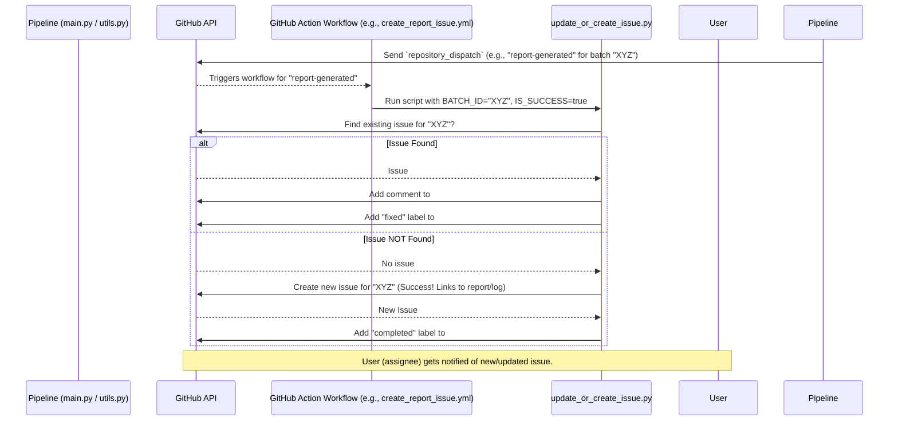

# Chapter 10: Automated Reporting and Issue Tracking

Welcome to the final chapter of our `SemiF-Preprocessing` tutorial! In [Chapter 9: Bounding Box Processing and Remapping](09_bounding_box_processing_and_remapping_.md), we saw how the system processes images to find, locate, and identify plants. After all that intensive processing, especially when it runs automatically for many batches, two big questions arise: "What happened?" and "Did it work correctly?"

This is where **Automated Reporting and Issue Tracking** comes in. This system is like the **Quality Control (QC) and Communication Office** for our entire image processing factory.
*   After a batch of images is processed, the "QC" part automatically generates a detailed PDF report summarizing everything that happened – what data went in, what results came out, how long it took, and any errors encountered.
*   The "Communication Office" part then interacts with GitHub. If everything went well, it might post a notification. If there was a problem, it creates a "ticket" (a GitHub issue) detailing the problem so someone can look into it and fix it.

This system is crucial for:
1.  **Quality Control:** Quickly seeing if the processing results look good.
2.  **Troubleshooting:** Easily finding out what went wrong if a batch fails.
3.  **Project Management:** Keeping track of the status of each batch and assigning tasks if issues arise.
4.  **Efficiency:** Saving a lot of time compared to manually checking logs and creating reports for every batch.

Let's explore the two main parts of this system.

## Part 1: Automated PDF Reports – Your Processing Summary

After the `SemiF-Preprocessing` pipeline finishes working on a batch of images, it can automatically generate a comprehensive PDF report. This report is like a detailed dossier for the batch, giving you a snapshot of the entire processing run.

### What's Inside a PDF Report?

The content of the PDF report can be quite rich. Here are some common things you might find, all assembled automatically by the `report` sub-task (usually part of the `deliver` [Image Processing Task Module](04_image_processing_task_module_.md)):

*   **Batch Summary:** Basic information like the `batch_id`, number of raw images, total data size, and when the processing occurred.
*   **Image Statistics:** Details about the input images, such as average file size, and plots showing capture times or upload delays.
*   **Processing Timings:** How long each major step of the pipeline (like `correct`, `asfm`, `label`) took to complete. This is extracted from the pipeline's log files.
*   **AutoSfM Summary:** Key pages from the Agisoft Metashape processing report (see [Chapter 7: AutoSfM (Structure from Motion) Pipeline](07_autosfm__structure_from_motion__pipeline_.md)), showing 3D model quality metrics, camera alignment details, and Ground Control Point errors.
*   **Sample Output Images:** A selection of randomly chosen output images (e.g., JPGs with bounding boxes drawn on them) to give a visual sense of the results.
*   **Analysis Plots:** If plant detection and analysis were performed, you might see plots like:
    *   Counts of different plant species identified.
    *   Histograms showing the distribution of plant sizes.
    *   Density maps showing where plants are concentrated.
*   **Log Snippets:** Important error or warning messages from the processing log, making it easy to spot issues without digging through the full log file.

### How are PDF Reports Generated?

The generation of these PDF reports is typically handled by the `report` sub-task, which uses the script `src/tasks/deliver_utils/report.py`. This script orchestrates the collection of all the necessary information and its assembly into a PDF document.

Let's look at a simplified conceptual view of how `src/tasks/deliver_utils/report.py` works:

```python
# src/tasks/deliver_utils/report.py (Conceptual Snippet)
import logging
from pathlib import Path
from omegaconf import DictConfig
# reportlab is used for creating PDFs
# from reportlab.pdfgen import canvas 
# matplotlib is used for plots
# import matplotlib.pyplot as plt 

log = logging.getLogger(__name__)

class LogParser: # Simplified
    def __init__(self, cfg: DictConfig, output_report_dir: Path):
        # self.log_path = Path(HydraConfig.get().runtime.output_dir) / f"{cfg.batch_id}.log"
        # ... (initializes path to the main log file for the batch) ...
        pass

    def extract_module_timings(self):
        # ... (logic to parse log file and find start/end times for modules) ...
        # Returns a pandas DataFrame with columns like "ScriptModule", "StartTime", "DurationSeconds"
        log.info("Extracting module timings from log...")
        return {} # Placeholder for actual data

    def extract_error_blocks(self):
        # ... (logic to find ERROR or WARNING lines in the log) ...
        log.info("Extracting error blocks from log...")
        return {} # Placeholder for actual data

class ImageReport: # Simplified
    def __init__(self, cfg: DictConfig):
        self.cfg = cfg
        self.batch_id = cfg.batch_id
        self.output_report_dir = Path(cfg.paths.inspection_dir) # Where to save report
        # ... (finds paths to raw images, developed images, etc.) ...
        self.log_parser = LogParser(cfg, self.output_report_dir)
        self.image_data = [] # To store metadata about each image

    def extract_image_metadata(self):
        # ... (gathers stats about raw images: count, size, timestamps) ...
        log.info("Extracting image metadata...")
        # Fills self.image_data

    def generate_summary_plots(self):
        # ... (creates plots like capture time vs. image index using matplotlib) ...
        log.info("Generating summary plots...")
        # Saves plots as PNG files to self.output_report_dir / "plots"

    def generate_analysis_plots(self): # Conceptual, might use AnnotationPlotter logic
        # ... (creates plots like species counts, area distribution using matplotlib/seaborn) ...
        # This part often relies on the outputs from the 'label' mode.
        # e.g., using data from src.tasks.label_utils.inspect_images.AnnotationPlotter
        log.info("Generating analysis plots...")

    def generate_pdf_report(self):
        if not self.image_data:
            self.extract_image_metadata() # Make sure we have image stats
        
        self.generate_summary_plots()
        self.generate_analysis_plots() # Generate species counts, etc.
        
        module_timings = self.log_parser.extract_module_timings()
        error_snippets = self.log_parser.extract_error_blocks()
        
        pdf_path = self.output_report_dir / f"{self.batch_id}_report.pdf"
        # c = canvas.Canvas(str(pdf_path)) # Initialize PDF canvas
        
        log.info(f"Starting PDF generation for {self.batch_id} at {pdf_path}")
        # --- Page 1: Summary ---
        # c.drawString(50, 750, f"Report for Batch: {self.batch_id}")
        # ... (add image counts, sizes, first/last upload times) ...
        # ... (add capture time plot image to PDF) ...
        # ... (add module timings table to PDF using module_timings) ...
        
        # --- Page 2 onwards: Metashape Report, Sample Images, Analysis Plots, Errors ---
        # c.showPage()
        # ... (add pre-extracted Metashape report image pages) ...
        # c.showPage()
        # ... (add sample output images from batch) ...
        # c.showPage()
        # ... (add analysis plot images like species counts) ...
        # c.showPage()
        # ... (list error snippets from error_snippets) ...
        
        # c.save() # Save the PDF
        log.info(f"PDF report saved to {pdf_path}")

# This main function is called when the 'report' sub-task runs
def main(cfg: DictConfig):
    image_report_generator = ImageReport(cfg)
    image_report_generator.generate_pdf_report()
```
This conceptual overview shows:
*   The `ImageReport` class is the main worker. It initializes paths and uses `LogParser`.
*   `LogParser` reads the pipeline's `.log` file to get timing information and error messages.
*   `ImageReport` calculates statistics, generates plots (using libraries like Matplotlib and Seaborn, based on image data and analysis results), and then uses `reportlab` (a Python PDF generation library) to arrange all this information—text, tables, and plot images—into a multi-page PDF.
*   It also incorporates pre-extracted pages from Metashape's own PDF report, providing detailed 3D modeling quality metrics.
*   The `AnnotationPlotter` class from `src/tasks/deliver_utils/inspect_images.py` is responsible for creating analysis plots like species counts and area distributions. The `ImageReport` class incorporates these plots into the final PDF.

This automated PDF report is then usually saved to the batch's output directory on the Long-Term Storage (LTS), making it accessible to the research team.

## Part 2: Automated GitHub Issue Tracking – Your Communication Hub

Knowing the results is one thing; communicating status and tracking problems is another. `SemiF-Preprocessing` uses GitHub Issues for this.

### Why GitHub Issues?

GitHub Issues provide a centralized place to:
*   **Notify** team members about the completion of a batch.
*   **Report** any failures or errors encountered during processing.
*   **Assign** responsibility for investigating and fixing issues.
*   **Track** the progress of resolving problems.
*   **Discuss** specific batches or errors.

### How It Works: Pipeline ↔ GitHub Actions ↔ Python Script

The process of creating or updating GitHub issues is typically orchestrated like this:

1.  **Pipeline Signal:** At the end of a processing run (or if a critical error occurs), the main `SemiF-Preprocessing` pipeline (e.g., `main.py`) sends a signal. This signal is a `repository_dispatch` event sent to its own GitHub repository. This is done using a helper function, like `create_issue` in `src/utils/utils.py`, which makes a `curl` request to the GitHub API.
    ```python
    # src/utils/utils.py (Conceptual part of create_issue function)
    # import subprocess
    # import json
    # import os

    # def trigger_github_action(batch_id, user_id, issue_type, task_name=None, error_msg=None):
    #     if issue_type == "report": # Success
    #         event_type = "report-generated"
    #         payload = {"batch_id": batch_id, "assignee": user_id}
    #     elif issue_type == "failure":
    #         event_type = "failure-reported"
    #         payload = {"batch_id": batch_id, "assignee": user_id, 
    #                    "task_name": task_name, "error_msg": error_msg}
    #     else:
    #         return

    #     dispatch_payload = {
    #         "event_type": event_type,
    #         "client_payload": payload
    #     }
        
        # github_token = os.environ.get("GITHUB_PAT") # Needs a GitHub Personal Access Token
        # repo_owner_slash_repo = "precision-sustainable-ag/SemiF-Preprocessing" # Example
        
        # curl_command = [
        #     "curl", "-X", "POST",
        #     f"https://api.github.com/repos/{repo_owner_slash_repo}/dispatches",
        #     "-H", f"Authorization: token {github_token}",
        #     "-H", "Accept: application/vnd.github.v3+json",
        #     "-d", json.dumps(dispatch_payload)
        # ]
        # subprocess.run(curl_command, check=True)
        # log.info(f"Sent repository_dispatch event: {event_type} for {batch_id}")
    ```
    This `trigger_github_action` (conceptually from `utils.create_issue`) sends an event to GitHub when a batch finishes successfully (triggering `report-generated`) or fails (triggering `failure-reported`).

2.  **GitHub Actions Trigger:** GitHub Actions (GitHub's automation platform) are listening for these `repository_dispatch` events. We have workflows defined in `.github/workflows/` like:
    *   `create_report_issue.yml`: Triggers when `report-generated` event is received (on success).
    *   `create_failure_issue.yml`: Triggers when `failure-reported` event is received.

    These YAML files define a job that will run on a GitHub server. Here's a tiny piece of what `create_report_issue.yml` looks like:
    ```yaml
    # .github/workflows/create_report_issue.yml (Snippet)
    name: Create Inspection Report Issue

    on:
      repository_dispatch: # Triggered by the pipeline's signal
        types: [report-generated] # Specifically for this event type

    jobs:
      create-issue:
        runs-on: ubuntu-latest # Runs on a Linux server provided by GitHub
        steps:
        # ... (steps to checkout code, setup Python) ...
        - name: Update or Create Success Issue
          env: # Sets up environment variables for the Python script
            GH_TOKEN: ${{ secrets.REPORT_BOT_PAT }} # Securely stored token
            BATCH_ID: ${{ github.event.client_payload.batch_id }} # From the dispatch payload
            # ... other variables like ASSIGNEE, REPO ...
            IS_SUCCESS: "true"
          run: python scripts/update_or_create_issue.py # Runs our script!
    ```
    This workflow essentially says: "When a `report-generated` signal comes in, run the `scripts/update_or_create_issue.py` script with these specific environment variables."

3.  **Python Script Interacts with GitHub:** The `scripts/update_or_create_issue.py` script does the actual work of talking to GitHub.
    *   It reads the environment variables set by the GitHub Action (like `BATCH_ID`, `IS_SUCCESS`, `ERROR_MSG`).
    *   It uses the GitHub API (via the `requests` library) to:
        *   Check if an issue for this `BATCH_ID` already exists.
        *   If not, create a new issue.
        *   If it exists, add a comment to it.
        *   Add or remove labels (like "bug", "fixed", "completed") based on success or failure.

    Here's a conceptual look at the logic in `scripts/update_or_create_issue.py`:
    ```python
    # scripts/update_or_create_issue.py (Conceptual Snippet)
    import os
    # import requests # For making HTTP requests to GitHub API

    # --- Read environment variables (set by GitHub Action) ---
    # TOKEN = os.environ["GH_TOKEN"]
    # REPO = os.environ["REPO"] # e.g., "owner/repository_name"
    # BATCH_ID = os.environ["BATCH_ID"]
    # IS_SUCCESS = os.environ.get("IS_SUCCESS", "false").lower() == "true"
    # ERROR_MSG = os.environ.get("ERROR_MSG", "No message")
    # GLOBUS_PREFIX = "https://link.to.globus.data/" # Base URL for data links

    # HEADERS = {"Authorization": f"token {TOKEN}", ...}

    def find_existing_issue(batch_id_title_part):
        # ... (uses requests.get to search GitHub issues for a title containing batch_id_title_part) ...
        # Returns issue number if found, else None
        log.info(f"Searching for existing issue for {batch_id_title_part}...")
        return None # Placeholder

    def create_github_issue(title, body_message, assignee):
        # ... (uses requests.post to create a new issue on GitHub) ...
        log.info(f"Creating new GitHub issue: {title}")
        # Returns the new issue's number

    def comment_on_github_issue(issue_number, comment_body):
        # ... (uses requests.post to add a comment to an existing issue) ...
        log.info(f"Commenting on issue #{issue_number}")

    def add_github_label(issue_number, label_name):
        # ... (uses requests.post to add a label to an issue) ...
        log.info(f"Adding label '{label_name}' to issue #{issue_number}")

    # --- Main logic ---
    # def main():
    #     title = f"{BATCH_ID}: Preprocessing Status"
    #     body = ""
    #     report_pdf_link = f"{GLOBUS_PREFIX}/{BATCH_ID}/inspection/{BATCH_ID}_report.pdf"
    #     log_link = f"{GLOBUS_PREFIX}/{BATCH_ID}/inspection/{BATCH_ID}.log"

    #     if IS_SUCCESS:
    #         body = f"✅ Batch {BATCH_ID} processed successfully.\n"
    #         body += f"View Report: [PDF]({report_pdf_link})\n"
    #         body += f"View Log: [LOG]({log_link})"
    #     else:
    #         body = f"❌ Task {os.environ.get('TASK_NAME', 'Unknown')} failed for batch {BATCH_ID}.\n"
    #         body += f"Error: {ERROR_MSG}\n"
    #         body += f"View Log: [LOG]({log_link})"

    #     existing_issue_num = find_existing_issue(BATCH_ID)

    #     if existing_issue_num:
    #         comment_on_github_issue(existing_issue_num, body)
    #         if IS_SUCCESS: add_github_label(existing_issue_num, "fixed") # Or "completed"
    #         else: add_github_label(existing_issue_num, "bug")
    #     else:
    #         new_issue_num = create_github_issue(title, body, os.environ["ASSIGNEE"])
    #         if IS_SUCCESS: add_github_label(new_issue_num, "completed")
    #         else: add_github_label(new_issue_num, "bug")
    # main() # Script executes this
    ```
    The actual `scripts/update_or_create_issue.py` script has more detailed message formatting, including instructions for manual review if it's the first successful report.

### What's in a GitHub Issue?

*   **For a successful run:**
    *   Title: `BATCH_ID: Preprocessing Status`
    *   Body: A message indicating success, with direct links to the generated PDF report and the full log file (usually on a shared storage like Globus).
    *   Labels: Might be `completed` or `fixed` (if it previously failed).
    *   Assignee: A designated person to review the report.

*   **For a failed run:**
    *   Title: `BATCH_ID: Preprocessing Status`
    *   Body: A message indicating failure, the name of the task that failed, the error message, and a link to the full log file.
    *   Labels: `bug`.
    *   Assignee: A designated person to investigate the failure.

### Tracking Issues in GitHub Projects

Finally, to keep all these automated issues organized, another GitHub Action workflow, `.github/workflows/publish_issues.yml`, can automatically add any newly created issue to a specific GitHub Project board. This helps the team see all processing statuses and assigned tasks in one place.

```yaml
# .github/workflows/publish_issues.yml (Conceptual Purpose)
# Trigger: When a new issue is opened.
# Action:
# 1. Use GitHub API to find the ID of your team's Project Board.
# 2. Add the newly opened issue to that Project Board.
# 3. Optionally, set fields on the project board (like "Team: computer-vision" or "Project: ag-image-repo") based on issue labels or content.
```
This workflow helps automatically categorize and track the issues generated by the pipeline.

### Visualizing the Issue Tracking Flow



## How Reports and Issues Work Together

1.  The `SemiF-Preprocessing` pipeline processes a batch.
2.  The `report` sub-task (using `src/tasks/deliver_utils/report.py`) generates a PDF report and saves it (e.g., to Globus).
3.  The pipeline then signals GitHub Actions (success or failure).
4.  A GitHub Action workflow runs `scripts/update_or_create_issue.py`.
5.  This script creates/updates a GitHub issue, including a link to the PDF report (if successful) or the error log.
6.  Team members are notified via GitHub and can review the report or investigate the failure.

This creates a closed loop of processing, reporting, and communication, making the entire system much more manageable.

## Conclusion

You've reached the end of the `SemiF-Preprocessing` tutorial! In this chapter, you learned about the crucial **Automated Reporting and Issue Tracking** system. This "QC and Communication Office" helps you understand what your pipeline is doing and manage its outcomes effectively.

Key takeaways:
*   **Automated PDF Reports** (generated by `src/tasks/deliver_utils/report.py`) provide a comprehensive summary of each processing batch, including statistics, timings, sample outputs, and error logs.
*   **Automated GitHub Issue Tracking** (orchestrated by GitHub Actions running `scripts/update_or_create_issue.py`) creates or updates GitHub issues to communicate the success or failure of each batch, complete with links to reports or logs.
*   This system significantly improves **quality control**, **troubleshooting**, and **project management** by providing timely, automated feedback.

Throughout these ten chapters, you've explored the core concepts of `SemiF-Preprocessing`, from how the pipeline is orchestrated ([Chapter 1: Pipeline Orchestration](01_pipeline_orchestration_.md)) and configured ([Chapter 2: Configuration Management (Hydra)](02_configuration_management__hydra__.md)), through various data handling ([Chapter 3: Data Synchronization and Path Management](03_data_synchronization_and_path_management_.md), [Chapter 8: Data Representation (Dataclasses)](08_data_representation__dataclasses_.md)) and image processing steps ([Chapter 5: Image File Conversion (RAW to JPG)](05_image_file_conversion__raw_to_jpg_.md), [Chapter 6: EXIF Data Management](06_exif_data_management_.md), [Chapter 7: AutoSfM (Structure from Motion) Pipeline](07_autosfm__structure_from_motion__pipeline_.md), [Chapter 9: Bounding Box Processing and Remapping](09_bounding_box_processing_and_remapping_.md)), all the way to understanding how results are reported.

We hope this tutorial has given you a solid foundation for understanding and using the `SemiF-Preprocessing` project. Happy processing!

---

Generated by [AI Codebase Knowledge Builder](https://github.com/The-Pocket/Tutorial-Codebase-Knowledge)
